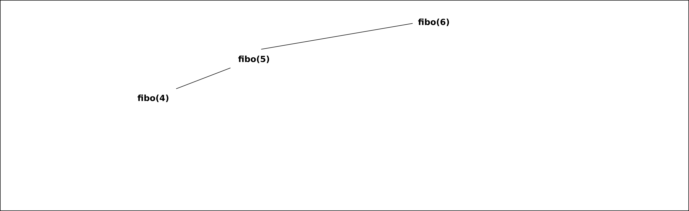

# Principes de la programmation dynamique

## Un premier exmple débranché

!!! question "Parcours sur une grille"

	=== "Enoncé"
	
		1. Combien y-a-t'il de chemin menant du point $D$ au point $A$ sur le graphique suivant, en ne se déplaçant à chaque pas que vers la droite ou vers le bas ?
		
			{: style="width:40%; margin:auto;display:block;background-color: #546d78;"}
		
		2. Combien y-a-t'il de chemin menant du point $D$ au point $A$ sur le graphique suivant, en ne se déplaçant à chaque pas que vers la droite ou vers le bas ?
		
			{: style="width:40%; margin:auto;display:block;background-color: #546d78;"}

	
	=== "Solution"
	
		A venir !
		
## La suite de Fibonacci

La {==**suite de [Fibonacci](https://fr.wikipedia.org/wiki/Suite_de_Fibonacci){: target="_blank"}**==} est une suite définie par une récurence d'ordre 2 de la manière suivante,  :

$$
\left\lbrace\begin{array}{rcl}
F_0 &=& 0\\
F_1 &=& 1 \\
F_{n+2} &=& F_{n+1} + F_{n} ~~ \forall n \in \mathbb{N}
\end{array}\right.
$$

!!! question "Calculer"

	=== "Enoncé"
	
		Calculer les 10 premiers termes de la suite de Fibonacci.
		
	=== "Solution"
	
		Les 10 premiers termes sont : 0, 1, 1, 2, 3, 5, 8, 13, 21, 34 

!!! info "Notation"
	On notera $F(n)$ le nombre de la suite de Fibonacci de rang $n$.
	Par exemple $F(0) = 0$ et $F(6) = 13$.
	
	
Algorithmiquement parlant, la suite de Fibonacci étant une suite définie par récurence, nous serions tentés de créer une fonction récursive pour calculer les termes $F(n)$ de la suite. Pour ce faire, nous pourrions utiliser la fonction suivante :

```` python linenums="1"
def fibo(n) :
	if n == 0 :
		return 	0
	elif n == 1 :
		return 1
	else :
		return fibo(n-1) + fibo(n-2)
````

Est-ce un choix judicieux ?

!!! question "Tester et voir les limites"

	=== "Enoncé"
		1. Tester la fonction `fibo` avec le code suivant :
		```` python
		import time
		for n in range(40) :
			start = time.perf_counter()
			print(f"fibo({n}) = {fibo(n)}", end="")
			end = time.perf_counter()
			print(f" Temps : {end - start}")
		````
		Que constate-t'on ?
		
		2. Réaliser un schéma de la pile d'appels récursif effectués lors de l'exécution de `fibo(6)`.
	
	=== "Solutions"
		
		1. Le temps d'exécution croît de manière exponentielle.
		2. On a la construction suivante :
			<!-- JavaScript Bundle with Popper -->
			<script src="https://cdn.jsdelivr.net/npm/bootstrap@5.1.3/dist/js/bootstrap.bundle.min.js" integrity="sha384-ka7Sk0Gln4gmtz2MlQnikT1wXgYsOg+OMhuP+IlRH9sENBO0LRn5q+8nbTov4+1p" crossorigin="anonymous"></script>

			<div id="carouselExampleIndicators" class="carousel slide" data-bs-ride="carousel">
			<div class="carousel-indicators">
			<button type="button" data-bs-target="#carouselExampleIndicators" data-bs-slide-to="0" class="active" aria-current="true" aria-label="Slide 1"></button>
			<button type="button" data-bs-target="#carouselExampleIndicators" data-bs-slide-to="1" aria-label="Slide 2"></button>
			<button type="button" data-bs-target="#carouselExampleIndicators" data-bs-slide-to="2" aria-label="Slide 3"></button>
			</div>
			<div class="carousel-inner">
			<div class="carousel-item active">

			{: class="d-block w-100" alt="Etape 0" style="width:40%; margin:auto;display:block;background-color: #546d78;"}

			</div>
			<div class="carousel-item">

			{: class="d-block w-100" alt="Etape 1" style="width:40%; margin:auto;display:block;background-color: #546d78;"}

			</div>
			<div class="carousel-item">

			{: class="d-block w-100" alt="Etape 2" style="width:40%; margin:auto;display:block;background-color: #546d78;"}

			</div>
			</div>
			<button class="carousel-control-prev" type="button" data-bs-target="#carouselExampleIndicators" data-bs-slide="prev">
			<span class="carousel-control-prev-icon" aria-hidden="true"></span>
			<span class="visually-hidden">Previous</span>
			</button>
			<button class="carousel-control-next" type="button" data-bs-target="#carouselExampleIndicators" data-bs-slide="next">
			<span class="carousel-control-next-icon" aria-hidden="true"></span>
			<span class="visually-hidden">Next</span>
			</button>
			</div>


	
	
	