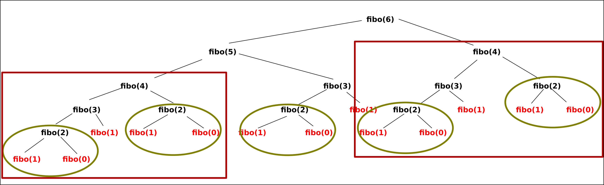

# Principes de la programmation dynamique

## Un premier exmple débranché

!!! question "Parcours sur une grille"

	=== "Enoncé"
	
		1. Combien y-a-t'il de chemin menant du point $D$ au point $A$ sur le graphique suivant, en ne se déplaçant à chaque pas que vers la droite ou vers le bas ?
		
			{: style="width:40%; margin:auto;display:block;background-color: #546d78;"}
		
		2. Combien y-a-t'il de chemin menant du point $D$ au point $A$ sur le graphique suivant, en ne se déplaçant à chaque pas que vers la droite ou vers le bas ?
		
			{: style="width:40%; margin:auto;display:block;background-color: #546d78;"}

	
	=== "Solution"
	
		A venir !
		
## La suite de Fibonacci

La {==**suite de [Fibonacci](https://fr.wikipedia.org/wiki/Suite_de_Fibonacci){: target="_blank"}**==} est une suite définie par une récurence d'ordre 2 de la manière suivante,  :

$$
\left\lbrace\begin{array}{rcl}
F_0 &=& 0\\
F_1 &=& 1 \\
F_{n+2} &=& F_{n+1} + F_{n} ~~ \forall n \in \mathbb{N}
\end{array}\right.
$$

!!! question "Calculer"

	=== "Enoncé"
	
		Calculer les 10 premiers termes de la suite de Fibonacci.
		
	=== "Solution"
	
		Les 10 premiers termes sont : 0, 1, 1, 2, 3, 5, 8, 13, 21, 34 

!!! info "Notation"
	On notera $F(n)$ le nombre de la suite de Fibonacci de rang $n$.
	Par exemple $F(0) = 0$ et $F(6) = 13$.
	
	
Algorithmiquement parlant, la suite de Fibonacci étant une suite définie par récurence, nous serions tentés de créer une fonction récursive pour calculer les termes $F(n)$ de la suite. Pour ce faire, nous pourrions utiliser la fonction suivante :

```` python linenums="1"
def fibo(n) :
	if n == 0 :
		return 	0
	elif n == 1 :
		return 1
	else :
		return fibo(n-1) + fibo(n-2)
````

La question que nous devons nous poser est : est-ce un choix judicieux ? 

!!! question "Tester et voir les limites"

	=== "Enoncé"
		1. Tester la fonction `fibo` avec le code suivant :
		```` python
		import time
		for n in range(40) :
			start = time.perf_counter()
			print(f"fibo({n}) = {fibo(n)}", end="")
			end = time.perf_counter()
			print(f" Temps : {end - start}")
		````
		Que constate-t'on ?
		
		2. Réaliser un schéma de la pile d'appels récursif effectués lors de l'exécution de `fibo(6)`.
	
	=== "Solutions"
		
		1. Le temps d'exécution croît de manière exponentielle.
		2. On a la construction suivante :
		
			<div class="container">
			<div id="slider" class="slider">
			<div class="slider-item active"></div>
			<div class="slider-item"></div>
			<div class="slider-item"></div>
			<div class="slider-item"></div>
			<div class="slider-item"></div>
			<div class="slider-item"></div>
			<div class="slider-item"></div>
			<div class="slider-item"></div>
			<div class="slider-item"></div>
			<div class="slider-item"></div>
			<div class="slider-item"></div>
			<div class="slider-item"></div>
			<div class="slider-item"></div>
			<div class="slider-item"></div>
			<div class="slider-item"></div>
			<div class="slider-item"></div>
			<div class="slider-item"></div>
			<div class="slider-item"></div>
			<div class="slider-item"></div>
			
			<ul id="dots" class="list-inline dots"></ul>
			</div>

			</div>
			
!!! bug "Multiples appels"

	Dans l'exemple précédent de calcul de `fibo(6)`, on peut constater que les appels récursifs sont nombreux, et souvent pour calculer plusieurs fois la même chose :
	
	{: style="width:90%; margin:auto;display:block;background-color: #546d78;"}
	
	Ainsi :
	
	* `fibo(2)` est calculé à 5 reprises ;
	* `fibo(3)` est calculé à 3 reprises ;
	* `fibo(4)` est calculé à 2 reprises.
	
	Le nombre d'appels augmente exponentiellement en fonction de `n`. Par exemple le calcul récursif de `fibo(20)` nécessite $4~181$ appels au calcul `fibo(2)`, celui de `fibo(30)` le nécessite $514~229$ fois, celui de `fibo(40)` le nécessite $63~245~986$ fois....
	
	Si la limite de récursion (qui est de 1000 par défaut pour Python) n'est pas atteinte pour `fibo(40)`, le temps de calcul, lui,  croît aussi exponentiellement...
	

## Programmation dynamique

### Premiers exemples sur la suite de Fibonacci

En considérant l'algorithme précédant, on comprend bien qu'il est particulièrement inefficace de calculer plusieurs fois le même sous-calcul. Afin d'améliorer le temps de calcul de l'algorithme, nous décidons donc de {==**mémoriser les calculs déjà effectués**==} dans un tableau. Il existe deux méthodes différentes :

!!! info "Programmation dynamique de la suite de Fibonacci"

	=== "Méthode ascendante"
	
		On va calculer les nombres de la suite de Fibonacci jusqu'à $n$ en partant de $F(0)$ et $F(1)$ :
		
		```` python linenums="1"
		def fiboAsc(n) :
			F = [0]*(n+1)
			F[1] = 1
			for i in range(2,n+1) :
				F[i] = F[i-1] + F[i-2]
			return F[n]
		
		````
		
	=== "Méthode descendante"
	
		On va calculer les nombres de Fibonacci récursivement, mais en sauvegardant les calculs déjà effectués dans une liste Python, en profitant de sa *mutabilité* :
		
		```` python linenums="1"
		def fiboDesc(n) :
		
			memo = [0, 1]+[None]*(n-1)
			
			def compute(n, memo) :
				if memo[n] is  None :
					memo[n] = compute(n-1, memo) + compute(n-2, memo)
				return memo[n]
				
			return compute(n, memo)
		
		````
		
		L'explication la plus simple du fonctionnement est visible [ici}(https://pythontutor.com/visualize.html#code=def%20fiboDesc%28n%29%20%3A%0A%0A%20%20%20%20memo%20%3D%20%5B0,%201%5D%2B%5BNone%5D*%28n-1%29%0A%20%20%20%20%0A%20%20%20%20def%20compute%28n,%20memo%29%20%3A%0A%20%20%20%20%20%20%20%20if%20memo%5Bn%5D%20is%20%20None%20%3A%0A%20%20%20%20%20%20%20%20%20%20%20%20memo%5Bn%5D%20%3D%20compute%28n-1,%20memo%29%20%2B%20compute%28n-2,%20memo%29&cumulative=false&curInstr=0&heapPrimitives=nevernest&mode=display&origin=opt-frontend.js&py=3&rawInputLstJSON=%5B%5D&textReferences=false){: target="_blank"}, pour un exemple sur `fiboDesc(6)`.
		
## Principes de la profg
		
		

