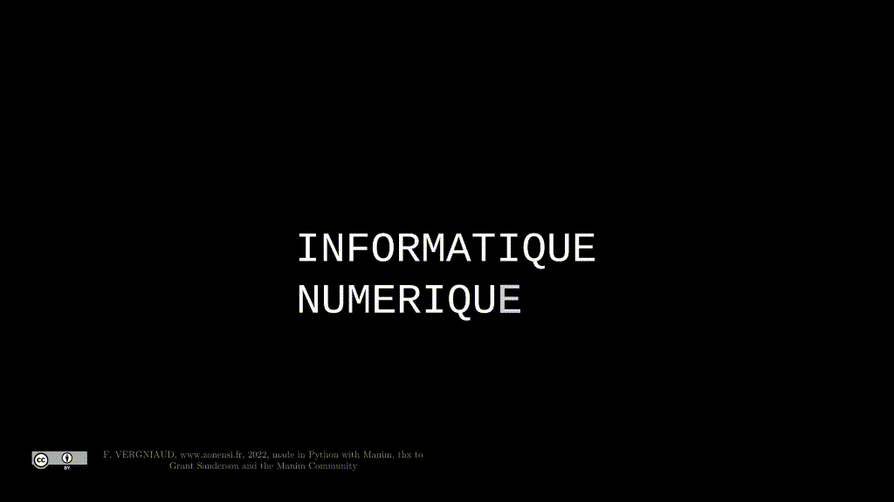
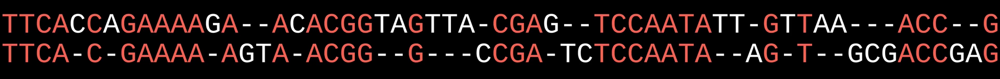
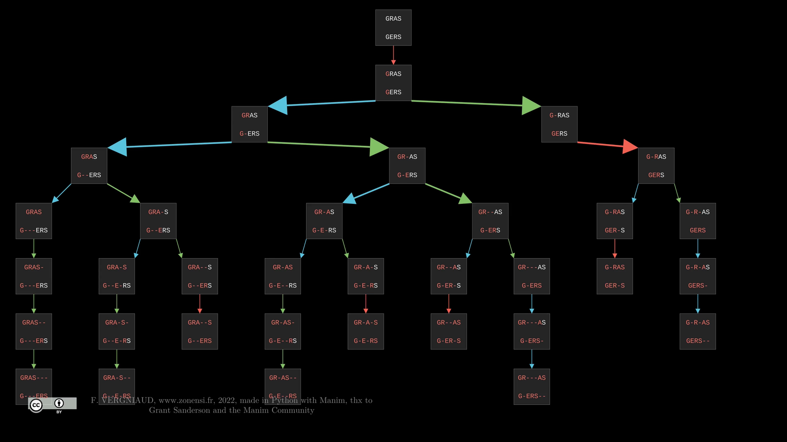
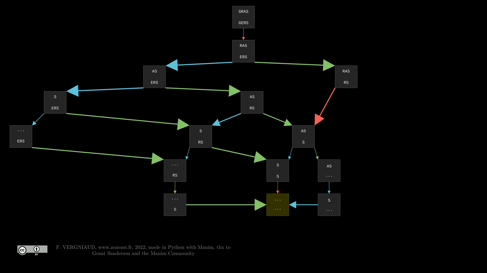
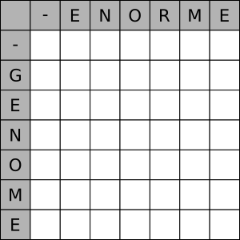
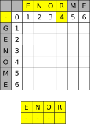
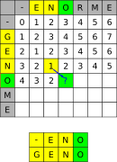
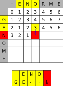
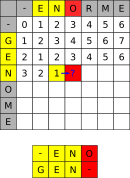
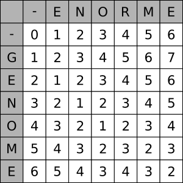

# Alignement de séquences


## Présentation du sujet 


On dispose de deux chaines de caractères : $A$, qui vaut `INFORMATIQUE`, et $B$, qui vaut `NUMERIQUE`. On aimerait mettre ces deux chaines de caractères en correspondance de la manière suivante :

* On place les 2 chaines l'une en dessous de l'autre ;
* Si les premiers caractères des deux chaines coïncident, alors on passe aux caractères suivants ;
* Sinon, on va ajouter un trou dans une des deux chaines, symbolisé par un - et on passe aux caractères suivants.

Voici un exemple d'alignement optimal :

{: style="width:40%; margin:auto;display:block;background-color: #d2dce0;"}

Dans cette situation on a besoin de 9 tirets pour obtenir l'alignement optimal, c'est-à-dire utilisant le moins de tirets.

L'objectif est d'aligner le maximum de lettres (donc de mettre le moins de tirets possible). Ce n'est pas un problème simple, surtout quand les chaines sont longues, comme pour les séquences d'ADN par exemple :

{: style="width:80%; margin:auto;display:block;background-color: #d2dce0;"}

## Résolution par une méthode récursive 

### Principes 

Le principe est présenté dans la vidéo suivante :

<iframe src="//video.toutatice.fr/video/28583-alignement-de-sequences-methode-recursive-et-programmation-dynamique/?is_iframe=true" size="240" width="1280" height="720" style="padding: 0; margin: 0; border:0" allowfullscreen ></iframe>


Pour les mots `GRAS` et `GERS`, l'arbre obtenu est le suivant :

{: style="width:80%; margin:auto;display:block;background-color: #d2dce0;"}

Après application d'une méthode dynamique ({==**Top Down**==}) (c'est-à-dire récursive avec mémoïsation), on obtient le graphe suivant :

{: style="width:80%; margin:auto;display:block;background-color: #d2dce0;"}

### Code Python

!!! question "Code sans memoïzation"

	Compléter le code de la fonction suivante :

	``` python
		def align_seq_rec(a : str, b : str) -> tuple:
			""" renvoie un alignement optimal pour les chaines a t b
			sous la forme d'un tuple dont :
			-le premier terme correspond à la chaine a avec les tirets insérés au bon endroit ;
			-le second terme correspond à la chaine b avec les tirets insérés au bon endroit ;
			- le troisième terme correspond au nombre total de tirets insérés.
			"""
			if len(a) == 0 and len(b) == 0 :
				return (...,..., 0)
			elif len(a) == 0 : 
				return ("", ..., ...)
			elif len(b) == 0 :
				return (..., ""..."",...)
			elif a[0] == b[0] :
				S = align_seq_rec(..., ...)
				return (a[0]+S[0], ..., ...)
			else :
				S1 = align_seq_rec(a, b[1:])
				S2 = align_seq_rec(a[1:], b)
				if S1[2]<=S2[2] :
					return (..., ..., 1+S1[2])
				else :
					return (a[0]+S2[0], "-"+S2[1], ...)
	```


!!! question "Code avec memoïzation"

	A partir de la fonction précédente, créer une fonction `align_seq_rec_memo` qui utilisera une sous-fonction récursive `compute` prenant trois arguments `a`, `b` et `memo`, où `memo` est un dictionnaire dont les clés sont les couples `(a, b)` et les valeurs les tuples `(c,d,n)`, où :

	* `c` représente la chaine `a` avec les tirets nécessaires à l'alignement avec `b` ;
	* `d` représente la chaine `b` avec les tirets nécessaires à l'alignement avec `a` ;
	* `n`représente le nombre total de tirets.


!!! question "Comparaison en temps des deux fonction"

	Exécuter le code suivant :

	```python
	import time
    
    X = "TTCACCAGAAAAGAACACGGTAGTTACGAGTCCAATATTGTTAAACCG"
    Y = "TTCACGAAAAAGTAACGGGCCGATCTCCAATAAGTGCGACCGAG"
    for i in range(1,min(len(X), len(Y))) :
        
        start = time.time()
        print(align_seq_rec(X[:i], Y[:i]))
        print(f"----> Sans mémoization : {time.time() - start}") 
        start = time.time()
        print(align_seq_rec_memo(X[:i], Y[:i]))
        print(f"----> Avec mémoization : {time.time() - start}") 
        
	```

## Résolution par une méthode itérative

### Activité débranchée

Considérons les deux chaines de caractères `GENOME` et `ENORME`. Afin de chercher le nombre minimal d'insertion à effectuer, nous allons compléter le tableau suivant, avec la convention suivante : à l'intersection de la colonne `N` et de la première ligne `E` se trouve le nombre minimal d'insertion nécessaire pour aligner les chaines `EN` et `GE`, c'est-à-dire 2 tirets. Par convention la première ligne et la première colonne correspondent à une chaine vide.

{: style="width:50%; margin:auto;display:block;background-color: #d2dce0;"}

!!! question
	=== "Enoncé"
	
		En quoi la méthode ci-dessus est-elle une méthode itérative ({==**Bottom Up**==}) ?
		
	=== "Réponse"
		
		1. Pour compléter le tableau, on va commencer par compléter la première ligne et la première colonne. Par exemple, la case de la première ligne correspondant à l'intersection de `R` et de `-` doit contenir le nombre minimal de tirets nécessaire pour aligner `ENOR` avec une chaine vide, c'est-à-dire 4.
		
			{: style="width:30%; margin:auto;display:block;background-color: #d2dce0;"}
			
		2. Pour compléter ensuite le reste du tableau, il faut concevoir deux cas différents :
			1. Soit la case correspond aux deux même lettres, comme dans l'exemple ci-dessous :
			
				{: style="width:30%; margin:auto;display:block;background-color: #d2dce0;"}
				
				Le meilleur alignement de `ENO` et de `GENO` contient autant de tirets que le meilleur alignement de `EN` et de `GEN`, donc ici 1.
				
			2. Soit les deux lettre sont différentes, et on peut considérer deux situations :
			
				<div style="display:flex;">
				<div style="display : inline; width : 50%;">
				
				{: style="width:50%; margin:auto;display:block;background-color: #d2dce0;"}
				
				On considère la case comme étant une *évolution* de l'alignement de `ENO` et `GE`, qui contenait 3 tirets, vers l'alignement de `ENO` et `GEN`, qui en contiendra donc **un de plus**, soit 4.
				
				</div>
				<div style="display : inline; width : 50%;">
				
				{: style="width:50%; margin:auto;display:block;background-color: #d2dce0;"}
				
				On considère la case comme étant une *évolution* de l'alignement de `EN` et `GEN`, qui contenait 1 unique tiret, vers l'alignement de `ENO` et `GEN`, qui en contiendra donc **un de plus**, soit 2.
				
				</div>
				</div>
		
			Comme nous cherchons un alignement minimisant le nombre de tirets, on va alors compléter la case avec la valeur 2, provenant de la situation de droite ci-dessus.
			
		3. On termine alors de compléter le tableau :
			
			{: style="width:30%; margin:auto;display:block;background-color: #d2dce0;"}
		
### Application en Python

L'activité est disponible sous la forme d'un [notebook capytale](https://capytale2.ac-paris.fr/web/c/ade1-491791){: target = "_blank"}