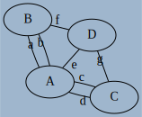
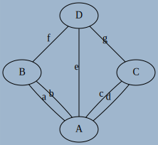
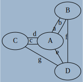

# Les graphes

!!! info "Problème des sept ponts de Königsberg"

	La ville de Königsberg (aujourd'hui Kaliningrad) est construite autour de deux îles situées sur le Pregel et reliées entre elles par un pont. Six autres ponts relient les rives de la rivière à l'une ou l'autre des deux îles, comme représentés sur le plan ci-dessus. 
	
	{: style="width:50%; margin:auto;display:block;background-color: #546d78;"}
	
	
	Le problème consiste à déterminer s'il existe ou non une promenade dans les rues de Königsberg permettant, à partir d'un point de départ au choix, de passer une et une seule fois par chaque pont, et de revenir à son point de départ, étant entendu qu'on ne peut traverser le Pregel qu'en passant sur les ponts. 
	
	Le mathématicien [Leonhard Euler](https://fr.wikipedia.org/wiki/Leonhard_Euler){: target="_blank"} donna la solution de ce problème en utilisant les prémices de ce qu'on appelera {==**Théorie des graphes**==}
	

## Définitions et vocabulaire

### Graphes orientés et non-orientés

!!! abstract "Graphe non oriernté et vocabulaire"

	Un Graphe $G$ est la donnée de d'un ensemble fini de {==**noeuds**==}(*nodes* en anglais) ou {==**sommets**==} (*vertices* en anglais) reliés entre eux par des liens (*edges* en anglais).
	
	Si les liens sont :
	
	* {==**bidirectionnels**==} (on peut les emprunter dans les deux sens), le graphe sera alors appelé {==**non-orienté**==}. On parlera alors de **noeuds** et les liens seront appelés {==**arêtes**==}, et représentés par des **segments** ;
	* {==**unidirectionnels**==} (on peut les emprunter dans un seul sens), le graphe sera alors appelé {==**orienté**==}. On parlera alors de **sommets** et les liens seront appelés {==**arcs**==}, et représentés par des **flèches**.

!!! example "Graphe du problème des ponts de Königsberg"

	Le graphe suivant est un représentatnt du problème des ponts de Königsberg :	
	
	{: style="width:20%; margin:auto;display:block;background-color: #546d78;" title="Graphe Konigsberg"}

	* Les ponts pouvant être franchis dans les deux sens, le graphe est **non-orienté**.
	* Les différentes zones (berges et iles) sont les sommets $A, B, C, D$ du graphe.
	* les différents ponts sont les arêtes $a, b, c, d, e, f, g$.
	
	On dira qu'il s'agit d'une représentation, car la forme du graphe n'est pas importante. Les dessins ci-dessous représentent le même graphe :
	
	

	

	{: style="width:60%; margin:auto;display:block;background-color: #546d78;" title="Graphe Konigsberg V2"}

	

	

	{: style="width:60%; margin:auto;display:block;background-color: #546d78;" title="Graphe Konigsberg V3"}

	

	

	{: style="width:60%; margin:auto;display:block;background-color: #546d78;" title="Graphe Konigsberg V4"}

	

	

	
	
!!! example "Graphe d'état d'un procesus"

	Dans le cours sur les processus, nous avons vu le schéma suivant :
	
	{: style="width:30%; margin:auto;display:block;background-color: #546d78;" title="Etat processus, image wikipedia"}
	
	* Le graphe est **orienté**
	* Les différentes états sont les sommets `départ`, `Prêt`, `Elu`, `Bloqué` et `terminé`.
	* les différentes transitions sont les arcs `Réveil`, `Election`, `Blocage`, `Déblocage` et `Fin`.
	
	
!!! abstract "Voisinage"

	Si il existe un arc d'un sommet $s$ à un sommet $t$, on dit que $t$ est **adjacent** à $s$, où que $t$ est un {==**voisin**==} de $s$.
	
Dans le graphe ci-dessous :

{: style="width:20%;margin:auto;display:block;background-color: #546d78;" title="Voisinages"}

* `A` a pour voisins `B`, `C` et `D` ;
* `B` a pour voisins `B` et `C` ;
* `C` n'a aucun voisin ;
* `D` a pour voisin `A`.
	
	
\begin{definition}{Vocabulaire des graphes}
\trianglenoir
 \begin{itemize}
  \item Deux sommets sont dits \textbf{adjacents} si ils sont reli\'es par la m\^eme ar\^ete.
  \item \textbf{L'ordre} d'un graphe est le nombre de sommets qui composent ce graphe.
  \item Le \textbf{degr\'e d'un sommet} est le nombre d'ar\^etes dont ce sommet est une extr\'emit\'e.
  \item On dira qu'un graphe est \textbf{complet} si tous ses sommets sont adjacents les uns avec les autres.
  \item On dira qu'un sommet est \textbf{isol\'e} s'il n'est reli\'e a aucun autre sommet.
 \end{itemize}

\end{definition}

\begin{ExerciceNomme}{Aventuriers du rail}
 \noindent \og Les aventuriers du Rail \fg est un jeu de plateau qui a pour
but de relier les gares de différentes villes sur une carte préexistante,
pour ainsi créer son réseau ferroviaire au détriment des autres joueurs.\\
\noindent\parbox{0.5\linewidth}{
\includegraphics[width=0.9\linewidth]{SPE02_01_Rail.JPG}}\hfill
\parbox{0.5\linewidth}{
\includegraphics[width=0.9\linewidth]{SPE02_01_Rail_graphe.png}}

\noindent Si l’on extrait une partie des liaisons ferroviaires, on obtient le graphe
ci-dessus.
\begin{enumerate}
\item A quoi correspond chacun des sommets ? chaque arête ?
\item Quel est l’ordre du graphe ?
\item Quel est le degré de Paris ? de Rome ? de Marseille ?
\item Comment peut-on interpréter les résultats de la question 3 ?
\item Ce graphe est-il complet ?
\end{enumerate}
\end{ExerciceNomme}
\begin{ExerciceNomme}{R\'egion Midi-Pyr\'en\'ees}
\noindent On donne ci-dessous un extrait de la carte de la France administrative ( avant remaniement des r\'egions...). On s’intéresse à la
région Midi-Pyrénées et aux huit départements qui la composent. On s'int\'eresse aux frontières communes entre les départements de
cette région.\\
\begin{center}
 \includegraphics[width=0.75\linewidth]{SPE02_01_Midi_Pyrenees.png}
\end{center}

\begin{enumerate}
 \item   Représenter cette carte par un graphe mettant en évidence ce découpage.
 \item A quoi correspond chacun des sommets ? chaque arête ?
 \item Quel est l’ordre du graphe ?
 \item Ce graphe est-il complet ?
 \item Déterminer le degré de chaque sommet.
\end{enumerate}
\end{ExerciceNomme}
\begin{Activite}{Une conjecture}
\begin{enumerate}
 \item On considère l’échiquier $3 \times 3$ ci-dessous dans lequel on s’intéresse au déplacement du cavalier noir.
 \begin{center}
  \includegraphics[width=0.15\linewidth]{SPE02_01_Echiquier.png}
 \end{center}
 
\begin{enumerate}
 \item Repr\'esenter par un graphe cet \'echiquier, les sommets \'etant les cases de l'\'echiquier, et les ar\^etes repr\'esentant les d\'eplacements
 possibles du cavalier.
 \item Quel est l'ordre de ce graphe ?
 \item Ce graphe est-il complet ?
 \item Que peut-on dire du sommet $b2$ ?
 \item Compl\'eter le tableau suivant :\\
 \begin{center}
\begin{tabular}{|l|c|c|c|c|c|c|c|c|c|}\hline
Sommet & a1 & a2 & a3 & b1 & b2 & b3 & c1 & c2 & c3\\\hline
Degré &  &  &  &  &  &  &  &  & \\\hline
 \end{tabular}
 \item Calculer la somme des degr\'es des sommets ainsi que le nombre d'ar\^etes.
 \end{center}
\end{enumerate}
\item Pour chacun des graphes suivants, calculer la somme des degr\'es des sommets ainsi que le nombre d'ar\^etes, puis \'emettre une conjecture :
\begin{center}
 \includegraphics[width=0.8\linewidth]{SPE02_01_Conjecture.png}
\end{center}

 
\end{enumerate}

\end{Activite}

\begin{theoreme}{Lemme dit \og des poign\'ees de main\fg}
La somme des degrés des sommets d’un graphe non orienté est égale \textbf{au double} du nombre d’arêtes du graphe. 
\end{theoreme}
\begin{preuve}
\noindent  Lorsqu’on additionne les degrés des sommets, chaque arête est comptée deux fois, une fois pour chaque extrémité.
\end{preuve}
\begin{propriete}{Cons\'equence directe}
\noindent Dans un graphe le nombre de sommets impairs est toujours pair.
\end{propriete}
\begin{preuve}
D'apr\`es le lemme \og des poign\'ees de mains \fg, la somme des degr\'es est un nombre pair. Or si le nombre de sommets
de degr\'e impair \'etait impair, alors cette somme serait impaire, ce qui est impossible.
\end{preuve}
\begin{definition}{Boucles et graphes simples}
 \trianglenoir
 \begin{itemize}
  \item Une arête est une \textbf{boucle} lorsque ses deux extrémités sont confondues.
  \item Un graphe est \textbf{simple} lorsqu’ un graphe n’a aucune boucle et si deux arêtes ne relient jamais les mêmes paires de
  sommets.
 \end{itemize}
\end{definition}
\begin{exemples}
 \parbox{0.3\linewidth}{
 \begin{center}
  \includegraphics[width=.9\linewidth]{SPE02_01_Graphe_Boucle.png}
 \end{center}

 }\hfill
 \parbox{0.6\linewidth}{
 Ce graphe comporte 4 sommets, c’est donc un graphe d’ordre 4.
 \trianglenoir
 \begin{itemize}
\item Du sommet A partent 4 arrêtes. Le degré du sommet A est donc 4.
\item Le degré du sommet B est 3, les deux ar\^etes \'etant compt\'ees s\'epar\'ement.
\item Le degré du sommet C est 4, la boucle comptant pour deux ar\^etes.
\item Le degré du sommet D est 1.
\end{itemize}

 }
\end{exemples}
\begin{ExerciceNomme}{Poign\'ees de mains}
 \noindent Les vingt-quatre maires des vingt-quatre communes de l’île de la Réunion se sont donné rendez-vous lors de
l’assemblée générale de l’Association des Maires du Département de la Réunion (AMDR). À cette occasion,
chaque maire serre la main de tous les autres maires. Quel est le nombre de poignées de mains échangées ?

\end{ExerciceNomme}	
	

	
### Chemins et cycles

###
	

	
	
### Hors programme : le langage `dot`

https://dreampuf.github.io/GraphvizOnline/#digraph%20G%20%7B%0A%0A%20%20subgraph%20cluster_0%20%7B%0A%20%20%20%20style%3Dfilled%3B%0A%20%20%20%20color%3Dlightgrey%3B%0A%20%20%20%20node%20%5Bstyle%3Dfilled%2Ccolor%3Dwhite%5D%3B%0A%20%20%20%20a0%20-%3E%20a1%20-%3E%20a2%20-%3E%20a3%3B%0A%20%20%20%20label%20%3D%20%22process%20%231%22%3B%0A%20%20%7D%0A%0A%20%20subgraph%20cluster_1%20%7B%0A%20%20%20%20node%20%5Bstyle%3Dfilled%5D%3B%0A%20%20%20%20b0%20-%3E%20b1%20-%3E%20b2%20-%3E%20b3%3B%0A%20%20%20%20label%20%3D%20%22process%20%232%22%3B%0A%20%20%20%20color%3Dblue%0A%20%20%7D%0A%20%20start%20-%3E%20a0%3B%0A%20%20start%20-%3E%20b0%3B%0A%20%20a1%20-%3E%20b3%3B%0A%20%20b2%20-%3E%20a3%3B%0A%20%20a3%20-%3E%20a0%3B%0A%20%20a3%20-%3E%20end%3B%0A%20%20b3%20-%3E%20end%3B%0A%0A%20%20start%20%5Bshape%3DMdiamond%5D%3B%0A%20%20end%20%5Bshape%3DMsquare%5D%3B%0A%7D

## Modélisation

