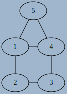

# Les graphes : définitions et vocabulaire

!!! info "Problème des sept ponts de Königsberg"

	La ville de Königsberg (aujourd'hui Kaliningrad) est construite autour de deux îles situées sur le Pregel et reliées entre elles par un pont. Six autres ponts relient les rives de la rivière à l'une ou l'autre des deux îles, comme représentés sur le plan ci-dessus. 
	
	{: style="width:50%; margin:auto;display:block;background-color: #d2dce0;"}
	
	
	Le problème consiste à déterminer s'il existe ou non une promenade dans les rues de Königsberg permettant, à partir d'un point de départ au choix, de passer une et une seule fois par chaque pont, et de revenir à son point de départ, étant entendu qu'on ne peut traverser le Pregel qu'en passant sur les ponts. 
	
	Le mathématicien [Leonhard Euler](https://fr.wikipedia.org/wiki/Leonhard_Euler){: target="_blank"} donna la solution de ce problème en utilisant les prémices de ce qu'on appelera {==**Théorie des graphes**==}
	

## Graphes orientés et non-orientés

!!! abstract "Graphe non orienté et vocabulaire"

	Un Graphe $G$ est la donnée de d'un ensemble fini de {==**nœuds**==}(*nodes* en anglais) ou {==**sommets**==} (*vertices* en anglais) reliés entre eux par des liens (*edges* en anglais).
	
	Si les liens sont :
	
	* {==**bidirectionnels**==} (on peut les emprunter dans les deux sens), le graphe sera alors appelé {==**non-orienté**==}. On parlera alors de {==**nœuds**==} et les liens seront appelés {==**arêtes**==}, et représentés par des **segments** ;

	* {==**unidirectionnels**==} (on peut les emprunter dans un seul sens), le graphe sera alors appelé {==**orienté**==}. On parlera alors de {==**sommets**==} et les liens seront appelés {==**arcs**==}, et représentés par des **flèches**.

!!! example "Graphe du problème des ponts de Königsberg"

	Le graphe suivant est un représentant du problème des ponts de Königsberg :	
	
	{: style="width:20%; margin:auto;display:block;background-color: #d2dce0;" title="Graphe Konigsberg"}

	* Les ponts pouvant être franchis dans les deux sens, le graphe est **non-orienté**.
	* Les différentes zones (berges et iles) sont les sommets $A, B, C, D$ du graphe.
	* les différents ponts sont les arêtes $a, b, c, d, e, f, g$.
	
	On dira qu'il s'agit d'une représentation, car la forme du graphe n'est pas importante. Les dessins ci-dessous représentent le même graphe :
	
	

	

	{: style="width:60%; margin:auto;display:block;background-color: #d2dce0;" title="Graphe Konigsberg V2"}

	

	

	{: style="width:60%; margin:auto;display:block;background-color: #d2dce0;" title="Graphe Konigsberg V3"}

	

	

	{: style="width:60%; margin:auto;display:block;background-color: #d2dce0;" title="Graphe Konigsberg V4"}

	

	

	
	
!!! example "Graphe d'état d'un processus"

	Dans le cours sur les processus, nous avons vu le schéma suivant :
	
	{: style="width:30%; margin:auto;display:block;background-color: #d2dce0;" title="État processus, image wikipedia"}
	
	* Le graphe est **orienté**
	* Les différentes états sont les sommets `départ`, `Prêt`, `Elu`, `Bloqué` et `terminé`.
	* les différentes transitions sont les arcs `Réveil`, `Élection`, `Blocage`, `Déblocage` et `Fin`.
	
	
!!! abstract "Voisinage"

	Si il existe un arc d'un sommet $s$ à un sommet $t$, on dit que $t$ est **adjacent** à $s$, où que $t$ est un {==**voisin**==} de $s$.

!!! example "Exemple"	
	Dans le graphe ci-dessous :

	{: style="width:20%;margin:auto;display:block;background-color: #d2dce0;" title="Voisinages"}

	* `A` a pour voisins `B`, `C` et `D` ;
	* `B` a pour voisins `D` et `C` ;
	* `C` n'a aucun voisin ;
	* `D` a pour voisin `A`.
	
!!! abtsract "Divers vocabulaire"	

	* {==**L'ordre**==} d'un graphe $G$ est le nombre de sommets qui composent ce graphe, et est noté $n = ord(G)$.
	* La {==**taille**==} d'un graphe est le nombre d'arcs/arêtes qui le composent.
	* Le {==**degré d'un sommet**==} est le nombre d'arêtes dont ce sommet est une extrémité.
	* On dira qu'un graphe est {==**complet**==} si tous ses sommets sont adjacents les uns avec les autres.
	* On dira qu'un sommet est {==**isolé**==} s'il n'est relié a aucun autre sommet.
	* On parlera de {==**boucle**==} lorsqu'un arc ou une arête a ses deux extrémités sur le meme sommet.
	* Un graphe est **simple** lorsqu’ un graphe n’a aucune boucle et si deux arêtes ne relient jamais les mêmes paires de sommets.
  
!!! example "Exemple : graphe de recherche de texte"
 
	On considère le graphe suivant :
	
	{: style="width:60%;margin:auto;display:block;background-color: #d2dce0;" title="Recherche Bob"}
	
	* Ce graphe est d'ordre 4 et de taille 9.
	* Le noeud `2` est de degré 4
	* Ce graphe n'est pas complet car le noeud `2` n'est pas pas relié à `1`.
	* Il y a une boucle au noeud `0`, qui est donc d'ordre 6.
	* Aucun sommet n'est isolé.
	

!!! question "Aventuriers du rail"

	=== "Énoncé"
		&laquo; Les aventuriers du Rail &raquo; est un jeu de plateau qui a pour but de relier les gares de différentes villes sur une carte préexistante, pour ainsi créer son réseau ferroviaire au détriment des autres joueurs. Il existe différentes versions du jeu, la carte ci-dessous étant la carte de la version Europe.

		{: style="width:60%;margin:auto;display:block;background-color: #d2dce0;" title="Les aventuriers du rail version Europe, Days of Wonder"}
		
		Une telle carte peut-être modélisée par un graphe. On en donne ci-dessous une partie en ayant extrait une partie des liaisons ferroviaires

		{: style="width:40%;margin:auto;display:block;background-color: #d2dce0;" title="Graphe Les aventuriers du rail version Europe, Days of Wonder"}

		1. A quoi correspond chacun des sommets ? chaque arête ?
		1. Quel est l’ordre du graphe ? Quelle est sa taille ?
		1. Quel est le degré de Paris ? de Rome ? de Marseille ?
		1. Comment peut-on interpréter les résultats de la question 3 ?
		1. Ce graphe est-il complet ?
		
	=== "Réponses"
		A venir !

!!! question "Région Midi-Pyrénées"

	=== "Enoncé"
		On donne ci-dessous un extrait de la carte de la France administrative ( avant remaniement des régions...). On s’intéresse à la région Midi-Pyrénées et aux huit départements qui la composent. On s'intéresse aux frontières communes entre les départements de cette région.

		{: style="width:60%;margin:auto;display:block;background-color: #d2dce0;" title="découpage départemental région Midi-Pyrénées"}
		
		1. Représenter cette carte par un graphe mettant en évidence ce découpage.
		1. A quoi correspond chacun des sommets ? chaque arête ?
		1. Quel est l'ordre du graphe ? sa taille ?
		1. Ce graphe est-il complet ?
		1. Déterminer le degré de chaque sommet.

!!! question "Une conjecture su les graphes non-orientés"

	=== "Enoncé"
		1. On considère l’échiquier $3 \times 3$ ci-dessous dans lequel on s’intéresse au déplacement du cavalier noir.
	
			{: style="width:20%;margin:auto;display:block;background-color: #d2dce0;" title="Echiquier"}

			1. Représenter par un graphe cet échiquier, les sommets étant les cases de l'échiquier, et les arêtes représentant les déplacements possibles du cavalier.
			1. Quel est l'ordre de ce graphe ?
			1. Ce graphe est-il complet ?
			1. Que peut-on dire du sommet $b2$ ?
			1. Compléter le tableau des degrés des sommets du graphe.
			1. Calculer la somme des degrés des sommets ainsi que le nombre d'arêtes.
		2. Pour chacun des graphes suivants, calculer la somme des degrés des sommets ainsi que le nombre d'arêtes, puis émettre une conjecture :

			{: style="width:60%;margin:auto;display:block;background-color: #d2dce0;" title="Graphes simples"}
			
	=== "réponses"
		A venir !
		
!!! abstract "Lemme dit &laquo; des poignées de main&raquo;"

	=== "Théorème"
		La somme des degrés des sommets d’un graphe non orienté est égale **au double** du nombre d’arêtes du graphe. 
	=== "Preuve"
		Lorsqu’on additionne les degrés des sommets, chaque arête est comptée deux fois, une fois pour chaque extrémité.

!!! question "Les poignées de main"

	=== "Énoncé"
		 Les vingt-quatre maires des vingt-quatre communes de l’île de la Réunion se sont donné rendez-vous lors de l’assemblée générale de l’Association des Maires du Département de la Réunion (AMDR). À cette occasion, chaque maire serre la main de tous les autres maires. Quel est le nombre de poignées de mains échangées ?
		 
	=== "Solution"
		A venir !

## Hors programme : le langage `dot`

Il existe un ensemble d'outils informatiques spécialement dédiés à la création de graphes : `GraphViz`. Il en existe de nombreuses versions, mais vous pouvez en trouver une version en ligne [ici](https://bit.ly/3EOF2x9){: target="_blank"}, avec le graphe de l'exemple précédent comme exemple d'utilisation du langage.

!!! question "pour s'amuser un peu"

	===  "Enoncé"
	
		Créer le graphe orienté suivant :
		
		* les sommets sont les nombres de 2 à 12 ;
		* un arc existe entre `a` et `b` si et seulement si `a` est un multiple de `b`.
		
	=== "Réponse"
		
		La solution [ici](https://bit.ly/38nqxUI){: target="_blank"}
		

## Graphes pondérés

Parfois il est nécessaire d'associer une valeur aux arcs/arêtes d'un graphe (orienté ou non). On parle alors d'ajouter une {==**pondération**==}, et de {==**graphes pondérés**==}.

Nous avons déjà rencontré ces graphes par exemple dans la partie routage, où les liaisons entre routeurs possèdent :

* soit une distance ;
* soit une vitesse;

Les valeurs de pondérations sont données directement à côté des arcs/arêtes sur le graphe.

!!! exemple "Exemple"

	Le graphe pondéré suivant représente les distances routières minimales entre les villes de Paris (`P`), Lyon (`L`), Marseille (`M`), Nantes (`N`), Bordeaux (`B`) et Toulouse (`T`).
	
	{: style="width:30%;margin:auto;display:block;background-color: #d2dce0;" title="Graphe pondérés"}

## Chemins et cycles

!!! abstract "Chemins et cycles"
	Dans un graphe donné, une {==**chaîne**==} (graphe non-orienté) ou un {==**chemin**==} (graphe orienté) reliant un sommet $u$ à un sommet $v$ est une séquence finie de sommets reliés deux à deux par des arcs/arêtes et menant de $u$ à $v$.
	
	Un chemin est dit {==**simple**==} s'il n'emprunte pas deux fois le même arc/arête, et {==**élémentaire**==} si il ne passe pas deux fois par le même sommet.
	
	Un chemin *simple* reliant  un sommet à lui même et contenant au moins un arc est appelé un {==**cycle**==}(graphe non-orienté) ou un {==**circuit**==}(graphe orienté).
	
!!! example "Exemple"

	{: style="width:30%;margin:auto;display:block;background-color: #d2dce0;" title="Graphe exemple chemins"}
		
	Sur le graphe ci-dessus, `a -> c -> d -> e` est un chemin de `a` à `e`, mais il n'est pas unique.
	
	On peut aussi avoir :
	
	* `a -> b -> c -> d -> e`
	* `a -> c -> d -> b -> c -> d -> e`
	* et tous les chemins empruntant plusieurs fois le cycle `b -> c -> d -> b`

	Il n'existe par contre pas de chemins menant de `d` à `a`.

	Le chemin `b -> c -> d -> b` est un circuit.
	
!!! abstract "Longueur d'un chemin et distance entre deux sommets"
		
	La **longueur d'un chemin** est définie comme étant le nombre d'arcs/arêtes composant ce chemin.
	
	La {==**distance**==} entre deux sommets est la **longueur du plus petit chemin** reliant ces deux sommets. Par convention la distance entre un sommet et lui-même est 0, et n'est pas définie s'il n'existe pas de chemins entre les deux sommets.
	
!!! example "Exemple"
	
	Dans le graphe précédent :
	
	{: style="width:30%;margin:auto;display:block;background-color: #d2dce0;" title="Graphe exemple chemins"}
	
	* Le chemin `a -> b -> c -> d -> e` est de longueur 4.
	* La distance entre `a` et `e` est 3 (par le chemin `a -> c -> d -> e`).
	
## Connexité

!!! abstract "Connexité"

	Un graphe *non-orienté* est dit {==**connexe**==} si il existe un chemin entre deux sommets quelconque du graphe (autrement dit il est en un seul morceau).
	
	Lorsqu'un graphe non-orienté est composé de plusieurs morceaux, on chaque morceau  est appelé une {==**composante connexe**==} du graphe.
	
!!! example "Exemple"
	
	{: style="width:30%;margin:auto;display:block;background-color: #d2dce0;" title="Graphe exemple connexité"}
	
	Le graphe ci-dessus n'est pas connexe, mais possède deux composantes connexes : ${0;1;2;3;4}$ et ${5;6;7;8}$.
	
!!! warning

	* Il existe des définitions similaires pour les graphes orientés (faible connexité et forte connexité), mais elles dépassent le cadre du programme.
	* Un arbre est un **graphe connexe acyclique**.

## Graphes Eulériens

!!! abstract "Chaîne/Chemin Eulérien"

	Une {==**Chaîne/Chemin Eulérien(ne)**==} ou {==**Parcours Eulérien**==} est une chaîne/chemin qui passe une fois et une seule par chaque arête du graphe.
	
	Un {==**Cycle/Circuit Eulérien**==}, ou une {==**Tournée Eulérienne**==}, est un cycle qui parcoure toutes les arêtes/arcs du graphe une et une seule fois (en revenant au sommet initial)
	
!!! question "Trouver des Chemins Eulériens"

	=== "Énoncé"
		Pour chacun des graphes suivants, trouver lorsque c'est possible une chaîne eulérienne / un parcours eulérien ( ce qui revient à tracer le graphe sans lever le stylo, en ne passant qu'une et une seule fois par chaque arête) : 
		
		

		

		{: style="width:90%; margin:auto;display:block;background-color: #d2dce0;" }

		

		

		{: style="width:90%; margin:auto;display:block;background-color: #d2dce0;" }

		

		

		{: style="width:90%; margin:auto;display:block;background-color: #d2dce0;" }

		

		

		{: style="width:90%; margin:auto;display:block;background-color: #d2dce0;" }

		

		

		{: style="width:90%; margin:auto;display:block;background-color: #d2dce0;" }

		

		

	
	=== "Réponses"
		A venir !
		
!!! abstract "Théorème d'Euler"

	Pour un graphe non-orienté, le {==**théorème d'Euler**==} énonce :

	* Un graphe connexe admet un **parcours eulérien** si et seulement si ses sommets sont tous de degré pair sauf au plus deux.
	* Un graphe connexe admet un **circuit eulérien** si et seulement si tous ses sommets sont de degré pair.

Que peut-on conclure alors pour le problème des ponts de Königsberg ?

