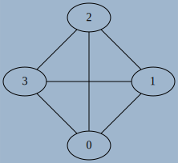

# Modélisation de graphes en Python

## Interface d'un graphe 

Il existe de nombreuses manières d'{==**implémenter**==} un graphe, mais dans de nombreux cas l'{==**interface**==} recherchée est  assez simple à concevoir. A ce titre l'utilisation d'une classe semble être judicieuse. Afin de définir l'interface choisie nous devons d'abord considérér les spécifications minimales de la création d'un graphe, orienté ou non, et éventuellement pondéré :

1. Obtenir un graphe vide par une méthode constructeur
1. Etre capable d'ajouter un noeud/sommet à un graphe existant.
1. Etre capable d'ajouter des arêtes/arcs à un graphe existant, avec *une éventuelle pondération*.
1. Obtenir la liste des voisins d'un sommet.

Une fois ces opérations élémentaires implémentées, nous pourrons rajouter des possibilités supplémentaires, comme par exemple

* obtenir l'ordre du graphe, sa taille ;
* obtenir donc le degré d'un sommet ;
* savoir si il existe un parcours eulérien ou un cycle eulérien dans ce graphe ;
* parcourir ce graphe en partant d'un sommet donné ;
* repérer les éventuels cycles du graphe ;
* appliquer un algorithme spécifique, comem celui de Dijkstra par exemple.

Pour commencer, nous allons donc définir une classe `Graph`, dont l'interface minimale sera la suivante (des ajustements seront possibles selon si le graphe est orienté ou non, pondéré ou non) :

| Méthode | Arguments | Valeur de retour | Description |
| :--- | :---: | :---: | :--- |
| `__init__` | aucun ou  ordre `n` du graphe  | aucune | Crée un graphe vide, d'ordre `n`b si nécessaire |
| `add_vertice` | aucun ou `label` du  sommet | aucune | Ajoute un sommet d'étiquette `label` si nécesaire |
| `add_edge` | `s` et `e`, `p` éventuellement | aucune | Ajoute un arc allant de `s` à `e`, avec la pondération `p` si nécessaire |
| `exist_edge` | `s` et `e` | booléen | Renvoie `True` si il existe un arc entre `s` et `e` |
| `get_neighbours` | `s` | itérable | renvoie un *itérable* contenant les voisins de `s` |


## Implémentation par une Matrice d'adjacence


!!! abstract "Matrice d'adjacence"
	Une des possibilités pour représenter un graphe est d'utiliser ce qu'on appelle une {==**matrice d'adjacence**==}. Dans ce type de représentation, les sommets sont **ordonnés**, et considérés comme étiquetés par des entiers de $0$ à $n-1$, où $n$ est l'ordre du graphe.

	Dans cette représentation, le coefficient $a_{i~j}$ de la matrice vaut :

	* $0$ si il n'existe pas d'arc entre les sommets $i$ et $j$ ;
	* $1$ ou la pondération $p$ si il existe un arc entre les sommets $i$ et $j$.
	
!!! example "Exemples"

	
	* la matrice d'adjacence  $M = \begin{pmatrix}
		0 & 1 & 0 & 1\\
		0 & 0 & 1 & 1\\
		0 & 1 & 1 & 0 \\
		0 & 0 & 1 & 0
		\end{pmatrix}$  	correspond au graphe suivant, avec les sommets dans l'ordre numérique  {: style="width:10%;background-color: #546d78;" }
		
	* la matrice d'adjacence  $M = 	\begin{pmatrix}
		0 & 1 & 1 \\
		1 & 0 & 1 \\
		1 & 1 & 0 
		\end{pmatrix}$ correspond au graphe suivant, avec les sommets dans l'ordre numérique {: style="width:10%;background-color: #546d78;" }
		
	* la matrice d'adjacence $M = \begin{pmatrix}
		0 & 10 & 0 & 0 \\
		0 & 0 & 20 & 0 \\
		40 & 0 & 0 & 30 \\
		5 & 0 & 0 & 0
		\end{pmatrix}$ correspond au graphe suivant, avec les sommets dans l'ordre *alphabétique* {: style="width:10%;background-color: #546d78;" }
		
		
!!! question "Associer Matrices d'adjacence et graphes"

	=== "Enoncé"
	
		1. Déterminer la matrice d'adjacence associée à ce graphe {: style="width:15%;background-color: #546d78;" }
		1. Déterminer la matrice d'adjacence associée à ce graphe {: style="width:15%;background-color: #546d78;" }
		1. Déterminer la matrice d'adjacence associée à ce graphe {: style="width:15%;background-color: #546d78;" }
		1. Déterminer la matrice d'adjacence associée à ce graphe {: style="width:30%;background-color: #546d78;" }		
		1. Tracer un graphe pouvant correspondre à la matrice $\begin{pmatrix}
		1 & 0 & 1 \\
		0 & 0 & 0 \\
		1 & 1 & 1 \\
		\end{pmatrix}$ Est-ce un graphe orienté ou non-orienté ?
		1. Tracer un graphe pouvant correspondre à la matrice $\begin{pmatrix}
		1 & 0 & 1 & 1 & 1 \\
		0 & 0 & 1 & 0 & 1 \\
		1 & 1 & 1 & 0 & 1 \\
		1 & 0 & 0 & 0 & 1 \\
		1 & 1 & 1 & 1 & 0 
		\end{pmatrix}$. Est-ce un graphe orienté ou non-orienté ?
		1. Tracer un graphe pouvant correspondre à la matrice $\begin{pmatrix}
		1 & 2 & 3 \\
		10 & 20 & 30 \\
		100 & 200 & 300 \\
		\end{pmatrix}$ Est-ce un graphe orienté ou non-orienté ?
		1. Quelle propriété semble posséder les matrices d'adjacence d'un graphe non-orienté ?
		
!!! question "Implémentation en Python"

	=== "Enoncé"
	
		Le code suivant permet d'implémenter en partie l'interface voulue d'un graphe avec une matrice d'adjacence :
		
		```` python
		class Graph :
			def __init__(self, n=0) :
				self.n = n
				self.adj = [[0]*n for _ in range(n)]
				
			def add_vertice(self) :
				self.n +=1
				for l in self.adj :
					l.append(0)
				self.adj.append([0]*(self.n))
				
			def add_edge(self, s, e, p=1) :
				self.adj[s][e] = p			
					
		````
		
		1. Compléter la *méthode*  `exist_edge` de la classe `Graph` pour qu'elle corresponde aux spécifications de l'interface.
		1. Compléter la *méthode*  `get_neighbours` de la classe `Graph` pour qu'elle corresponde aux spécifications de l'interface.
		1. Ajouter une méthode `get_order` à la classe `Graph` pour qu'elle renvoie l'ordre du graphe.
		1. Ajouter une méthode `get_degree` à la classe `Graph` pour qu'elle renvoie le degré d'un sommet passé en argument.
		1. Ajouter une méthode `is_directed` à la classe `Graph` pour qu'elle renvoie `True` si le graphe est orienté et `False` sinon.
		1. Ajouter une méthode `is_undirected_and_eulerian` qui renvoie :
			* `False` si le graphe est non-orienté et qu'il n'existe pas de parcours eulérien du graphe
			* `True` si le graphe est non-orienté et qu'il existe un cycle eulérien.
			* un tuple `(s,e)` donnant les sommlets de départ et d'arrivée d'un éventuel chemin eulérien.
		1. Ajouter une méthode `delete_edge` à la classe `Graph` pour qu'elle supprime l'arc situé entre les sommets `s` et `e` passés en argument.
		1. Ajouter une méthode DUNDERS `__repr__` afin qu'elle renvoie la chaîne de caractère correspondant à la matrice d'adjacence (et donc directement utilisable par l'instruction `print(G)`).
		

!!! warning "Limites du modèle"		
	
	Si l'utilisation d'une matrice d'adjacence sous la forme présentée est très utile d'un point de vue mathématique (voir par exemple la propriété de l'itérée sur la page [wikipedia](https://fr.wikipedia.org/wiki/Matrice_d%27adjacence){: target="_blank"}), et très facile à mettre en oeuvre, elle possède néanmoins ceryaines limites :
	
	* Elle utilise une place en mémoire proportionnelle à $n^2$. Pour un graphe de 1000 sommets, il faudra plus d'un million d'entiers pour stocker cette matrice d'adjacence, ce qui commence à être considérable;
	* Pour connaître les voisins d'un sommet, il faut parcourir la totalité de la lign,e correspondant à ce sommet, ce qui peut rapidement être trop long	.
	* Les sommets sont limités à des entiers, ou à un ordre défini, et il est difficile d'intégrer de nouveau sommets qui ne respecteraient pas la convention fixée.

## Implémentation par un dictionnaire

Pour réduire la taille prise en mémoire par la matrice d'adjacence, il est possible d'utiliser un  {==**dictionnaire**==} de voisinage. Ce dictionnaire apportera en plus la capacité d'avoir des chaînes des caractères comme identifiant des sommets.

Selon que le graphe soit pondéré ou non, on aura quelques différences dans l'implémentation.

### Graphe non pondéré

!!! question "Implémentation en Python"

	=== "Enoncé"
	
		Le code suivant permet d'implémenter en partie l'interface voulue d'un graphe avec un dictionnaire de voisinage  :
		
		```` python
		class Graph :
			def __init__(self) :
				self.adj = {}
				
			def add_vertice(self,s) :
				if s not in self.adj :
					self.adj[s] = set() # crée un objet set vide, et graranti l'unicité de chaque élément
				
			def add_edge(self, s, e) :
				self.add_vertice(s)
				self.add_vertice(e)
				self.adj[s].add(e) # La méthode add des objets de type set fonctionne comme append
					
		````
		
		1. Compléter la *méthode*  `exist_edge` de la classe `Graph` pour qu'elle corresponde aux spécifications de l'interface.
		1. Compléter la *méthode*  `get_neighbours` de la classe `Graph` pour qu'elle corresponde aux spécifications de l'interface.
		1. Ajouter une méthode `get_order` à la classe `Graph` pour qu'elle renvoie l'ordre du graphe.
		1. Ajouter une méthode `get_degree` à la classe `Graph` pour qu'elle renvoie le degré d'un sommet passé en argument.
		1. Ajouter une méthode `is_directed` à la classe `Graph` pour qu'elle renvoie `True` si le graphe est orienté et `False` sinon.
		1. Ajouter une méthode `is_undirected_and_eulerian` qui renvoie :
			* `False` si le graphe est non-orienté et qu'il n'existe pas de parcours eulérien du graphe
			* `True` si le graphe est non-orienté et qu'il existe un cycle eulérien.
			* un tuple `(s,e)` donnant les sommlets de départ et d'arrivée d'un éventuel chemin eulérien.
		1. Ajouter une méthode `delete_edge` à la classe `Graph` pour qu'elle supprime l'arc situé entre les sommets `s` et `e` passés en argument.
		1. Ajouter une méthode DUNDERS `__repr__` afin qu'elle renvoie la chaîne de caractère correspondant à la matrice d'adjacence (et donc directement utilisable par l'instruction `print(G)`).

### Graphes pondérés 

Il existe pluseiurs méthodes permettant d'ajouter une pondération sur chaque arc :

*  on peut ajouter dans le dictionnaire de voisinage un tuple contenant à la fois le nom et le poids de l'arc considéré ;
* on peut aussi ajouter un autre dictionnaire parallèle à `self.adj` dont les clés sont les couples de sommets et les valeurs le poids de l'arc considéré.


!!! question "Implémentation en Python avec un tuple"

	=== "Enoncé"
	
		Le code suivant permet d'implémenter en partie l'interface voulue d'un graphe avec un dictionnaire de voisinage et une pondération :
		
		```` python
		class Graph :
			def __init__(self) :
				self.adj = {}
				
			def add_vertice(self,s) :
				if s not in self.adj :
					self.adj[s] = set() # crée un objet set vide, et graranti l'unicité de chaque élément
				
			def add_edge(self, s, e, p=1) :
				self.add_vertice(s)
				self.add_vertice(e)
				self.adj[s].add((e,p)) # La méthode add des objets de type set
					
		````
		
		Quels sont les changements à apporter aux autres méthodes par rapport à la situation sans pondération ?
		
!!! question "Implémentation en Python avec un dictionnaire d'arcs"

	=== "Enoncé"
	
		Le code suivant permet d'implémenter en partie l'interface voulue d'un graphe avec un dictionnaire de voisinage et une pondération :
		
		```` python
		class Graph :
			def __init__(self) :
				self.adj = {}
				self.edges= {}
				
			def add_vertice(self,s) :
				if s not in self.adj :
					self.adj[s] = set() 
				
			def add_edge(self, s, e, p=1) :
				self.add_vertice(s)
				self.add_vertice(e)
				self.adj[s].add(e) 
				self.edges[(s,e)]=p
					
		````
		
		Quels sont les changements à apporter aux autres méthodes par rapport à la situation précédente ?

	=== "réponses"
		A venir
		
		
## Notion d'héritage (hors programme)

!!! warning "Construction d'un graphe non-orienté"
	
	<div style="display:flex;">
	<div style="display : inline; width : 50%;">

	{: style="width:30%; margin:auto;display:block;background-color: #546d78;" }

	</div>
	<div style="display : inline; width : 50%;">
	
	Dans toutes les implémentations que nous avons jusqu'ici créées, nous sommes resté sur une notion de graphe orienté. Plus précisémment, pour créer un graphe non orienté tel que celui ci-contre à partir d'une des implémentations précédentes, il faudra utiliser le code suivant :

	```` python
	G = Graph()
	G.add_edge(0, 1, 20)
	G.add_edge(1, 0, 20)
	G.add_edge(0, 2, 128)
	G.add_edge(2, 0, 128)
	G.add_edge(1, 2, 42)
	G.add_edge(2, 1, 42)
	````
	
	On se retrouve donc à devoir doubler les lignes à chaque création d'arête... Ce qui n'est pas du tout ergonomique...
	
	</div>
	</div>
	
Bien entendu, il est possible de créer de nouveau une nouvelle classe qui implémenterait cette possibilité immédiatement. Mais il exsite aussi en POO une notion fondamentale qui va nous permettre, sans changer le code de notre classe `Graph` actuelle et en effectuant qu'un codage minimal, de créer une nouvelle classe permettant d'implémenter spécifiquement des graphes non orientés.

Il s'agit de le notion d'{==**héritage de classe**==}. Sans rentrer dans les détails(que vous pouvez par exemple trouver [ici](https://devstory.net/11417/python-inheritance-polymorphism){: target ="_blank"}), il s'agira de créer une classe *fille* héritant de toutes les capacités de la classe *mère* - attributs et méthodes, mais dans laquelle on pourra rajouter ou modifier des caractéristiques spécifiques.

Ainsi, en simplifiant, on peut dire qu'un graphe non-orienté est un graphe orienté dans lequel les arcs sont doublés. Les graphes non-orientés sont donc une **sous-classe** des graphes orientés, d'un point de vue codage.

Voici le code permettant de créer cette nouvelle classe :

```` python linenums="1"
class UndirectedGraph(Graph) :
    def __init__(self) :
        super().__init__()
        
    def add_edge(self, s, e, p=1) :
        super().add_edge(s,e,p)
        super().add_edge(e,s,p)

````

* En ligne 1, on crée une classe `UndirectedGraph`, qui *dérive*, ou *hérite* de la classe `Graph`. 
* En ligne 2, on définit la méthode constructeur des objets de classe `UndirectedGraph`.  Celle-ci se compose dune unique ligne, disant simplement que l'initialisation d'un objet de classe `UndirectedGraph` se fait de la même manière qu'un objet de la classe *mère* `Graph`, par l'intermédiaire du mot-clé `super()`. 
	On fait ainsi appel à la méthode constructeur de la classe `Graph` pour construire un objet de classe `UndirectedGraph`.
* En ligne 5, on va redéfinir la méthode `add_edge`. On appelle une telle redéfinition un **surcharge**  de méthode. Il s'agira en fait d'appeler deux fois la méthode `add_edge` de la classe `Graph`, encore une fois en utilisant le mot-clé `super()`.


Une fois cette nouvelle classe créé, elle peut être directement utilisée *tout en conservant toutes les méthodes de la classe mère* :

```` python linenums="1"
G = UndirectedGraph()
G.add_edge(0, 1, 20)
G.add_edge(0, 2, 128)
G.add_edge(2, 1, 42)
G.get_neighbours(1)
G.get_order()
print(G)
````

Dan le code ci-dessus, même si nous n'avons pas surclasssé les méthodes `get_neighbours`, `get_order` et la méthode DUNDERS `__repr__`, elles demeurent accessible à tout objet de classe `UndirectedGraph`, puisque directement héritées de la classe mère `Graph`.


!!! abstract "Objets en Python"

	En Python, tout est objet. Cette phrase n'est pas qu'une déclaration de principe, puisqu'il existe une classe générique (appelée **classe abstraite**) `Object`, dont dérivent toutes les autres classes, comme `int`, `float`, `tuple`,...
	
!!! abstract "Polymorphisme"

	Il est tout à fait possible de faire hériter une classe de plusieurs autres classes. Cette notion s'appelle le {==**polymorphisme**==}, mais est complètement hors du programme de terminale...
	
## Exemple d'utilisation : Coloration d'un graphe

!!! abstract "Théorème des 4 couleurs"

	Le [{==**théorème des 4 couleurs**==}](https://fr.wikipedia.org/wiki/Th%C3%A9or%C3%A8me_des_quatre_couleurs){: target="_blank"} est un théorème classique de théorie des graphes. D'après wikipedia :
	
	&laquo; Le théorème des quatre couleurs indique qu'il est possible, en n'utilisant que quatre couleurs différentes, de colorier n'importe quelle carte découpée en régions connexes, de sorte que deux régions adjacentes (ou limitrophes), c'est-à-dire ayant toutes une frontière (et non simplement un point) en commun reçoivent toujours deux couleurs distinctes. L'énoncé peut varier et concerner, de manière tout à fait équivalente, la coloration des faces d'un polyèdre ou celle des sommets d'un graphe planaire, en remplaçant la carte par un graphe dont les sommets sont les régions et les arêtes sont les frontières entre régions. 
	[...]
	Même si l'énoncé de ce théorème est élémentaire, on n'en connaît pas de preuve simple. Les démonstrations connues décomposent le problème en un nombre de sous-cas tellement important qu'elles nécessitent l'assistance d'un ordinateur pour être vérifiées.

	Le théorème se généralise à certaines classes de graphes non planaires. Cependant, lorsqu'on généralise le problème à un graphe quelconque, il devient [NP-complet](https://fr.wikipedia.org/wiki/Probl%C3%A8me_NP-complet){: target="_blank"} de déterminer s'il est coloriable avec seulement quatre couleurs (ou même trois). 
	&raquo;
