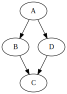
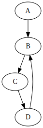
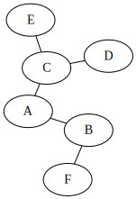
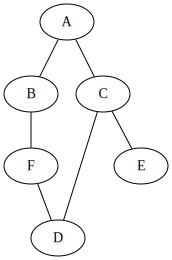

# Parcours de graphes et applications

## Parcours en profondeur

### Comparaison avec un arbre

Le {==**parcours en profondeur**==} d'un graphe (*Depth First Search* en anglais), c'est-à-dire un parcours où on explore chaque chemin jusqu'à son extrémité finale,  est équivalent à celui pour un arbre comme présenté dans le chapitre [idoine](/NSI/Terminale/C05/Def_Arbres/#parcours-en-profondeur-dfs-ou-depth-first-search){: target="_blank"}, à une subtilité prêt : dans un graphe il est possible de trouver des boucles, ce qui pourrait amener à un chemin infini :

!!! warning "le cas d'une boucle"

	{: style="width:15%; margin:auto;display:block;background-color: #546d78;"}
	
	Dans un parcours DFS d'un graphe comme ci-dessus, et en partant de $A$, on aura un parcours dans l'ordre suivant (en considérant les voisins dans l'ordre alphabétique) :
	
	* On ira de $A$ à $B$ puis de $B$ à $C$ ;
	* Une fois en $C$, il faut remonter au dernier sommet visité, donc $B$, et regarder si il existe d'autres voisins, donc on passera ensuite à $D$, puis à $A$, puis à $B$, etc.
	
	On obtient donc un parcours infini $A -> B -> C -> D -> A -> ...$, et l'algorithme ne s'arrête pas.


### Algorithme en langage naturel

Pour que l'algorithme puisse fonctionner, il faudra donc *marquer* les sommets déjà visités, comme sur l'exemple suivant :

{: style="width:80%; margin:auto;display:block;background-color: #546d78;"}

On considèrera qu'il existe une méthode pour *marquer* les sommets, et donc qu'on n'explore plus un sommet déjà marqué.

````
fonction explore_graphe(G, s) :
	Marquer(s)
	pour chaque voisin v de s :
		si v n'est pas marqué :
			explorer_graphe(G,v)
````

!!! warning "Graphes avec de multiples composantes connexes"
	Cette fonction ne permet pas d'explorer tout le graphe si celui-ci comporte pluiseurs composantes connexes,  car on explore uniquement de voisins en voisins :
	
	{: style="width:30%; margin:auto;display:block;background-color: #546d78;"}
	
	Sur un graphe tel que ci-dessus, la fonction précédente appelée sur $A$ n'explorera que les sommets $A$, $B$, $C$ et $D$ dans cet ordre.
	
Il faut donc encapsuler la fonction précédente dans une autre fonction :

````
fonction parcours_profondeur(G) :
	pour chaque sommet s de G :
		si s n'est pas marqué :
			explorer_graphe(G,s)
````

### Implémentation en Python

Pour pouvoir implémenter le parcours de graphe en profondeur, il nous faut utiliser une structure permettant de conserver les sommets visités, tout en gardant leur ordre. Une solution évidente est d'utiliser une *liste Python*, et d'utiliser en particulier sa propriété de **mutabilité**.

!!! asbtract "Hors programme : paramètre mutable d'une fonction"

	Considérons le code suivant et son exécution dans PythonTutor :
	
	<iframe width="1000" height="500" frameborder="0" src="https://pythontutor.com/iframe-embed.html#code=def%20fibonacci%28n,%20lst,%20tpl%29%20%3A%0A%20%20%20%20lst.append%28n%29%0A%20%20%20%20tpl%20%3D%20*tpl,%20n%0A%20%20%20%20if%20n%20%3C2%20%3A%20%20%20%20%20%20%20%20%0A%20%20%20%20%20%20%20%20return%20n%0A%20%20%20%20else%20%3A%0A%20%20%20%20%20%20%20%20return%20fibonacci%28n-1,%20lst,%20tpl%29%20%2B%20fibonacci%28n-2,%20lst,%20tpl%29%0A%20%0Alst%20%3D%20%5B%5D%0Atpl%20%3D%20%28%29%0Afibonacci%284,%20lst,%20tpl%29&codeDivHeight=400&codeDivWidth=350&cumulative=false&curInstr=0&heapPrimitives=nevernest&origin=opt-frontend.js&py=3&rawInputLstJSON=%5B%5D&textReferences=false"> </iframe>
	
	L'objectif est de comprendre la différence entre objets **mutables** et **non-mutables** :
	
	* un objet de type `list` est mutable, et possède une méthode `.append` qui permet de lui ajouter un élément ;
	* un objet de type `tuple` est non-mutable. Pour ajouter un élément on est obligé de créer un nouvel objet, qu'on réaffecte au nom `tpl`   :
	
		```` python
		tpl = *tpl, n
		````
		
		On utilise ici l'opérateur `*` pour `unpacker` (décompacter) les éléments constituant le tuple `tpl`, puis ajouter l'élément `n` au nouveau tuple.
		
		
	A la fin de l'exécution du code, alors que les méthodes semblent similaires, on constate que les objets *tuples* créés ont disparu à la fin de l'exécution de chaque instance de la fonction `fibonacci`, alors que l'objet de type `list` a lui été modifié au fur et à mesure, et {==**que ces modifications sont conservées !**==}
	
	Le paramètre `lst` de la fonction `fibonacci` est donc un {==**argument mutable**==}, ce qui :
	
	* est parfois fort pratique ;
	* est souvent un {==**générateur d'effets de bords indésirés**==} !
	
??? asbtract "Totalement hors programme : utilisation d'une liste en paramètre non-mutable"

	En réalité, ce n'est pas tant la structure de liste utilisée qui est importante dans l'exemple ci-dessus, mais bien l'utilisation d'une méthode **en place** comme `append`. On peut en effet utiliser une liste comme un paramètre pseudo non-mutable comme dans l'exemple ci-dessous, avec la concaténation de listes :
	
	<iframe width="1000" height="500" frameborder="0" src="https://pythontutor.com/iframe-embed.html#code=def%20fibonacci%28n,%20mutable,%20pseudo_non_mutable%29%20%3A%0A%20%20%20%20mutable.append%28n%29%0A%20%20%20%20pseudo_non_mutable%20%3D%20pseudo_non_mutable%20%2B%20%5Bn%5D%0A%20%20%20%20if%20n%20%3C2%20%3A%20%20%20%20%20%20%20%20%0A%20%20%20%20%20%20%20%20return%20n%0A%20%20%20%20else%20%3A%0A%20%20%20%20%20%20%20%20return%20fibonacci%28n-1,%20mutable,%20pseudo_non_mutable%29%20%2B%20fibonacci%28n-2,%20mutable,%20pseudo_non_mutable%29%0A%20%20%20%20%20%0Amutable%20%3D%20%5B%5D%0Apseudo_non_mutable%20%3D%20%5B%5D%0Afibonacci%284,%20mutable,%20pseudo_non_mutable%29&codeDivHeight=400&codeDivWidth=350&cumulative=false&curInstr=58&heapPrimitives=nevernest&origin=opt-frontend.js&py=3&rawInputLstJSON=%5B%5D&textReferences=false"> </iframe>
	
	Au vu de mon expérience, un conseil : **NE FAITES SURTOUT PAS CA** ! Vous vous éviterez des heures de débuggage frustrantes !
	
	Si vous tenez à conserver un paramètre non-mutable, utilisez **TOUJOURS** une structure qui est construite en ce sens...
	
	
	
	

!!! question "Implémentation en Python"

	=== "Enoncé"
	
		1. Ajouter à la classe `Graph` (implémentation au choix) une méthode `get_vertices()` renvoyant la liste des sommets *dans l'ordre lexicographique*.
		2. Créer une fonction `explore_graph(G, s, explored)` qui explore récursivement le graphe `G` à partir du sommet `s`, connaissant un objet de type  `list` `explored` contenant la liste des sommets déjà explorés.
		3. Créer une fonction `DFS(G)` renvoyant la liste des sommets explorés, dans l'ordre d'exploration lexicographique (dans l'exemple du graphe à deux composantes connexes ci dessu, on obtiendra `[A, B, C, D, E, F, G, H]`, et dans l'exemple présenté exhaustivement, on aura `[A, B, D, E, C]`).
		
	=== "Corrigé"
		A venir !
		
## Parcours en largeur

### Comparaison avec un arbre
		
Le {==**parcours en largeur**==} d'un graphe (*Breadth First Search* en anglais), c'est-à-dire un parcours où on explore chaque chemin jusqu'à son extrémité finale,  est équivalent à celui pour un arbre comme présenté dans le chapitre [idoine](/NSI/Terminale/C05/Def_Arbres/#parcours-en-largeur){: target="_blank"}, tout en  ajoutant le même problème que pour le parcours en profondeur : il faut marquer les sommets déjà visités.

{: style="width:15%; margin:auto;display:block;background-color: #546d78;"}

Ainsi, dans le graphe ci-dessus, l'ordre de parcours des sommets est : $A, B, E, C, D, F, G, H$.

### Algorithme en langage naturel

L'algorithme itératif s'implémente à l'aide d'une file :

````
fonction explore_largeur(G, s):
       Créer une file f
       Enfiler s dans f
       marquer s
       tant que la file est non vide
            defiler f dans s
            afficher s
            pour tout voisin t de s dans G
                si t non marqué
                    Enfiler t dans f
                    marquer t
````

De même que pour un parcours en profondeur, la fonction ci-dessus ne permet pas un parcours de graphe non-connexe. On complètera donc cette fonction par :

````
fonction parcours_largeur(G) :
	Pour chaque sommet s de G 
		si s n'est pas marqué	
			explore_largeur(G,s)
````


### Implémentation en Python

!!! question "Percours en largeur"

	=== "Enoncé"
		
		1. Créer une fonction `explore_width(G,s)` qui effectue un parcours en largeur à partir du sommet `s` du graphe `G` et renvoie les sommets dans l'ordre de visite. Pour éviter d'avoir à réimplémenter nous-même une classe `File`, nous pouvons utiliser le module `queue` de Python et les commanes suivantes :
		
			* `F = queue.Queue()`, pour créer une file vide ;
			* `F.put(item)` : enfile `item` dans la file `F` ;
			* `item = F.get()` : défile la file `F` et stocke dans `item` ;
			
		2. Créer une fonction `BFS(G)` qui renvoie les sommets dans l'ordre de visite du parcours en largeur.
		
	=== "Corrigé"
		A venir !
		
## Application : Recherche de cycle dans un graphe

Il est parfois nécessaire de détecter dans un graphe la présence d'un cycle, comme par exemple :

* pour déterminer la longueur de cycle d'un [générateur de nombre pseudo-aléatoires](https://en.wikipedia.org/wiki/Pseudorandom_number_generator){: target="_blank"} ;
* en cryptographie, en particulier pour détecter des collisions dans des fonctions de hachage cryptographiques ([CHF](https://en.wikipedia.org/wiki/Cryptographic_hash_function){: target="_blank"}) ;
* pour détecter des boucles infinies dans certains programmes, en utilisant une représentation du programme sous la forme d'un graphe ([Méthodes formelles](https://fr.wikipedia.org/wiki/M%C3%A9thode_formelle_(informatique)){: target="_blank"}) ;
* etc.

Le parcours en profondeur est adapté aux recherches de cycles dans un graphe, mais il faudra lui apporter quelques modifications. En effet, dans le parcours en profondeur, on **marque un noeud avant d'explorer ses voisins**. Quand on retombe sur un noeud déjà marqué, on ne peut pas forcément savoir si c'est à cause de la présence d'un cycle. Prenons comme exemple les deux graphes ci-dessous :


!!! tips
	<div style="display:flex;">
	<div style="display : inline; width : 50%;">

	{: style="width:30%; margin:auto;display:block;background-color: #546d78;"}

	</div>
	<div style="display : inline; width : 50%;">

	{: style="width:30%; margin:auto;display:block;background-color: #546d78;"}

	</div>
	</div>

* Dans le cas du graphe de gauche, on va explorer `A`, puis `B` puis `C`, et donc `C` sera marqué. Puis on retombera sur `C` en venant de `D`, mais sans cycle puisqu'il s'agit de chemins parallèles.
* Dans le cas du graphe de droite, on va explorer `A`, puis `B` puis `C`, et donc `C` sera marqué. Puis on retombera sur `C` en venant de `D`, mais *par un cycle* !

La différence entre les deux situations est que dans le premier cas, *la visite des voisins de `C` est terminée*, alors qu'elle est *toujours en cours dans le deuxième cas*. On va donc devoir {==**différencier ces deux situations**==}.


!!! abstract "Algorithme de détection de cycles"

	Nous adopterons une solution en utilisant {==**3 couleurs**==} pour marquer ces sommets : blanc, gris et noir. Initialement, tous les sommets seront de {==**couleur blanche**==}.
	
	Lorsqu'on visitera un sommet `s` :
	
	* s'il est blanc :
		1. on colore le sommet `s` en gris ;
		2. on visite tous les voisins de `s` récursivement ;
		3. on colore le sommet `s` en noir une fois toutes les étapes précédentes franchies.
	* s'il est gris, c'est qu'on vient de découvrir un cycle ;
	* s'il est noir, on ne fait rien.
	
!!! question "Application"

	Pour chacun des graphes ci-dessous, appliquez l'algorithme de détection d'un cycle au graphe ci-dessous (vous partirez du sommet de votre choix). 
	
	=== "Graphe 1"
	
		{: style="width:15%; margin:auto;display:block;background-color: #546d78;"}
		
	=== "Graphe 2"
	
		{: style="width:15%; margin:auto;display:block;background-color: #546d78;"}


!!! tips "Codage en Python"

	```` python linenums="1"
	
	BLANC, GRIS, NOIR = 1, 2, 3
	
	### Un dictionnaire est mutable, donc on peut le modifier par appels récursifs.
	
	def parcours_cycle(graphe : Graph, couleur : dict , s : Sommet) -> boolean :
		if couleur[s] == ... :
			return True
		if couleur[s] == ... :
			return False
		couleur[s] = ...
		for v in graphe.get_neighbours(s) :
			got_cycle = parcours_cycle(g, couleur, s)
			if  got_cycle :
				return True
		couleur[s] = ...
		return False
		
	def cycle(graphe) :
		couleur = {}	
		for s in ... :
			couleur[s] = BLANC
		for s in ... :
			if parcours_cycle(graphe, couleur, s) :
				return True
		return False		
	
	````
