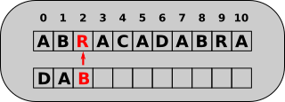
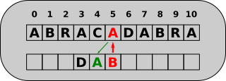
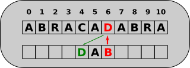
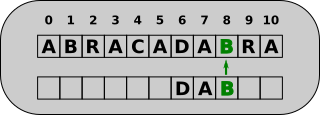
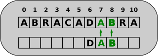
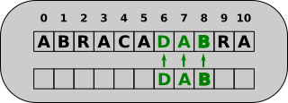

# Recherches textuelles

*Largement inspiré de [https://www.lyceum.fr/tg/nsi/5-algorithmique/5-recherche-textuelle](https://www.lyceum.fr/tg/nsi/5-algorithmique/5-recherche-textuelle){: target="blank"}*

!!! info "Le contexte"

	La recherche de sous-chaîne dans une chaîne donnée est un problème important de l'informatique, puisque ses applications sont nombreuses, comme pour les moteurs de recherches, l'utilisation des outils de recherche dans les traitements de textes ou navigateurs web, mais aussi au sein de la bio-informatique, pour la recherche de séquences données de nucléotides.

## L'algorithme naïf

Une méthode évidente pour trouver une sous-chaîne dans une chaîne de caractère donnée est la suivante : 

* on avance dans le texte caractère par caractère ;
* puis si le caractère considéré correspond au premier caractère du mot, nous comparerons les caractères suivants à ceux du mot. 
* Si la recherche s'avère fructueuse on renvoie `True`, et sinon `False`

!!! warning "Timeit"

	Nous allons comparer nos algorithmes avec les fonctions natives de Python. Pour cela nous aurons besoin de la fonction ``timeit`` suivante, que nous allons utiliser en tant que **decorateur** de nos fonctions :

	```` python 
	import time

	def timeit(fonction):
		def wrapper(*args, **kwargs):
			debut = time.time()
			resultat = fonction(*args, **kwargs)
			fin = time.time()
			print(f"Temps d'exécution de {fonction.__name__}: {fin - debut:.4f} secondes")
			return resultat
		return wrapper

			
	# Exemple d'utilisation
	@timeit
	def exemple(a, b):
		time.sleep(2)  # Simule une tâche longue
		return a + b

	# Appel de la fonction
	resultat = exemple(5, 7)
	print(f"Résultat: {resultat}")
	````

!!! question "Codage en Python"

	=== "Enoncé"
		
		1. Coder une fonction `recherche(mot : str, chaine : str) -> bool` qui renvoie `True` si mot appartient à `chaine`, **sans utiliser le mot clé `in` de python**.
		
			On pourra tester avec :
			
			
			* `recherche('dab', 'abracadabra')`
			* `recherche('bad', 'abracadabra')`
			
		2. Télécharger le fichier [suivant](RTP.txt){: target="_blank"}, et utiliser la fonction suivante pour lire ce fichier et stocker son contenu dans une variable `texte` :
		
			```` python
			def lit_texte(fichier) :
				with open(fichier, 'r', encoding='utf8') as f :
					contenu = f.readlines()
				return " ".join(contenu).replace("\n", "")
			````
		3. Comparez maintenant la recherche de la phrase suivante, en utilisant notre fonction `recherche` et le mot-clé `in`  :
		
			```` python
			phrase = "Mais toutes ces pensées ne durèrent "\
			"que l'espace d'une seconde, le temps qu'il portât "\
			"la main à son coeur, reprît sa respiration et parvint "\
			"à sourire pour dissimuler sa torture. Déjà il recommençait "\
			"à poser ses questions. Car sa jalousie qui avait pris une peine "\
			"qu'un ennemi ne se serait pas donnée pour arriver à lui faire "\
			"asséner ce coup, à lui faire faire la connaissance de la douleur "\
			"la plus cruelle qu'il n'eût encore jamais connue, sa jalousie ne "\
			"trouvait pas qu'il eut assez souffert et cherchait à lui faire recevoir "\
			"une blessure plus profond encore."
			````
			
		4. Faire de même avec la chaine `"majesté dodonéenne"`.
		
		
	=== "Solution"
		A venir !

!!! abstract "Coût de la méthode naïve"

	On pose la longueur de la chaine `N` et la longueur du mot `n`.

	L'exécution est relativement lente, la fonction doit tester `N-n` positions dans la chaine et pour chacune effectuer jusqu'à `n` comparaisons.

	La complexité de cet algorithme est donc dans le pire des cas $\mathscr{O}\left( (N-n) \times n \right )$, c'est-à-dire une complexité quadratique. 
	
	Nous allons voir qu'il est beaucoup plus efficace de faire la recherche à l'envers à partir de la fin du mot.

## Algorithme de Boyer-Moore-Horspool


### Présentation et exemples

L'algorithme de Boyer-Moore est un algorithme de recherche de sous-chaîne particulièrement efficace. Il a été développé par Robert S. Boyer et J Strother Moore en 1977.

Il existe une version simplifiée, développée par Nigel Horspool en 1980, que nous allons présenter ici.

!!! abstract "Principes de l'algorithme"

	1. On aligne le mot (ou *motif*, ou *pattern* en anglais) sous la chaine, en partant de la gauche.
	2. On compare les lettres du mots avec celles correspondantes de la chaine, mais **en partant de la fin du mot** (c'est contre-intuitif). Trois cas peuvent alors se produire :
		* Les lettres du mot et de la chaine correspondent, on continue alors en **remontant le motif de la droite vers la gauche**.
		* les lettres ne correspondent pas, et la **lettre de la chaine n'est pas présente dans le motif**. On va alors décaler le motif vers la gauche d'un nombre de saut égal à sa longueur.
		* les lettres ne correspondent pas, et **la lettre de la chaine est présente dans le motif**. On va alors décaler le motif de manière à faire correspondre la lettre de la chaine à celle du motif.
		
!!! example "Exemple commenté"

	On veut chercher le motif `DAB` dans la chaîne `ABRACADABRA`. On utilisera deux compteurs :
	
	* `i` qui représente la position du premier caractère du motif par rapport à la chaîne. 
	* `j` qui représente l'indice du caractère du motif étudié.
	
	=== "1"
		
		{: style="width:40%; margin:auto;display:block;background-color: #d2dce0;" title="Boyer-Moore_Horspool, Etape 1"}
		
		Le premier caractère du motif est placé à l'indice `i=0`. On compare alors le dernier caractère du motif, d'indice `j=2`, avec celui de la chaine d'indice `i+j`, soit 2. Ils sont différents, et le caractère de la chaîne est `R`, qui n'est pas présent dans le motif. On va donc décaler le motif de sa propre longueur, soit 3, vers la droite. Ce qui signifie que son premier caractère sera en `i = i+3`.
		
	=== "2"
		
		{: style="width:40%; margin:auto;display:block;background-color: #d2dce0;" title="Boyer-Moore_Horspool, Etape 2"}
		
		Après l'étape précédente, on a `i=3` et `j=2`, et on compare le dernier caractère du motif, avec celui de la chaîne d'indice `i+j`, soit 5. Ils diffèrent, mais le caractère `A` en position 5 de la chaîne est présent dans le motif `DAB`. On va décaler le motif d'un rang, car `A` est l'avant dernier caractère de `DAB`. Ce qui signifie que son premier caractère sera en `i = i+1`.
		
	=== "3"
		
		{: style="width:40%; margin:auto;display:block;background-color: #d2dce0;" title="Boyer-Moore_Horspool, Etape 3"}
		
		Après l'étape précédente, on a `i=4` et `j=2`, et on compare le dernier caractère du motif, avec celui de la chaîne d'indice `i+j`, soit 6. Ils diffèrent, mais le caractère `D` en position 6 de la chaîne est présent dans le motif `DAB`. On va décaler le motif d'un rang, car `D` est l'avant-avant-dernier caractère de `DAB`. Ce qui signifie que son premier caractère sera en `i = i+2`.
	
	=== "4"
		
		{: style="width:40%; margin:auto;display:block;background-color: #d2dce0;" title="Boyer-Moore_Horspool, Etape 4"}
		
		Après l'étape précédente, on a `i=6` et `j=2`, et on compare le dernier caractère du motif, avec celui de la chaîne d'indice `i+j`, soit 8. Ils sont identiques, donc on ne déplace pas le motif, mais on va le remonter vers la gauche, en décrémentant de 1 la valeur de `j`.
		
	=== "5"
		
		{: style="width:40%; margin:auto;display:block;background-color: #d2dce0;" title="Boyer-Moore_Horspool, Etape 5"}
		
		Après l'étape précédente, on a `i=6` et `j=1`, et on compare l'avant-dernier caractère du motif , avec celui de la chaîne d'indice `i+j`, soit 7. Ils sont identiques, donc on ne déplace pas le motif, mais on va le remonter vers la gauche, en décrémentant de 1 la valeur de `j`.
		
	=== "6"
		
		{: style="width:40%; margin:auto;display:block;background-color: #d2dce0;" title="Boyer-Moore_Horspool, Etape 6"}
		
		Après l'étape précédente, on a `i=6` et `j=0`, et on compare le premier caractère du motif , avec celui de la chaîne d'indice `i+j`, soit 6. Ils sont identiques, donc on ne déplace pas le motif, mais on va le remonter vers la gauche, en décrémentant de 1 la valeur de `j`. Mais `j` devenant négatif, c'est qu'on a fini la comparaison, et le motif a été trouvé. Il a donc suffit de faire 6 comparaisons pour trouver le motif, alors que 9 auraient été nécessaires avec la méthode naïve.


!!! question "Tester avec un autre motif"

	On veut rechercher le motif `string` dans la chaîne `stupid_spring_string`.
	
	1. Combien d'étapes sont nécessaires avec l'algorithme naïf ?
	2. Appliquer l'algorithme de Boyer-Moore-Horspool sur cette recherche. Combien d'étapes sont nécessaires ?
	
### Codage de l'algorithme


!!! question "Pré-traitement du motif"
	Une des clés de l'algorithme est de savoir de combien de pas déplacer le motif quand la lettre étudiée appartient au motif. Nous créerons donc une fonction de pré-traitement qui renverra un dictionnaire donnant pour chaque lettre du motif (sauf la dernière) le nombre de décalages nécessaires.
	
	Compléter la fonction suivante :
	
	```` python
	def pre_traitement(mot : str) -> dict :
		"""Renvoie un dictionnaire avec pour clé la lettre et pour valeur le décalage"""
		n = len(mot)
		décalages = {}
		for i, letter in enumerate(...):
			décalages[letter] = ...
		return décalages

	# tests
	assert pre_traitement("dab") == {'d': 2, 'a': 1}
	assert pre_traitement("maman") == {'m': 2, 'a': 1}
	````


!!! question "Recherche Boyer-Moore-Horspool"

	Compléter la fonction suivante (on se servira des assertions comme tests) :
	
	
	{{ IDEv('Exo_BMH') }}
	
	```` python
	def recherche_BMH(mot : str, chaine : str) -> bool :
		N = len(chaine)
		n = len(mot)
		i = 0
		j = ...
		while i<... and j>... :
			...
			
		return False
	
	assert recherche_BMH('abracadabra', 'dab')
	assert recherche_BMH('abracadabra', 'abra')
	assert recherche_BMH('abracadabra', 'obra') is False
	assert recherche_BMH('abracadabra', 'bara') is False
	assert recherche_BMH('maman est là', 'maman')
	assert recherche_BMH('bonjour maman', 'maman')
	assert recherche_BMH('bonjour maman', 'papa') is False
	````
	