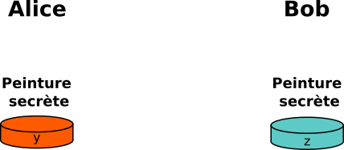
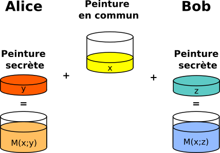

# Sécurisation des communications

## Rappels : communication sur internet

Que se passe-t-il lorsque nous tapons dans la barre d'adresse de Firefox une URL, telle que `http://www.zonensi.fr/` ? Entre le cours de SNT de seconde, et celui de NSI, nous pouvons décrire l'enchainement des communications ainsi :

1. L'URL est décodée par le navigateur, qui isole :
    * le protocole utilisé : `HTTP`
    * le nom de domaine : `www.zonensi.fr`
    * le chemin vers la ressource : `/`, la racine du site.
2. Le navigateur effectue une résolution de nom, soit en se connectant à un serveur `DNS`, soit dans son propre cache `DNS`, ce qui lui donne l'adresse `IP` de la ressource cherchée.
3. Le navigateur peut établir une connexion `TCP` vers l'adresse `IP`, via un [handshaking en trois temps](https://fr.wikipedia.org/wiki/Three-way_handshake#Fonctionnement){: target="_blank"}, comme montré sur l'image ci-dessous :

    {: style="width:30%; margin:auto;display:block;background-color: #d2dce0;"}

4. Une fois la connexion établie, client et serveur échangent des données en utilisant le protocole `HTTP`, tout en découpant les données en paquets `TCP`, eux-mêmes encapsulés dans des paquets `IP` (on pourra se rappeler du modèle `OSI`).

    {: style="width:60%; margin:auto;display:block;background-color: #d2dce0;"}

5. Les paquets sont transmis de routeurs en routeurs, en étant à chaque fois désencapsulés pour inscrire l'adresse `IP` du prochain routeur.

    {: style="width:60%; margin:auto;display:block;background-color: #d2dce0;"}


!!! warning "Des limites"

    Ce système, en place depuis l'invention de `TCP/IP` dans les années 1970, a vu l'intégration de chaque nouveau protocole (`FTP`, `SMTP`, etc) au sein de la couche application. Mais avec la démocratisation d'Internet, des problèmes sont rapidement apparus : si on utilise tel quel le modèle écrit ci-dessus pour effectuer des opérations bancaires ou échanger des données confidentielles, on se rend compte qu'un grand nombre d'intermédiaires (en particulier les routeurs) sont en possibilité de lire les données transmises.

On souhaite donc sécuriser les connexions afin que seul l'émetteur et le destinataire puissent avoir connaissance du contenu. D'où un questionnement sur trois aspects :

* Comment chiffrer le contenu des communications afin qu'elles ne soient lisibles que par la source et la destination (garantie de {==**confidentialité**==}) ?
* Comment garantir que le serveur auquel on se connecte est bien celui auquel on pense se connecter (garantie d'{==**authenticité**==}) ?
* Comment s'assurer que le message transmis n'a pas été modifié par un tiers (garantie d'{==**intégrité**==}) ?

Le tout devant bien entendu se faire dans le cadre d'une communication en utilisant l'infrastructure d'Internet, à savoir les communications `TCP/IP` ?

## Quelques définitions nécessaires

!!! infos "Coder/Décoder"

    {==** Coder**==}, c'est représenter l'information par un ensemble de signes prédéfinis. {==**Décoder**==}, c'est interpréter un ensemble de signes pour en extraire l'information qu'ils représentent. 

    Coder et décoder s'emploient lorsqu'il n'y a pas de secret. Par exemple on peut coder/décoder des entiers relatifs par une suite de bits par un «codage en complément à deux».

!!! infos "Cryptographie"
    La {==**cryptographie**==} est une discipline veillant à protéger des messages (pour en assurer la confidentialité, l'authenticité et l'intégrité), par l'intermédiaire de {==**clés de chiffrements**==}.

    La cryptographie est utilisée depuis au moins l'antiquité.

    Son pendant est la {==**cryptanalyse**==}, qui est la technique qui consiste à déduire un texte en clair d’un texte chiffré **sans posséder la clé de chiffrement**. Le processus par lequel on tente de comprendre un message en particulier est appelé {==**une attaque**==}.

    {==**Chiffrer**==} un message, c'est rendre une suite de symboles incompréhensible au moyen d'une **clé de chiffrement**.

    {==**Déchiffrer**==} ou {==**décrypter**==}, c'est retrouver la suite de symboles originale à partir du message chiffré. On utilise **déchiffrer** quand on utilise la clé de chiffrement pour récupérer le texte original, et **décrypter** lorsqu'on arrive à retrouver le message original sans connaitre la clé de chiffrement.


## Cryptographie symétrique

!!! abstract "Cryptographie symétrique"

    On parle de {==**cryptographie symétrique**==} lorsque la même clé est utilisée pour chiffrer et déchiffrer un message.

### Code de César

!!! abstract "Le code (ou chiffre) de César : chiffrement par décalage"

    Le chiffre de César est une méthode de chiffrement très simple utilisée par Jules César dans ses correspondances secrètes (ce qui explique le nom « chiffre de César »). 

    Le texte chiffré est obtenu en remplaçant chaque lettre du texte original par une lettre obtenue par un décalage à distance fixe, toujours du même côté, dans l'ordre de l'alphabet. 

    {: style="width:60%; margin:auto;display:block;background-color: #d2dce0;"}
    
    On a ainsi, pour un chiffre de César avec un clé de 3, les correspondances suivantes :

    ``` python
    >>> alphabet_clair = "ABCDEFGHIJKLMNOPQRSTUVWXYZ"
    >>> alphabet_chiff = "DEFGHIJKLMNOPQRSTUVWXYZABC"
    ```

!!! question "Exercice"

    Afin de pouvoir chiffrer un message avec le code de César, il faut avoir un texte ne comportant que des lettres majuscules de l'alphabet latin, donc nettoyer le texte de tous les accents, espaces, signes de ponctuation, etc. 

    1. Créer une fonction `formate_texte(texte : str) -> str` qui prend en argument un texte non formaté, et renvoie le texte sans accents, sans signes de ponctuations ni espaces, et en majuscule
    2. Créer alors une fonction `code_Cesar(texte :str, cle : int) -> texte` qui renvoie le chiffre de César d'un texte qui lui est passé en argument, avec une clé sous la forme d'un entier entre 1 et 26 qui représente le décalage devant être obtenu. On rappelle les éléments suivants :

    ``` python
    >>> ord('A')
    65
    >> chr(66)
    'B'
    >>> chr(((ord('Z')-65)+3)%26+65)
    'C'
    ```

!!! question "Cryptanalyse d'un chiffre de César"

    === "Enoncé"
        Proposer un texte long chiffré au professeur. Combien de temps va-t-il mettre pour décrypter celui-ci ?

    === "Attaque par force brute"

        Une attaque par force brute consiste à attaquer en testant toutes les possibilités. Avec le chiffre de César, il n'existe que 26 clés différentes, la méthode par force brute est donc particulièrement adaptée, même dans le cas d'un texte long.

        ``` python
        def brute_force_Cesar(texte : str) -> str :
            decrypte = []
            for k in range(1,26) :
                decrypte.append(code_Cesar(texte, k))
            return decrypte
        ```

    === "Attaque par analyse de fréquences"

        Une étude des textes écrits en français montre que la lettre la plus fréquemment utilisée est «E» (minuscule ou majuscule). Si on sait que le texte est écrit en français, il est probable que la lettre la plus fréquente dans le code de César soit celle qui remplace le «E». Il est alors possible de tester en premier la clé correspondant à ce décalage.

        ```python
        def get_freq_texte(texte : str) -> dict :
            dico = dict()
            for letter in texte :
                if letter in dico :
                    dico[letter] += 1
                else :
                    dico[letter] = 1
            return dico

        def attaque_Cesar_analyse_frequence(texte : str) -> str:
            dico = get_freq_texte(texte)
            max_dico = []
            maxi = 0
            for letter in dico :
                if dico[letter]> maxi :
                    max_dico=[letter]
                    maxi = dico[letter]
                elif dico[letter] == maxi :
                    max_dico.append(letter)
            possible_keys = [ord(k)-ord('E') for k in max_dico]
            possible_texts = [ f"Clé {k} :\n\n"+code_Cesar(crypto, 26-k) for k in possible_keys]
            return possible_texts

        ```


??? infos "Chiffre de Vigenère"

    Le chiffre de César est donc très facilement déchiffrable, comme tout chiffrement monoalphabétique (où une lettre est toujours remplacée par le même symbole). Il existe d'autres méthodes de chiffrement par substitution, dits polyalphabétiques, pour lesquels la même lettre n'est pas forcément toujours remplacée par le même symbole, tels que le [chiffre de Vigenère](https://fr.wikipedia.org/wiki/Chiffre_de_Vigen%C3%A8re){target="_blank"}. Cependant de telles méthodes ne résiste pas forcément à des [attaques par analyse de fréquences](https://ensip.gitlab.io/programmation_e2/PDF/C_P2A_50_crypto_anafreq.pdf){target="_blank"}.

### Chiffrement XOR 

!!! abstract "XOR ( OU exclusif)"
    L'opérateur binaire `XOR`, où *OU Exclusif*, noté $\oplus$, est un opérateur dont la table de vérité est :

    $$\begin{array}{|c|c|c|}
    \hline
    \oplus & 0 & 1\\\hline
    0 & 0 & 1 \\\hline
    1 & 1 & 0 \\\hline
    \end{array}
    $$

    L'opérateur XOR, en plus d'être *commutatitf* ($A\oplus B = B \oplus A$) possède la propriété de {==**réversibilité**==}, ce qui signifie que si $A \oplus B = C$, alors on a les égalités suivantes :

    * $A \oplus C = B$
    * $B \oplus C = A$

!!! abstract "Chiffrement XOR"

    Étant donné un message, par exemple «UN MESSAGE TRÈS SECRET», et une clé de chiffrement, par exemple «NSI», on recopie plusieurs fois la clé sous le message :

    ```
    UN MESSAGE TRÈS SECRET
    NSINSINSINSINSINSINSIN

    ```
    Chaque caractère du message est associé à une valeur numérique entière (par exemple son Unicode) :

    ```
    85 78 32 77 69 83 83 65 71 69 32 84 82 200 83 32 83 69 67 82 69 84
    78 83 73 78 83 73 78 83 73 78 83 73 78  83 73 78 83 73 78 83 73 78
    ```

    On effectue ensuite l'opération $\oplus$ entre chaque nombre du message et de la clé. par exemple pour le premier caractère :

    $$
    \begin{array}{cccccccccr}
      &0&1&0&1&0&1&0&1&&85\\
    \oplus&0&1&0&0&1&1&1&0&&78\\\hline
    &0&0&0&1&1&0&1&1&&27
    \end{array}
    $$

    Le code obtenu dans notre exemple est donc :

    ```
    27 29 105 3 22 26 29 18 14 11 115 29 28 155 26 110 0 12 13 1 12 26
    ```

    L'opérateur $\oplus$ étant réversible, la réitération de l'opération sur le message chiffré rendra le message original.


!!! question "Chiffré/déchiffré"

    1. Créer une fonction `get_unicode(chaine : str) -> list` qui prend en argument une chaine de caractère et renvoie la liste des codes unicode correspondant aux caractères.
    2. Créer une fonction `get_string(liste : list) -> str` qui fait l'opération inverse de la fonction `get_unicode`.
    3. Créer une fonction `chiffre_XOR(texte : list, cle : list) -> list` qui renvoie une liste de valeurs entières correspondant à l'application d'un `XOR` sur chacun des valeurs des deux listes `texte` et `cle`.

        *Indications :*

        * l'opérateur $\oplus$ en python s'écrit de la manière suivante :

            ```python
            >> 85 ^ 78
            27
            ```
        * Il n'est pas nécessaire de créer une liste de la même longueur que le texte avec la clé. Une utilisation judicieuse de l'opération modulo doit vous permettre de vous en sortir.
    
    4. Vérifiez que la fonction `chiffre_XOR` permet bien de chiffrer/déchiffrer un texte avec une clé donnée.

Les caractéristiques de l'opérateur `XOR`, et le fait qu'il puisse être implémenté directement dans le processeur, font qu'il est souvent utilisé dans les algorithmes de chiffrement modernes, comme [AES](https://fr.wikipedia.org/wiki/Advanced_Encryption_Standard){taget="_blank"} ou [ChaCha20](https://en.wikipedia.org/wiki/Salsa20#ChaCha_variant){target="_blank"}. Bien sûr ces algorithmes sont nettement plus complexes que la méthode naïve que nous avons utilisée, mais leurs principes reposent sur des fonctionnements similaires.

En plus d'être relativement sûrs (voir ci-dessous), ces algorithmes sont très efficaces et permettent de chiffrer très rapidement. On peut ainsi chiffrer en direct des communications audio ou vidéo en temps réel.

!!! warning "Cryptanalyse : attention à la longueur de la clé !"

    Une clé trop courte peut compromettre la sécurité des données : dans le cas où un mot du message peut-être envisagé, et où la clé est de taille raisonnable (en pratique dans le code suivant, de taille maximale de 4), il est tout à fait possible de faire une attaque par force brute :

    ```python
    def all_possible(length : int) :
        """ crée une liste de toutes les clés possible de longueur donnée"""
        if length ==0 :
            return ['']
        poss = []
        disp = all_possible(length-1)
        for uni in range(65, 65+26) :
            for d in disp :
                poss.append(chr(uni)+d)
        return poss
                        
    def cryptanalyse_XOR(chiffre : list, contain : str, taille_cle : int) :
        """ renvoie les clés possibles qui trouvent la chaine contain dans le code chiffre, en testant toutes les clés possibles de taille taille_cle"""
        poss_keys = []
        for k in all_possible(taille_cle) :
            decode = get_string(chiffre_XOR(chiffre, get_unicode(k)))
            if contain in decode :
                poss_keys.append(k)
        return poss_keys
    ```
!!! warning "Un point sur les mots de passe : entropie de Shannon"

    En informatique, la robustesse d'un mot de passe *aléatoire* est exprimée en terme d'entropie de Shannon, mesurée en bits. 

    D'après [wikipedia](https://fr.wikipedia.org/wiki/Robustesse_d%27un_mot_de_passe){target="_blank"}, « au lieu de mesurer la robustesse par le nombre de combinaisons de caractères qu'il faut tester pour trouver le mot de passe avec certitude, on utilise le logarithme en base 2 de ce nombre. Cette mesure est appelée l'entropie du mot de passe. Un mot de passe avec une entropie de 42 bits calculée de la sorte serait aussi robuste qu'une chaine de 42 bits choisie au hasard.

    En d'autres termes, un mot de passe de 42 bits de robustesse ne serait brisé de façon certaine qu'après $2^{42} = 4 398 046 511 104$ tentatives lors d'une attaque par force brute. L'ajout d'un bit d'entropie à un mot de passe double le nombre de tentatives requises, ce qui rend la tâche de l'attaquant deux fois plus difficile.»

    L'entropie d'un mot de passe de taille $L$ utilisant des caractères parmi $N$ possibilités aura une entropie $H$ calculée de la manière suivante :

    $$ H = L.\log_2(N) = L. \cfrac{\ln(N)}{\ln(2)}$$

    Ce qui donne les résultats suivants :

    | Nombre de symboles | A-Z (26) | a-zA-Z(52) | a-zA-Z0-9 (62) | a-zA-Z0-9,;:!... (95) |
    | :---: | ---: | ---: | ---: | ---: |
    | 6 caractères | 28 | 34 | 35 | 39 |
    | 10 caractères | 47 | 57 | 59 | 66 |
    | 12 caractères | 56 | 68 | 71 | 79 |
    | 20 caractères | 94 | 114 | 119 | 131 |

    On constate donc qu'un mot de passe de 10 caractères latin majuscules est plus «résistant» qu'un mot de passe de 6 caractères utilisant n'importe quel symbole du clavier français... Cela signifie que le nombre de caractère est nettement plus important que la diversité de ceux-ci. On peut le voir grâce au tableau suivant :

    {: style="width:60%; margin:auto;display:block;background-color: #d2dce0;"}

    Vous pouvez calculer l'entropie de vos mots de passe sur le [site suivant](https://timcutting.co.uk/tools/password-entropy){target="_blank"}.

    Gardez toutefois en tête que la sécurité est maximale lorsque vous utilisez des mots de passe aléatoires de longueur suffisante, utilisant le maximum de caractères, et différents pour chaque site. Pour aider à retenir tous ces mots de passe, l'utilisation d'un gestionnaire de mots de passe, tel que [Cozy Pass](https://cozy.io/fr/features/#pass){target="_blank"} est nécessaire. celui-ci peut-être protégé grâce à une Pass-Phrase, c'est à dire une phrase composée de mots (aléatoires de préférence), garantissant une grande difficulté de décryptage.

    Et le mot de la fin sera pour [xkcd](https://xkcd.com/){: target="_blank"}

    {: style="width:60%; margin:auto;display:block;background-color: #d2dce0;"}

## Cryptographie asymétrique

Le gros problème des cryptographies symétriques est le suivant : {==**les deux protagonistes de l'échange doivent connaitre la clé, et donc se l'échanger**==}. Or ils n'ont pas de moyens de communications sécurisés pour l'instant. Il leur reste donc deux solutions :

* soit ils échangent la clé par un moyen de communication non sécurisé, comme des mails ou du courrier, mais un attaquant pourrait alors s'emparer de la clé et compromettre la sûreté des communications futures ;
* soit ils échangent la clé par un moyen plus sûr, mais moins pratique (sur un pont isolé par une nuit sans lune dans une mallette menottée au poignet, comme dans les films noirs des années 1950).

Pour résoudre ce problème, les scientifiques américains et britanniques dans les années 1970, puis la recherche académique publique, se sont tournés vers la {==**cryptographie asymétrique**==}. Il s'agit de méthodes utilisant des techniques de mathématiques avancées, dont on ne présentera pas ici les véritables tenants et aboutissants. On peut cependant présenter quelques méthodes et en expliquer sommairement le fonctionnement.

### Les puzzles de Merkle

La méthode du puzzle de Merkle, créé en 1974 et pour la première fois publiée en 1978, est la première méthode de chiffrement asymétrique (**non top secrète**) à clé publique.


!!! tips "Déroulé d'un échange"
    Voici les étapes de la méthode des puzzles de Merkle, qui permette à Alice et Bob d'échanger des messages sans qu'Eve (diminutif de *eavesdropper*, ou oreille indiscrète, espion) puisse décrypter les messages :

    === "Etape 1"

        Alice génère un fichier de très grande taille, par exemple 100 000 lignes, où chaque ligne consiste en un **identifiant unique** et une clé de longueur suffisante :

        ```
        ...
        Id : 345768 Key : p(;;9a"ZMBz53P<6C5Q3
        Id : 768453 Key : 8uQw(;e3SRHaN=]QsFp%
        Id : 108943 Key : >ye5JH@%,%%J6<FsGWE,
        ...
        ```

        Elle crypte ce fichier avec un chiffre `XOR`, mais en respectant les consignes suivantes :

        * chaque ligne est chiffrée avec une clé différente ;
        * les clés utilisées sont de petites tailles.

        Elle transmet ensuite le fichier à Bob.

        **Le fichier est probablement intercepté par Eve.**

    === "Etape 2"

        Bob reçoit le message chiffré d'Alice. Il choisit au hasard une des lignes, et l'**attaque par force brute**. Comme la clé utilisée est de petite taille, l'attaque est possible en un temps raisonnable, disons 10 minutes.

        Bob récupère donc une ligne avec un identifiant et une clé.

        ```
        Id : 768453 Key : 8uQw(;e3SRHaN=]QsFp%
        ```
        Bob transmet alors **en clair** l'identifiant `768453` à Alice.

        **Eve intercepte probalement cet identifiant**.

    === "Etape 3"

        Alice regarde dans son fichier non crypté la clé correspondant à l'identifiant transmis : `8uQw(;e3SRHaN=]QsFp%`. Avec cette clé, la communication s'engage entre Alice et Bob en **utilisant un chiffrement symétrique**.

        A aucun moment la clé n'a été transmise en clair entre les deux protagonistes, qui n'ont pas eu besoin de se rencontrer non plus pour entamer une communication sécurisée.

    === "Et Eve ?"

        Eve a donc en sa possession un fichier crypté de 100 000 lignes, et un identifiant en clair. Mais pour faire correspondre cet identifiant à une clé, il faut qu'elle décrypte par force brute chacune des lignes du fichier jusqu'à trouver le bon identifiant. Pour décrypter la totalité du fichier, il lui faudra donc 100 000 fois 10 minutes, soit près de 12 jours. Donc, en moyenne, Alice et Bob peuvent communiquer sereinement pendant 6 jours avec la même clé.


### Méthode de Diffie-Hellman

La méthode des puzzle de Merkle, bien que novatrice pour son époque, n'est plus jugée suffisante de nos jours pour garantir une véritable sécurité. Cependant elle a posé les bases d'autres méthodes, comme la méthode de Diffie-Helman, proposée en 1974 par les cryptologues américains Bailey W. Diffie et Martin Hellman.

Cette méthode repose sur l'utilisation d'une fonction mathématique à deux variables. Cette fonction, souvent nommée $M$ (pour «mélange»), doit respecter les propriétés suivantes :

1. $M$ est connue, ce qui signifie qu'on connait l'algorithme ou la formule qui permet de calculer des images (toutes les fonctions ne sont pas calculables, voir [théorie de la calculabilité](https://fr.wikipedia.org/wiki/Th%C3%A9orie_de_la_calculabilit%C3%A9#Existence_de_fonctions_non_calculables){target="_blank"}).
2. Si on connait $M(x;y)$ et $x$, il doit être **très difficile** de retrouver $y$. Par difficile, on entend le fait que pour trouver le $y$ donnant à $M(x;y)$ une valeur donnée, il faudra essayer sur tous les entiers $y$ possibles.
3. Pour tous entiers $x, y$ et $z$, on a $M(M(x;y);z) = M(M(x;z);y)$, autrement dit $y$ et $z$ sont commutables.

Une analogie couramment utilisée pour expliquer le fonctionnement de  cette fonction $M$ est celle des pots de peinture :

!!! tips "Pots de Peintures"

    Les images suivantes ont été extraites et modifiées depuis <a href="https://commons.wikimedia.org/wiki/File:Diffie-Hellman_Key_Exchange_(fr).svg">Idée originale : A.J. Han VinckVersion vectorielle : Flugaal Traduction : Dereckson</a>, Public domain, via Wikimedia Commons

    === "Etape 1"

        On dispose d'un très grand nombre de pots de peinture de couleurs différentes. Alice et Bob se mettent d'accord pour choisir une couleur commune $x$, qui sera «publique», puisqu'elle peut être interceptée.

        {: style="width:40%; margin:auto;display:block;background-color: #d2dce0;"}

    === "Etape 2"

        Alice et Bob choisissent alors chacun une couleur, respectivement $y$ et $z$, qui resteront privées et secrètes et ne seront jamais échangées.

        {: style="width:40%; margin:auto;display:block;background-color: #d2dce0;"}

    === "Etape 3"

        Alice et Bob élaborent alors leurs mélanges, en utilisant la couleur commune et leur propre couleur privée. 

        {: style="width:40%; margin:auto;display:block;background-color: #d2dce0;"}

    === "Etape 4"

        Alice et Bob échangent *en clair* leurs mélanges respectifs, qui peuvent donc être interceptés.

        {: style="width:40%; margin:auto;display:block;background-color: #d2dce0;"}

    === "Etape 5"

        Alice et Bob ajoutent alors au mélange qu'ils ont reçu leur couleur secrète. La fonction de mélange est construite afin que les mix obtenus par Alice et Bob soient identiques. Ils ont ainsi une «couleur» commune secrète, qui peut alors leur permettre d'effectuer des échanges via un cryptage symétrique.

        {: style="width:40%; margin:auto;display:block;background-color: #d2dce0;"}

    === "Et Eve ?"

        Eve peut connaitre trois choses : la couleur commune, et chacun des mix ayant circulé en clair. Pour autant, la fonction de mélange est faite de telle manière qu'il soit extrêmement long et difficile d'extraire les couleurs secrètes même si la couleur commune est connue. 

        Par ailleurs, même en mélangeant les deux mix obtenus, on n'obtiendra pas la même couleur que celle obtenue par ALice et Bob, puisque la couleur commune sera deux fois plus présente.

        {: style="width:40%; margin:auto;display:block;background-color: #d2dce0;"}

Le protocole d'échange de clé de Diffie-Hellman propose donc une manière élégante de régler le problème d'échange de clé posé par le chiffrement symétrique. Cependant, un problème reste à régler, il s'agit du {==**problème de l'authentification**==} : la sureté des communications dépend essentiellement sur le fait qu'Alice et Bob soient certains de communiquer avec la bonne personne.

!!! warning "Attaque de l'homme du milieu"

    Imaginons qu'Eve ne se contente pas d'intercepter la couleur commune, mais qu'elle se fasse passer pour Bob auprès d'Alice, et d'Alice auprès de Bob. Eve peut alors choisir une couleur commune avec Alice, et une autre avec Bob. Le protocole d'échange se poursuit normalement, mais Eve intercepte et décode chaque message transmis, avant de le retransmettre à son tour, modifié ou non :

    {: style="width:60%; margin:auto;display:block;background-color: #d2dce0;"}

    Une telle technique s'appelle une {==**attaque de l'homme du milieu**==}, ou **man in the middle attack**, souvent abrégée en MITM.

### Cryptage RSA

!!! abstract "Système RSA"

    Le système RSA est un système de chiffrement asymétrique basé sur des paires de clés publiques et privées, pour la première fois publié en 1978. Son nom provient des initiales de ses trois inventeurs : [Ron Rivest, Adi Shamir et Len Adelman](https://fr.wikipedia.org/wiki/Chiffrement_RSA){target="_blank"}. 

    Les mathématiques derrière le système RSA utilisent entre autres les congruences sur les entiers et le petit théorème de Fermat. Tous les calculs se font modulo un nombre entier $n$ qui est le produit de deux nombres premiers, en général très grands, car les messages clairs et chiffrés sont des entiers inférieurs à l'entier $n$. Les opérations de chiffrement et de déchiffrement consistent à élever le message à une certaine puissance modulo $n$, ce qui donne des calculs très couteux.

Globalement, le système consiste en la mise en place d'une {==**paire de clés publiques et privées**==} pour chaque participant :

* Alice possède une clé $K_A^{pub}$ et une clé privée $K_A^{pri}$.
* Bob possède une clé $K_B^{pub}$ et une clé privée $K_B^{pri}$.

On notera $K_P^x(m)$ le fait de chiffrer un message avec la clé $x$ de la personne $P$.

La manière exacte de créer ces clés est complexe, mais l'essentiel est de comprendre que l'utilisation des deux clés d'une personne permet de déchiffrer un message. Par exemple pour Alice :

$$K_A^{pub}\left(K_A^{pri}(m)\right) = K_A^{pri}\left(K_A^{pub}(m)\right) = m$$

Ce qui signifie qu'un message chiffré avec la clé publique d'Alice peut être déchiffrer avec sa clé privée, et réciproquement.

D'autre part, les propriétés des clés font que :

* il est impossible en connaissant $K_A^{pub}$ de deviner $K_A^{pri}$ ;
* il est impossible en connaissant $K_A^{pub}(m)$ ou $K_A^{pri}(m)$ de deviner $m$.

!!! tips "Fonctionnement d'une communication"

    Si Bob veut envoyer un message secret à Alice, les deux procèdent comme suit :

    1. Alice met à disposition sa clé publique $K_A^{pub}$, en la mettant par exemple sur son site web ou en l'envoyant par mail.
    2. Bob chiffre son message $m$ avec la clé publique d'Alice et envoie le résultat $K_A^{pub}(m)$ à Alice.
    3. Alice applique sa clé privée sur le message reçu $K_A^{pri}\left(K_A^{pub}(m)\right) = m$, et déchiffre ainsi le message de Bob.

L'inconvénient majeur de RSA est que les {==**chiffrements et déchiffrements sont très couteux en temps de calcul**==}, et ne permettent pas des échanges sur des gros volumes de données, ou sur des flux de communications audio ou vidéo.

Cependant, il est possible d'utiliser RSA à la manière de Diffie-Hellman, afin d'échanger une clé pour un algorithme de chiffrement symétrique, qui est en général un fichier de quelques milliers de bits.

Un autre des avantages de RSA est qu'il est possible de l'utiliser comme {==**système d'authentification**==}.

### Certificats et tiers de confiance

En France, l’État délivre aux citoyens une carte d'identité. Lorsque une personne se présente au bureau de poste pour retirer un colis, son identité est vérifiée par la personne au guichet par l'intermédiaire de cette carte d'identité. A priori, un bout de carton plastifié à lui seul ne permet pas de garantir réellement une authentification. Le système fonctionne parce que le bureau de poste **fait confiance** à l’État, qui a fait les vérifications nécessaires pour s'assurer de l'identité de la personne, et qui a mis en place une carte difficile à falsifier. L'État joue ici le rôle d'un {==**tiers de confiance**==}.

On retrouve le même système dans les communications sur Internet, où certains acteurs jouent le rôle de tiers de confiance. Ils fournissent des {==**certificats**==} numériques, créés à partir des clés RSA publiques des participants.

!!! exemple "Exemple d'authentification"

    Imaginons que Bob veuille s'assurer que c'est bien Alice avec qui il va entrer en communication, via son site web.

    1. Alice fait appel à Thierry, un tiers de confiance. Thierry vérifie qu'ALice est bien la propriétaire du site, en constant qu'elle peut administrer le site, ou bien par l'intermédiaire de factures montrant qu'elle possède le nom de domaine ainsi que le serveur qui héberge le site. Une fois ces vérifications effectuées, Thierry crée un certificat avec sa clé privée et la clé publique d'Alice :

        $$ c = K_T^{pri}(K_A^{pub})$$

    2. Quand Bob se connecte au site d'Alice, celui-ci envoie le certificat $c$ et la clé publique d'Alice $K_A^{pub}$.
    3. Bob se sert alors de la clé publique de Thierry sur le certificat :

        $$K_T^{pub}(c) = K_T^{pub}\left(K_T^{pri}(K_A^{pub})\right) = K_A^{pub}$$ 

        Il compare le résultat avec la clé que lui a fourni le site d'Alice. Si il y a correspondance, il est assuré d'être en communication avec Alice. Il peut alors démarrer un échange de clé soit en utilisant RSA, soit Diffie-Hellman.


## Le protocole HTTPS

### Autorités de certifications

Une {==**autorité de certification**==} (ou AC), est une entité habilitée à délivrer des certificats. Il s'agit de tiers de confiance, que l'on peut classer en trois catégories :

* les entreprises spécialisées ;
* les associations (comme *Let's Encrypt*, que nous croiserons plus tard);
* les entités étatiques.

Leur rôle est d'attester par l'intermédiaire de certificat qu'une entité est bien ce qu'elle prétend être. Elles sont soumises à des audits réguliers et pointilleux, dont les résultats sont publics, et il existe une hiérarchie des AC. En effet, une AC doit être elle-même certifiée par une autre AC, ce qui crée un arbre de certification jusqu'à des AC appellées **AC racines**. La fondation Mozilla reconnait à ce jour (24 Mai 2023) [142 AC racines](https://ccadb.my.salesforce-sites.com/mozilla/CACertificatesInFirefoxReport){target="_blank"}. 

Le club des AC est donc très fermé, les OS et navigateurs ayant chacun les clés publiques des AC qu'ils reconnaissent (au passage, Google, Microsoft et Apple ne reconnaissent pas exactement les mêmes AC que Mozilla).

### Normes de certifications X.509

Les AC suivent généralement le format standard de certficat qui est à l'heure actuelle le format `X.509`. Il s'agit d'un format de fichier binaire contenant entre autre :

* l'identifiant de l'AC qui **signe**(chiffre) le certificat ;
* les dates de validité du certificat (dates de départ et dates de fin);
* l'identité de l'entité certifiée ;
* la clé publique de l'entité certifiée ;
* l'algorithme utilisé pour la signature du certificat ;
* la signature du certificat par l'AS.

On retrouve la construction présentée précédemment, mais avec quelques points techniques supplémentaires : plutôt que de vérifier la signature de chaque ligne du fichier, on utilise une {==**fonction de hachage**==} qui génère une {==**somme de contrôle**==} du fichier. Cette somme de contrôle est alors chiffrée avec la clé privée de l'AC.

!!! exemple "Zonensi.fr"
    Voici un extrait du certificat de [zonensi.fr]() :

    ```
    Certificate:
        Data:
            Version: 3 (0x2)
            [...]
            Issuer: C = US, O = Let's Encrypt, CN = R3
            Validity
                Not Before: May 15 22:38:03 2023 GMT
                Not After : Aug 13 22:38:02 2023 GMT
            Subject: CN = zonensi.fr
            Subject Public Key Info:
                Public Key Algorithm: rsaEncryption
                    Public-Key: (2048 bit)
                    Modulus:
                        00:ae:43:ac:a5:ae:80:f4:38:4c:52:32:f7:...
                    Exponent: 65537 (0x10001)
            [...]
        Signature Algorithm: sha256WithRSAEncryption
        Signature Value:
            59:17:d1:ff:e2:2f:1f:a1:e5:2f:71:b6:e3:4a:4d:e4:...
    ```
    On constate donc que :

    * l'AC qui a signé le certificat est [Let's Encrypt](https://letsencrypt.org/fr/){target="_blank"} ;
    * celui-ci est valide du 15 mai 2023 au 13 Aout 2023 ;
    * il certifie le domaine `zonensi.fr` ;
    * la clé publique est une clé RSA, sur 2048 bits, et calculée à partir des informations `Modulus`et `Exponent`.
    * l'algorithme utilisé pour créer la somme de contrôle du fichier est `sha256WithRSAEncryption` ;

    Quand vous vous connectez à `zonensi.fr` en `https`, votre navigateur :

    * récupère le certificat ;
    * la signature est le résultat du chiffrage de la somme de contrôle par la clé privée de l'AC.
    * retire les deux dernières lignes et utilise l'algorithme `sha256WithRSAEncryption`pour calculer la somme de contrôle du certificat ;
    * utilise la clé publique de *Let's Encrypt* sur la signature du certificat, et compare le résultat à la somme de contrôle calculée ;
    * en cas d'égalité, l'identité est vérifiée et on peut commencer une transaction asymétrique.

### HTTP+ SSL/TLS = HTTPS


## Sources

[http://www.monlyceenumerique.fr/nsi_premiere/archios_arse/a3_encapsulation_tcp_ip.php](http://www.monlyceenumerique.fr/nsi_premiere/archios_arse/a3_encapsulation_tcp_ip.php)

[https://fr.wikipedia.org/wiki/Three-way_handshake](https://fr.wikipedia.org/wiki/Three-way_handshake)