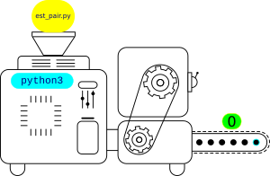

# Décidabilité

*La plupart des informations de cette page proviennent de :*

* Numérique et Sciences Informatiques, 24 leçons avec exercices corrigés, balabonsky, Conchon, Filliâtre, Nguyen, Editions Ellipses, 2020
* Le [cours](https://glassus.github.io/terminale_nsi/T2_Programmation/2.3_Calculabilite_Decidabilite/cours/){:target="_blank"} de G. Lassus, du Lycée François Mauriac à Bordeaux
* Le document de Serge Bays, disponible [ici](https://mathematice.fr/fichiers/nsi2/chap01b.pdf){:tagert="_blank"}

## Décidabilité : Histoire et définitions

!!! abstract "Décidabilité"

    La {==**décidabilité**==} est une notion utilisée en logique. Dans le cadre d’une théorie basée sur un certain nombre d'axiomes (c'est-à-dire de propositions non démontrées) et de leurs conséquences, il s’agit de *démontrer* qu’une proposition est *vraie* ou *fausse*. Si cette démonstration est possible, on dit que la proposition est {==**décidable**==}. Sinon, on dit que la proposition est {==**indécidable**==}.

    En algorithmique, un {==**problème de décision**==} est une question à laquelle on répond par «oui» ou par «non». On dit qu’un problème est {==**décidable**==} s’il existe un algorithme, c’est-à-dire une méthode qui se termine en un nombre fini d’étapes, qui permet de répondre par oui ou par non à la question posée par le problème. Sinon on dit que le problème est {==**indécidable**==}.


!!! example "Exemple"

    Prenons le problème suivante : « Est-il possible d'écrire une fonction prenant en argument un entier `n` et renvoyant `0` si le nombre `n` est pair et `1` si le nombre ne l'est pas ? »

    Il s'agit bien ici d'un **problème de décision**, et il est évidemment **décidable** quand on considère la fonction suivante :

    ``` python
    def est_pair(n : int) -> int :
        return n%2
    ```

    Notons que nous venons de créer une **fonction calculable** pour répondre à notre problème.

!!! note  "Histoire"

    <figure markdown="span">
    {width="150" }
    <figcaption>David Hilbert, [Wikipedia](https://upload.wikimedia.org/wikipedia/commons/7/79/Hilbert.jpg){target="_blank"}</figcaption>
    </figure>
    David Hilbert a posé en 1928 la question en logique mathématique qu’on appelle le problème de la décision, en allemand *« Entscheidungsproblem »*. Peut-on déterminer par un algorithme si un énoncé quelconque est vrai ou faux, si c’est un théorème ?

    <figure markdown="span">
    {width="150" }
    <figcaption>Kurt Gödel, [Wikipedia](https://upload.wikimedia.org/wikipedia/commons/9/9e/Young_Kurt_G%C3%B6del_as_a_student_in_1925.jpg){target="_blank"}</figcaption>
    </figure>

    Kurt Gödel a démontré en 1931 **qu’il existe des propriétés mathématiques non décidables dans n’importe quel système définissant l’arithmétique.**
    
    Turing a lui aussi répondu négativement à la question de Hilbert en utilisant l’indécidabilité d’un problème nommé {==**«le problème de l’arrêt»**==}. 

!!! abstract "Turing et le problème de l'arrêt"

    Dans son article de 1936, Turing montre que si le problème de la décision est décidable, alors la question de l’arrêt ou non d’une machine de Turing donnée peut être résolue par un algorithme. Autrement dit, **si la terminaison d’un programme quelconque peut être déterminée par une machine de Turing, alors les problème de la décision est décidable**.

## Programme comme paramètre d'un programme

Considérons la fonction `est_pair` précédente :

``` python
def est_pair(n : int) -> int :
    return n%2
```

Ce programme prend en argument un paramètre `n` entier et renvoie `1` ou `0` selon la parité de `n`. Une représentation imagée serait celle d'une machine :

* il y a une entrée, dans laquelle on introduit par exemple le nombre `16`
* la machine effectue des opérations sur l'entrée, ici un modulo 2 ;
* elle envoie dans la sortie le résultat, ici `O`.


{: style="width:30%; margin:auto;display:block;"}

Enregistrons ensuite le code suivant dans un fichier `est_pair.py`.

``` python
def est_pair(n : int) -> int :
    return n%2

print(est_pair(17))
```

Pour exécuter le code, nous pouvons nous rendre dans un terminal et taper le code `python3 est_pair.py` :

{: style="width:60%; margin:auto;display:block;"}

En exécutant cette ligne, on fait appel au programme `python3`, qui prend comme paramètre le fichier `est_pair.py`. Dans ce cadre, `est_pair.py` est un ensemble de caractères qui contient les instructions que le programme `python3` va interpréter, pour écrire en sortie la valeur `0`.

{: style="width:30%; margin:auto;display:block;"}

Mais en poussant plus loin la réflexion, le terminal est lui-même un programme, qui lit en entrée la chaine de caractères `python3 est_pair.py`, l'interprète puis exécute les instructions demandées, pour au final afficher `0`.

{: style="width:30%; margin:auto;display:block;"}

On pourrait continuer ainsi en remontant au système d'exploitation, puis au bootloader.

!!! abstract "Programme et données"
    
    Un programme informatique peut parfaitement être observé comme une donnée pouvant être reçue comme paramètre par un autre programme.

??? info "Retour à l'assembleur : programme se modifiant lui-même"

    Regardons le programme suivant dans le simulateur [RISC](../../Premiere/C05/simu_risc.zip){target="blank"} ( où [ici](https://peterhigginson.co.uk/RISC/){target="blank"}) :

    ```assembly
        INP R0, 0
        STR R0, 042
        INP R1, 0
        STR R1,001
        BRA 00
    ```
    Dans ce programme, à la quatrième ligne, on stocke dans la mémoire `001` le contenu du registre `R1`. Or la mémoire `001` contenait l'instruction de la ligne 2.
    Le problème est que le programme boucle en ligne 5, en repartant en ligne 1, donc à la mémoire `000`. il devra donc lire de nouveau l'instruction `001`, qui ne correspondra plus à celle originale, voire ne correspondra plus du tout à une instruction compréhensible par le processeur RISC... Le programme à modifié son propre code, et s'est lui-même rendu inopérant. On parle alors d' *Invalid Opcode Fault*, résultant dans un redouté [*Blue Screen of Death*](https://en.wikipedia.org/wiki/Blue_screen_of_death){target="_blank"}.

## Le problème de l'arrêt

### Premier exemple

!!! question ""

    === "Enoncé"
        Peut-on prédire l'arrêt ou non du programme suivant :

        ``` python
        def countdown(n : int) -> None :
            while n != 0 :
                print(n)
                n -= 1
            print("Go !")
        ```

    === "Réponse"

        On peut effectivement prédire si ce programme va s'arrêter ou non :

        * si l'argument `n` est un entier positif, comme `5`, le programme va s'arrêter :

            ``` python
            >>> count(5)
            5
            4
            3
            2
            1
            Go !
            ```
        * dans le cas contraire, le programme ne s'arrêtera pas de lui-même, il faudra une intervention extérieure pour tuer le processus. En effet, l'appel avec `2.5` comme paramètre va donner :

            ``` python
            >>> countdown(2.5)
            2.5
            1.5
            0.5
            -0.5
            -1.5
            -2.5
            ...
            KeyboardInterrupt
            ```

Si dans cet exemple il était facile de voir les conditions d'arrêt de ce programme, **est-il possible d'automatiser cette analyse, en créant un programme qui prédira l'arrêt ou non d'un autre programme qui lui sera passé en paramètre ?**

### Une fonction qui calcule l'arrêt

Imaginons que nous ayons une fonction `HALT` prenant en paramètre :

* `prog` le code source d'un programme ;
* `x` un paramètre (ou une liste de paramètres) pour le programme `prog`

Cette fonction renverrait :

* `True`si `prog(x)` s'arrête ;
* `False` si `prog(x)` ne s'arrête pas.

!!! example "Exemples"

    * `HALT(countdown, 10)` renvoie `True` :
        
        {: style="width:30%; margin:auto;display:block;"}

    * `HALT(countdown, 2.5)` renvoie `False` :

        {: style="width:30%; margin:auto;display:block;"}


### Une nouvelle construction

Considérons maintenant la fonction suivante :

``` python

def sym(prog) :
    if HALT(prog, prog) :
        while True :
            print("To infinity and beyond !")
    else :
        return 1

```

On constate que ce programme teste si `prog(prog)` s'arrête. On rappelle qu'un code source est une donnée et peut donc parfaitement être passée comme argument d'une fonction. Le programme à alors deux possibilités :

* si `HALT(prog, prog)` est `True`, ce qui signifie que `prog(prog)` s'arrête, alors `sym(prog)` rentre dans une boucle infinie ;
* si `HALT(prog, prog)` est `false`, ce qui signifie que `prog(prog)` ne s'arrête pas, alors `sym(prog)` renvoie `1`.

### Des contradictions

Que se passe-t-il si on applique le code source de `sym` à elle-même, c'est-à-dire qu'on appelle `sym(sym)` :

* Si `HALT(sym, sym)` est `True`, alors l'appel `sym(sym)` rentre dans la boucle infinie. Pourtant, pour obtenir ce comportement, il faut que `sym(sym)` s'arrête. Ce qui donne une contradiction.
* Si `HALT(sym, sym)` est `false`, alors l'appel `sym(sym)` renvoie `1`. Pourtant, pour obtenir ce comportement, il faut que `sym(sym)` ne s'arrête pas. Ce qui donne une contradiction.


!!! warning "Conclusion"

    Le programme `HALT`, sensé prédire si un programme `prog` appliqué à une donnée `x` ne peut donc pas exister. Le **problème de l'arrêt est donc indécidable**.


    Cette question, appelée «problème de la décision», ou *Entscheidungsproblem* en allemand, est définitivement tranchée par le problème de l'arrêt : un tel théorème ne peut pas exister, puisque par exemple, aucun algorithme ne peut répondre «oui» ou «non» à la question «ce programme va-t-il s'arrêter ?».