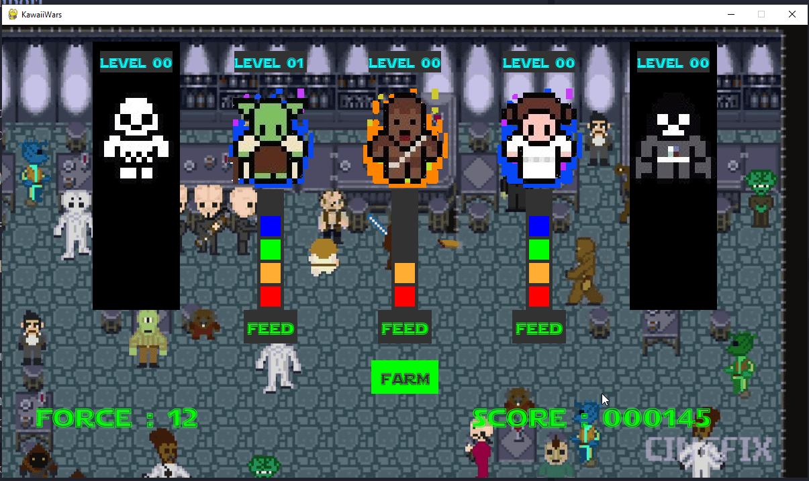

# Projet : ClickerWars

## Le jeu

Le principe est de créer un jeu de type *clicker*, où le/la joueur·euse clicque sur un bouton pour récolter des points fournis par des personnages. Dans le même temps, ces personnages voient leur barre de vie diminuer régulièrement, et il faut les nourrir individuellement avec les points accumulés pour éviter qu'ils ne meurent.

Lorsque leur barre de vie est pleine, ils changent de niveau, ce qui augmente leur résistance, augmente le nombre de points récoltés, mais génère aussi un besoin de nourriture plus important.

Une présentation possible est la suivante :

{: style="width:90%; margin:auto;display:block;background-color: #d2dce0;" title="ClickerWars Screenshot"}

## La structure du code

### La classe personnage

Un objet de la classe `personnage` devra posséder à minima les {==**attributs**==} suivants :

* un **niveau** ;
* un nombre de **points de vie maximum** ;
* un nombre de **points de vie actuels** ;
* un nombre de **points de collecte** (combien il rapporte à chaque clic) ;
* une **vitesse** de décroissance des points de vie ;
* des attributs spécifiants quelles sont les augmentations/diminutions des autres attributs à chaque augmentation de niveau.
* il devra aussi avoir des attributs pointants vers d'autres objets comme :
    * la barre de vie ;
    * le bouton pour le nourrir ;
    * le texte donnant son niveau
    * et bien sûr l'image associée au personnage

Il devra aussi avoir les {==**méthodes**==} suivantes :

* une méthode d'initialisation d'instance `__init__`, définissant les attributs et les initialisant ;
* une méthode permettant de baisser le nombre de points de vie ;
* une méthode permettant de modiffier les attributs lors d'un changement de niveau ;
* une méthode d'affichage permettant d'afficher le bloc de personnage.

Bien entendu, il sera peut-être nécessaire de créer d'autres méthodes selon la manière choisie pour implémenter le code.

### Bouton de collecte

Une classe sera nécessaire pour encapsuler youtes les données liées au bouton de collecte, et cette classe devra avoir deux méthodes :

* une méthode d'initialisation ;
* une méthode d'affichage.

### Bouton de nourriture

Chaque personnage aura associé un objet correspondant à une classe de type bouton, qui devra avoir au moins 3 méthodes :

* la méthode d'initialisation ;
* la méthode d'affichage ;
* une méthode spécifique permettant de nourrir le personnage auquel ce bouton est rattaché, en vidant la réserve de points accumulée d'un certain nombre de points :
    * soit elle vide complètement la réserve si le nombre de points n'est pas suffisant pour amener la barre de vie au maximum ;
    * soit elle vide la réserve du nombre de points exact permettant à un personnage de changer de niveau.

### réserve de points

Une classe spécifique pourra être créée pour contenir et afficher la réserve de points.
