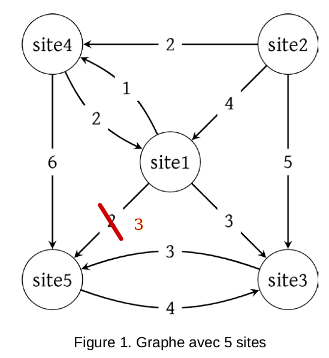

# Proposition de corrigé, Métropole 2024 J1

Le sujet est téléchargeable [ici](24-nsij1me.pdf){: target='blank'}. Il contient quelques erreurs, mais une seule a été signalée lors de l'épreuve :

* Exercice 1, sur le graphe, la pondération entre le `site 1` et le `site 5` doit être corrigée en remplaçant `2` par `3`.
* Pour les autres erreurs du sujet, plusieurs interprétations sont possibles et j'essayerai d'être le plus exhaustif possible.

## Exercice 1

??? infos "Le graphe et le code fournis dans l'énoncé"

    {: style="width:30%; margin:auto;display:block;"}

    La classe `Site` ;

    ``` python linenums='1'
    class Site:
        def __init__(self, nom):
            self.nom = nom
            self.predecesseurs = []
            self.successeurs = []
            self.popularite = 0
            self.couleur = 'blanche'

        def calculPopularite(self):
            ...

    ```

    La représentation du graphe avec la classe `Site` :

    ``` python linenums='1'
    # Description du graphe
    s1, s2, s3, s4, s5 = Site('site1'), Site('site2'),Site('site3'), Site('site4'), Site('site5')
    s1.successeurs = [(s3,3), (s4,1), (s5,3)]
    s2.successeurs = [(s1,4), (s3,5), (s4,2)]
    s3.successeurs = [(s5, 3)]
    s4.successeurs = [(s1,2), (s5,6)]
    s5.successeurs = [(s3,4)]
    s1.predecesseurs = [(s2,4), (s4,2)]
    s2.predecesseurs = []
    s3.predecesseurs = [(s1,3), (s2,5), (s5,4)]
    s4.predecesseurs = ...
    s5.predecesseurs = ...
    ```

1. Le site `site2` n'est cité par aucun autre site (il n'y a pas d'arc entrant sur le noeud `site2`). Il ne possède pas de prédécesseurs d'où l'affectation d'une liste vide à `s2.predecesseurs`.
2.  Lignes 11 et 12 :

    ```python linenums='11'
    s4.predecesseurs = [(s1, 1), (s2, 2)] # ou bien l'ordre inverse des éléments de la liste
    s5.predecesseurs = [(s1, 3), (s3, 3), (s4, 6)] # ou tout autre ordre des éléments de la liste
    ``` 

3. `s2.successeurs` est de type `list`, donc `s2.successeurs[1]` est l'élément d'indice `1` de la liste, soit le tuple `(s3, 5)`. D'où `s2.successeurs[1][1]` est l'élément d'indice `1` du tuple, soit l'élément `5` de type `int`.

4. Selon la définition, le site `site1` possède deux prédécesseurs, `site2` avec `4` citations et `site4` avec `2` citations. la popularité de `site1` est donc `4+2 = 6`.

5. Le code de la méthode, avec *tuple unpacking* :  

    ```python linenums='10'
    def calculPopularite(self):
        self.popularite = 0
        for site, pop in self.predecesseurs :
            self.popularite += pop
        return self.popularite
    ```

    ??? info "Le code du parcours du graphe"

        ```python linenums='1'

        def parcoursGraphe(sommetDepart):
            parcours = []
            sommetDepart.couleur = 'noire'
            listeS = []
            listeS.append(sommetDepart)
            while len(listeS) != 0:
                site = listeS.pop(0)
                site.calculPopularite()
                parcours.append(site)
                for successeur in site.successeurs:
                    if successeur[0].couleur == 'blanche':
                        successeur[0].couleur = 'noire'
                        listeS.append( successeur[0] )
            return parcours
        ```

6. Lorsqu'on ajoute un élément à `listeS` avec `append`, celui-ci est mis à la fin de la liste. Lorsqu'on retire un élément avec `pop(0)`, il s'agit de l'élément d'indice `0`, soit le premier inséré. On est donc sur une structure de type `PEPS` (`FIFO`), c'est-à-dire une file.

7. C'est un parcours en largeur du graphe (on parcourt un sommet, puis tous ses successeurs, puis tous les successeurs de ceux-ci, etc. ).

8. À l'appel de `parcoursGraphe(s1)` :
    * `s1` est le premier sommet inséré dans `parcours` ;
    * puis on ajoute tous ses successeurs dans l'ordre de son attribut `successeurs`, soit `s3`, `s4` puis `s5` ;
    * on ajoute ensuite les successeurs de `s3` qui ne sont pas de couleur noire, il ne reste plus que `s2`, et ainsi tous les noeuds sont marqués.

    Donc l'appel `parcoursGraphe(s1)` renvoie la liste `[s1, s3, s4, s5, s2]`.

9. Complétion des lignes 6 et 7 du code fourni :

    ```python linenums='1' hl_lines="6 7"
    def lePlusPopulaire(listeSites):
        maxPopularite = 0
        siteLePlusPopulaire = listeSites[0]
        for site in listeSites:
            if site.popularite > maxPopularite:
                maxPopularite = site.popularite
                siteLePlusPopulaire = site
        return siteLePlusPopulaire
    ```

10. En calculant la popularité de chaque site, on obtient :

    | Site | `s1` | `s2` | `s3` | `s4` | `s5` |
    | :---: | :---: | :---: | :---: | :---: | :---: |
    | Popularité | 6 | 0 | 12 | 3 | 12 |

    Or la fonction `lePlusPopulaire` renvoie le premier site trouvé ayant la plus grande popularité (ceci est du au signe `>` ligne `5`. Si le signe avait été `>=`, la fonction aurait renvoyé le dernier site trouvé avec la plus grande popularité).

    Donc d'après l'ordre de parcours donné en question 8, l'appel `lePlusPopulaire(parcoursGraphe(s1)).nom` renvoie la chaine de caractères `'site3'`.

11. En utilisant la fonction `parcoursGraphe` :

        * on va parcourir l'ensemble du graphe ;
        * à chaque étape on doit ré-indexer l'ensemble des éléments de `listeS`, qui est utilisé comme une file ;

    donc la complexité en temps de la fonction `parcoursGraphe` est en $\mathscr{O}(n^2)$.
    De plus la fonction `lePlusPopulaire`est en $\mathscr{O}(n)$.

    L'utilisation de ces fonctions n'est donc pas efficace. Il faudrait utiliser une véritable structure de file, et ne faire qu'un parcours, en intégrant la recherche du site le plus populaire dans la fonction de parcours du graphe.