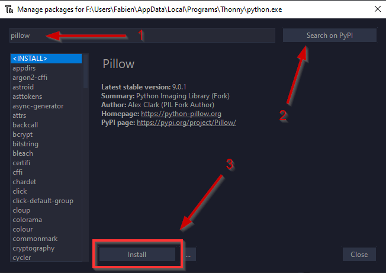
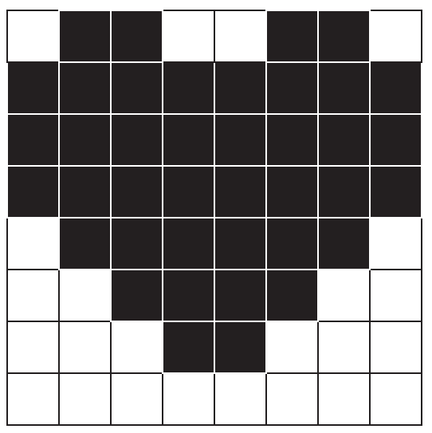
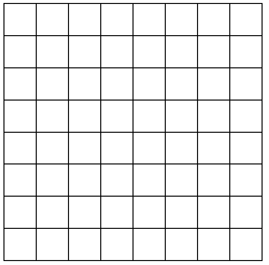

# Pixel Art avec Python


## Se préparer pour l'activité

1. Ouvrez le logiciel `Thonny` depuis le menu `Windows`.
2. Dans le menu `Tools>Manage packages`, tapez dans la barre de saisie le mot `pillow` puis cliquez sur `Find package from PyPi`.

	{: style="width:40%; margin:auto;display:block;background-color: #546d78;"}
	
	Puis cliquez sur `Install` (si vous voyez à la place les boutons `Upgrade` et `Uninstall `, ce n'est pas nécessaire). Laissez le logiciel installer jusqu'au bout, cela prend quelques secondes.
	
3. Ouvrez l'explorateur de fichier `windows`, puis allez dans le dossier `Images`. Créez un sous-dossier avec votre nom et prénom. Ce dossier sera celui dans lequel vous devrez copier **tous les fichiers de cette activité**.
4. Rendez-vous sur le site [www.zonensi.fr](, et cliquez sur `Activite Pixel Art`. Enregistrez tous les fichiers suivants dans votre dossier personnel.

	* [PixelArt.py](https://fvergniaud-drive.mytoutatice.cloud/public?sharecode=bqphfzyLT0yK){: target="_blank"}
	* [makeMatrix.py](https://fvergniaud-drive.mytoutatice.cloud/public?sharecode=wov9s1safq67){: target="_blank"}
	* [bigMatrix.txt](https://fvergniaud-drive.mytoutatice.cloud/public?sharecode=Eq1v3AzO0X7d){: target="_blank"}

## Du Pixel Art en Noir et Blanc

!!! info "Pixels et tableaux de nombres"
	Une image numérique est composée de pixels. Ces pixels sont les plus petites &laquo; lampes&raquo; allumables par l'ordinateur. Pour demander à l'ordinateur d'allumer un pixel, on lui donne une valeur numérique. Une image numérique est donc représentée dans un ordinateur par un tableau de nombres, appelé {==**matrice**==} en français  (*matrix* en anglais).


1. Voici une image en noir et blanc de 8 pixels de long, et de 8 pixels de haut, ainsi que sa représentation sous la forme d'une matrice dans le langage Python :

	<div style="display:flex;">
	<div style="display : inline; width : 50%;">
	
	{: style="width:60%; margin:auto;display:block;background-color: #546d78;"}
	
	</div>
	<div style="display : inline; width : 50%;">
	```` python
	matrix=[
		[255, 0, 0, 255, 255, 0, 0, 255],
		[0, 0, 0, 0, 0, 0, 0, 0],
		[0, 0, 0, 0, 0, 0, 0, 0],
		[0, 0, 0, 0, 0, 0, 0, 0],
		[255, 0, 0, 0, 0, 0, 0, 255],
		[255, 255, 0, 0, 0, 0, 255, 255],
		[255, 255, 255, 0, 0, 255, 255, 255],
		[255, 255, 255, 255, 255, 255, 255, 255],
		]
	````
	</div>
	</div>
	A quoi correspondent les valeurs $0$ et $255$ dans la matrice ?

2. Ouvrir le logiciel `Thonny`, et depuis ce logiciel ouvrez le fichier `pixelArt.py`  (avec le menu `File>open`).
3. Cliquez sur la petite flèche verte pour exécuter le script Python.

	{: style="width:40%; margin:auto;display:block;background-color: #546d78;"}

	Qu'obtient-on ?

4. La ligne créant l'image et l'affichent à partir de la matrice est la ligne 35 :

	```` python
	makeImage(matrix, 8, 8)
	````
	
	Dans cette ligne, la fonction`makeImage` utilise la variable `matrix`, pour créer une image de dimension $8 \times 8$. Remplacer cette ligne par la ligne suivante :

	```` python
	makeBiggerImage(matrix, 8, 8, scale=5)
	````

	Qu'obtient-on ?

5. Sauvegarder cette nouvelle image dans le même dossier que le fichier `pixelArt.py` sous le nom `greatHeart.png`. Combien de pixels composent cette image ?
6. Comment faire pour obtenir une image de $80\times 80$ pixels ?
7. A l'aide des grilles suivantes, créez deux nouvelles images de dimension $8\times 8$ (vous pouvez vous inspirer du site [http://www.pixelart.name/pixel-art-8x8/](http://www.pixelart.name/pixel-art-8x8/){: target="_blank"}).
<div style="display:flex;">
	<div style="display : inline; width : 50%;">
	
	{: style="width:60%; margin:auto;display:block;background-color: #546d78;"}
	
	</div>
	<div style="display : inline; width : 50%;">
	
	{: style="width:60%; margin:auto;display:block;background-color: #546d78;"}
	
	</div>
	</div>\item Modifier le programme Python afin d'afficher vous deux images en noir et blanc, en taille $80 \times 80$, et sauvegardez-les.
8. Combien de nombres sont nécessaires pour une image de $16 \times 16$ pixels ? de $32 \times 32$ pixels ? de $64 \times 64$ pixels ?


## Une image en niveau de gris

1. Ouvrez avec le bloc-note le fichier `bigMatrix.txt` et copiez-collez la totalité de ce texte dans le fichier `pixelArt.py`, à la place de la variable `matrix`.
2. Cette nouvelle variable `bigMatrix` est une matrice de dimension $16 \times 16$. Mis à part sa taille et son nom, qu'a-t-elle de nouveau par rapport à la variable précédente ?
3. Modifiez la ligne `makeBiggerImage...` de la manière suivante :

	```` python
	makeBiggerImage(bigMatrix, 16, 16, scale=5)
	````
	
	Puis exécutez le code. Qu'obtient-on ?


!!! info "les niveaux de gris"
	Nous avons vu qu'un pixel peut être &laquo; allumé &raquo; quand on lui donne la valeur $255$, et qu'il est &laquo; éteint &raquo; quand on lui donne la valeur $0$. Mais en réalité on peut lui donner n'importe quelle valeur entre $0$ et $255$, ce qui donnera un \textbf {niveau de gris}, sachant que plus la valeur est grande, plus la nuance se est éclaircie, et plus elle est proche de $0$ plus elle est assombrie.

## Votre propre matrice

1. Allez chercher sur le web une image - pas trop grande en dimension, et sauvegardez-là dans votre dossier.
2. Ouvrez dans `Thonny` le fichier `makeMatrix.py`.
3. Modifiez la ligne $11$ en remplaçant le nom `Mario.png` par le nom de votre image 5ou le no; aue vous choisissew-. Attention à bien conserver les guillemets !
4. Exécutez alors le code. Qu'obtenez-vous ?
5. Copiez-collez la matrice obtenue à la place de la précédente dans le fichier `pixelArt.py`, puis modifiez le fichier afin de pouvoir l'exécuter. Attention, il vous faudra connaître le nombre de pixels de cette image pour pouvoir exécuter correctement le code !

