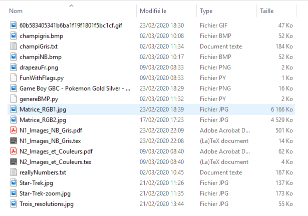
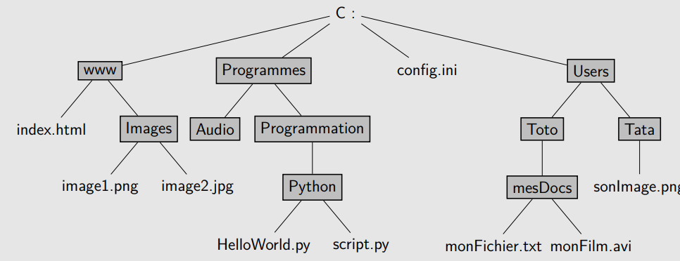
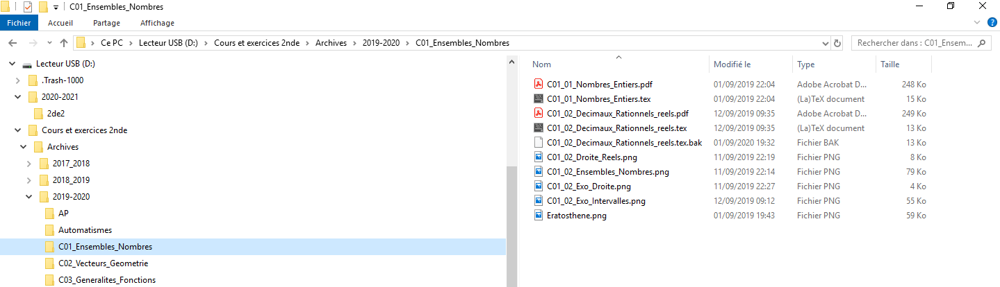
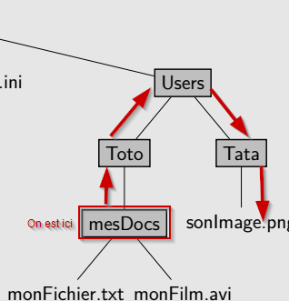

# Arborescence des fichiers et des dossiers

## Les fichiers informatiques

### Définitions
!!! abstract "Fichier informatique"
	Un {==**fichier informatique**} est un ensemble de données cohérentes réunies, c'est-à-dire une suite de chiffres binaires dont l'ordre possède une signification pour un ou des programmes informatiques. Un fichier informatique est enregistré dans une mémoire de stockage (disque dur local ou réseau, clé USB ou carte mémoire Flash, CD/DVD, ... ) afin de pouvoir lire et/ou modifier les données qui y sont écrites.
	
	Un fichier informatique est repéré par son **nom**, qui possède souvent, mais pas toujours, la structure suivante :
 
		nom.extension
	
	où le **nom** est une suite de caractères quelconques, et l'**extension** est une suite de deux, trois ou quatre lettres pouvant donner une idée du contenu du fichier.
	
!!! info "Remarques"

	* Un nom de fichier peut n'avoir aucune extension, et peut même n'être écrit qu'avec des espaces... Mais c'est peu recommandé.
	* Les programmes informatiques sont eux aussi des fichiers (ou des ensembles de fichiers) qui sont lus par le système d'exploitation.
	* Le système d'exploitation est aussi un ensemble de fichiers.
	* On peut généralement ouvrir un fichier informatique avec un éditeur de texte. Mais le contenu sera illisible par un être humain.
	* L'organisation de tous les fichiers, appelée \textit{système de fichiers}, dépend du système d'exploitation (Windows, Unix, Linux, etc) 
 
### Les extensions

!!! tips "Utilité des extensions"
	Sous les systèmes windows, le système d'exploitation peut être configuré de manière à sélectionner automatiquement( c'est-à-dire par double-clique ) un programme pour ouvrir un type de fichier, en fonction de son extension.
	
	Ainsi, généralement, pour les fichiers portant l'extension `.jpg`, le système d'exploitation sera configuré de manière à ouvrir avec un logiciel visionneur d'image, ou bien un éditeur d'image.
	
	
!!! info "Remarques"

  * Il est tout à fait possible de changer le logiciel avec lequel on ouvre un fichier, grâce au menu contextuel  `Ouvrir avec`.
  * Certaines extensions de fichiers ne sont pas reconnues par le système d'exploitation. Ce sera par exemple le cas avec les sauvegardes de l'application `frisechrono.fr`. Dans ce cas, il est nécessaire de *d'abord démarrer le logiciel ou l'application, puis utiliser le menu \`Ouvrir` de celui-ci* pour chercher le fichier à ouvrir.
  * ⚠ En changeant l'extension d'un fichier, on ne change pas fondamentalement les données. Par contre on risque d'avoir un fichier illisible !
 

!!! question "Connaître les différentes extensions"

	=== "Enoncé"
		Compléter le tableau suivant :

		| **Types de fichiers** | **Extensions possibles** | **Remarques** |
		| :---: | :---: | :---: | 
		| Images compressées  | | |
		| Images brutes | | |
		| | `.avi`, `.mp4`, `.wmv`, `.vob` | |
		| Textes formatés |  |  |
		| Textes bruts  |  |  |
		| | `.zip`, `.7z`, `.gz` | |
		| | `.pdf` | |
		| Exécutables windows | | |
		| Sons compressés | | |
		| Sons bruts | | |
		| | `.html`, `.css`, `.js`, `.py` | |
		
	=== "Solution"
	
	
		| **Types de fichiers** | **Extensions possibles** | **Remarques** |
		| :---: | :---: | :---: | 
		| Images compressées  | `.png`, `.jpg`, `.gif` | A utiliser sur le net |
		| Images brutes | `.raw`, `.bmp`, ... | Quand on traite des images |
		| Vidéos | `.avi`, `.mp4`, `.wmv`, `.vob` |  Selon le support |
		| Textes formatés | `.doc`, `.odt` | Les fichiers de suites offices |
		| Textes bruts  | `.txt`, `.csv` | Des fichiers ne contenant que des caractères |
		| Archives | `.zip`, `.7z`, `.gz` | Pour créer un ficheir à partir de plusieurs |
		| Documents portables | `.pdf` | Multiplateforme, simple à transmettre, mais compliqués à modifier |
		| Exécutables windows | `.exe`, `.msi` | Danger ! Attention, il faut savoir ce qu'on fait quand on ouvre un de ces fichiers |
		| Sons compressés | `.mp3`,`.ogg` | petits mais certaines fréquences sont absentes |
		| Sons bruts | `.wav`, `.raw` | peuvent être conséquents |
		|  Code informatiques | `.html`, `.css`, `.js`, `.py` | ce ne sont que des fichiers textes |
		
 
### Méta-données

!!! abstract "Méta-données d'un fichier"
	Non seulement un fichier contient des données brutes ( la vidéo en question, le texte, etc. ), mais il contient aussi des {==**méta-données**==} (certaines informations concernant les informations) - telles que, suivant le système de fichier, la longueur du fichier, son auteur, les personnes autorisées à le manipuler, ou la date de la dernière modification. 

!!! question "Savoir lire les informations"

	On considère l'image suivante, capture d'écran faite sur un système d'exploitation Windows.

	

	=== "Enoncé"

		1. Quelles sont les extensions présentes de fichiers images ? 
		2. Lesquels de ces fichiers ne peuvent être ouverts par double-clic ?
		3. Deux fichiers peuvent-ils avoir le même nom mais pas la même extension ?
		4. Quel est le plus ancien fichier ? 
		5. Quel est celui qui a été modifié le plus tard  ? 
		6. Quelle est la nature des deux plus gros fichiers ?

	=== "Solution"
	
		1. Il y a :
		
			* des fichiers `.gif`
			* des fichiers `.png` et `.jpg` (images cçompressées)
			* des fichiers `.bmp` (images brutes)
			
		2. Le fichier `genereBMP.py`  ne peut pas être ouvert par double-clique. On le voit car il n'est associé à aucun icône d'application.		
		3. Oui, il y a les fichiers `N1_Images_NB_Gris.pdf` et `N1_Images_NB_Gris.tex`.
		4. Le fichier `Matrice_RGB2.jpg`  qui date du 17/02/2020.
		5. Le fichier `N1_Images_NB_Gris.pdf` à 22h09.
		6. Les deux plus gros fichiers sont des fichiers images compressés (`.jpg`).

## Arborescence des fichiers

### Dossiers et arborescence

!!! abstract "Dossiers informatiques"
	Un {==**dossier**==} informatique (ou **répertoire**, *directory* en anglais)  est un fichier particulier qui contient les références à d'autres fichiers.
	
	Dans tous les système de fichier, chaque fichier ou dossier est {==**référencé par un autre dossier**==}, appelé {==**parent**==} du fichier ou du dossier correspondant.
	
	Un tel système forme une hiérarchie, appelée {==**arborescence**==}, dont le point d'entrée est appelé {==**répertoire racine**==}.

!!! example "Exemple : Arborescence complète dessinée sous la forme d'un arbre"
 
		
		
!!! question "Lire une arborescence"

	A partir de l'arborescence précédente :
  
	=== "Enoncé"
	
		1. Le répertoire racine est  ?
		1. Le dossier parent de `Programmation` est ?
		1. Le dossier `Users` possède deux enfants qui sont ?
		1. Le dossier `www` possède combien de références ?

	=== "Solution"
	
		1. Le répertoire racine est  {==**C:**==}.
		1. Le dossier parent de `Programmation` est {==**Programmes**==}.
		1. Le dossier `Users` possède deux enfants qui sont {==**Toto**==} et {==**Tata**==}.
		1. Il en possède deux : le fichier `index.html` ainsi que le répertoire `Images`.
	
### Chemin absolu
 
!!! abstract "Chemin absolu d'un fichier ou d'un dossier"
	Donner le {==**chemin absolu**==} d'un fichier ou d'un dossier, c'est donner l'ensemble des dossiers traversés depuis le répertoire racine pour atteindre ce fichier ou dossier.

!!! info "Remarques"
	Pour séparer des dossiers, on utilise un caractère spécifique :
	
	* sous windows : l'&laquo; antislash &raquo; ++backslah++;
	* sous système Unix : le &laquo; slash &raquo; ++slash++.

!!! example "Exemples"

	* On considère le chemin absolu suivant sur un système windows :
	
			C:\Windows\System32\avifile.dll
	
		* La cible est `avifile.dll`
		* Le répertoire racine est `C:`
		* Le répertoire parent de `avifile.dll` est `System32`.
		* Le répertoire parent de `System32` est `Windows`.
		* Le répertoire parent de `Windows` est le répertoire racine

	* On considère maintenant le chemin absolu suivant sur un téléphone Android :
	
			/InternalStorage/Pictures/facebook/FB_IMG_352.jpg
			
	
		* La cible est `FB_IMG_352.jpg`.
		* Le répertoire racine est `/` (c'est bizarre mais c'est comme ça avec les systèmes UNIX).
		* Le répertoire parent de `facebook` est `Pictures`.
		* Le répertoire parent de `Pictures` est  `InternalStorage`.
	
!!! question "A partir de l'arborescence exemple"
	On considère l'arborescence dessinée sous la forme d'un arbre  :
	
	
	
	=== "Enoncé"
	
		1. Quelle est l'adresse absolue du fichier `image2.jpg` ?		
		2. Quelle est l'adresse absolue du dossier `Audio` ?		
		3. Quelle est l'adresse absolue du fichier `config.ini` ?
		
	=== "Solution"
	
		1. `C:\www\Images\image2.jpg`
		2. `C:\Programmes\Audio`
		3. `C:config.ini`
		
	
!!! question "A partir d'une arborescence Windows réelle"
	On considère la capture d'écran ci-dessous :

	

	=== "Enoncé"
	
		1. Quel est le répertoire racine de cette arborescence ?
		2. Quelle est l'adresse absolue du fichier `Eratosthene.png` ?
		3. Combien de sous-répertoires (ou *sous-dossiers*, ou *répertoires enfants*) possède le dossier `2020-2021` ?
		4. Voit-on dans l'arborescence les fichiers contenus dans le répertoire `2de2` ?  
		
	=== "Solution"
	
		1. `D:`
		2. `D:\Cours et exercices 2nde\Archives\2019-2020\C01_Ensembles_Nombres\Eratosthene.png`
		3. Un seul : `2de2`
		4. Non
		
!!! question "Arborescence Android"
	On considère la capture d'écran ci-dessous :

	{: style="width:30vw;"}

	=== "Enoncé"
		Quelles sont les informations disponibles concernant l'arborescence des fichiers sur cette capture d'écran ?
		
	=== "Solution"
		Il y a deux fichiers images, situés dans le dossier dont l'adresse absolue est :
		
			/Stockage interne/Pictures/facebook/
			
## Chemin relatif

!!! abstract "Chemin relatif d'un fichier ou d'un dossier}"
	Il est possible de donner le {==**chemin relatif**==} vers un fichier ou un dossier **à partir d'un autre dossier** de la même arborescence.
	
	Pour cela il est parfois nécessaire de remonter dans les répertoires parents. Le nom du répertoire parent n'étant pas connu par le répertoire courant, on utilise la convention  `..`  (deux points) pour signifier qu'il faut remonter d'un parent vers la racine.
	
!!! example "Exemple"

	Dans l'exemple d'arborescence dessinée, si on se trouve dans le répertoire `mesDocs`, alors l'adresse relative du fichier `sonImage.png` est :

		..\..\Tata\sonImage.png
		
	
		
	* le premier `..` permet de remonter dans le dossier  `Toto`.
	* le second  `..` permet de remonter dans le dossier `Users`
	* Ensuite on descend normalement dans l'arborescence.

!!! question "Chemins relatifs"
	
	Toujours dans l'arboprescence dessinée :
	
	
	
	=== "Enoncé"
	
		1. Quelle est l'adresse relative du fichier `image1.png` par rapport à  `index.html` ?
		1. Quelle est l'adresse relative du fichier `HelloWorld.py` par rapport au fichier `index.html` ?
		1. Quelle est l'adresse relative du fichier `config.ini` par rapport au fichier `monFichier.txt`  ?
		
	=== "Solution"

		1.  `Images/image1.png` (Inutile de remonter l'arborescence, `index.html` est dans `www` tout comme le dossier `Images`).
		1. `..\Programmes\Programmation\Python\HelloWorld.py`
		1. `..\..\..\config.ini`