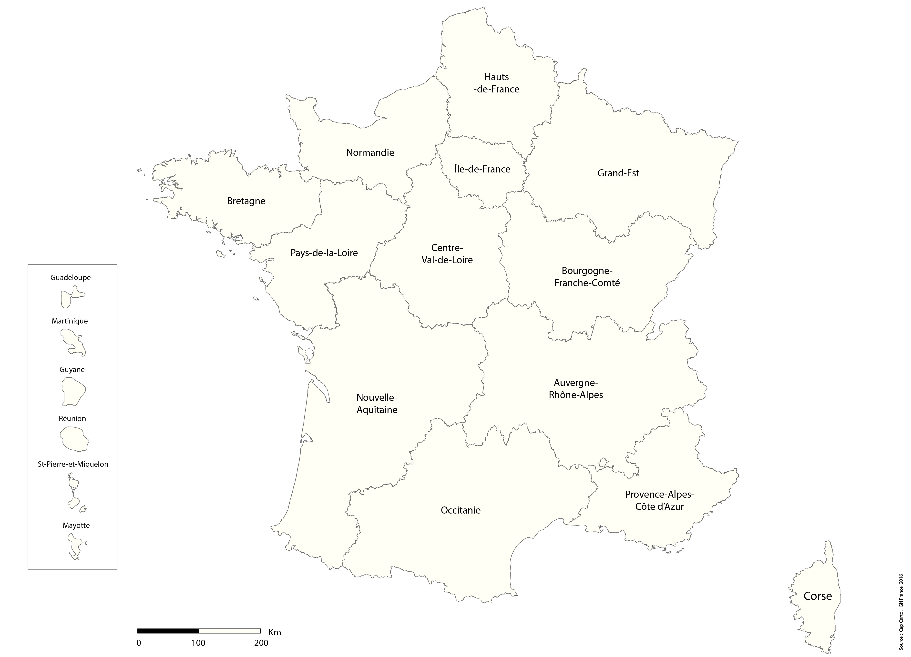
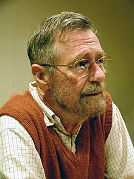
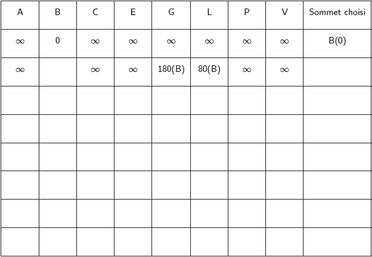
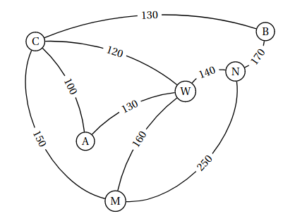

# Recherche du chemin le plus court : l'algorithme de Dijkstra

!!! info "Le contexte"
	Un des problèmes classique en informatique est de trouver le plus court chemin reliant deux éléments d'un même réseau, que ce soit deux villes dans un réseau routier ou deux routeurs d'un réseau informatique.

## Représenter une carte routière, notion de graphe

On considère l'extrait de carte de la région Auvergne-Rhône-Alpes donné ci-dessous :

{: style="width:100%; margin:auto;display:block;background-color: #546d78;" title="Région Auvergne"}

Un technicien d'une entreprise doit se déplacer et pouvoir intervenir sur les différents sites de cette entreprises, situés dans les villes suivantes : Aurillac (A), Bourg-en-Bresse (B), Clermont-Ferrand (C), Saint-Etienne (E), Grenoble(G), Lyon (L), Le Puy-en-Velay(P), Valence(V). Il connait les distances suivantes par autoroute, en km :

<ul>
<li>AC = 160</li>
<li>AP = 180</li> 
<li>CP = 130</li>
<li>CE = 140</li> 
<li>CL = 180</li> 
</ul>

<ul>
<li>PE = 80 </li>
<li>PV = 100</li>
<li>EL = 70 </li>
<li>EV = 100</li>
<li>LV = 100</li>
</ul>

<ul>
<li>LB = 80 </li>
<li>LG = 110</li>
<li>BG = 180</li>
<li>VG = 90 </li>
</ul>

!!! question " Exercice"
	=== "Enoncé"
		Donner une représentation graphique simplifiée de la situation présentée ci-dessus.
	=== "Solution" 
		

!!! abstract "Notion de graphe (non orienté)"

	* Un tel type de représentation s'appelle un graphe non orienté (*undirected graph*) - car les segments peuvent être parcourus dans les deux sens.
	* Les points A, B, C, etc sont appelés **sommets** (*nodes*) du graphe.
	* Les segments reliant deux sommets sont appelés **arêtes** (*edges*).
	* Les valeurs sur les arêtes sont appelées **poids** (*weights*).
	* Deux sommets sont dits **voisins** si il existe une arête entre ces deux sommets.
	* Une **chaîne** (ou un chemin, *path* en anglais) est une suite finie d'arêtes consécutive, et le poids d'une chaîne est la somme des poids de ses arêtes.

La théorie des graphes est une branche particulière des mathématiques ayant une importance capitale dans le développement de l'informatique, et de nombreux algorithmes classiques liés à la théorie des graphes sont systématiquement étudiés par les élèves des différentes écoles et universités faisant de l'informatique.
De nombreux problèmes sont résolubles grâce à une implantation sous la forme de graphe, dont certains problèmes historiques comme :

* {==**Le problème des ponts de Königsberg**==} : est il possible de visiter à pied la ville de Königsberg en passant une et une seule fois par chacun des ponts ?

	{: style="width:50%; margin:auto;display:block;background-color: #546d78;" title="Königsberg"}

* {==**Le problème de la coloration de graphe**==} : On veut colorier une carte géographique tracée sur le plan (ou la sphère) de manière que deux régions voisines soient toujours de couleurs différentes. Combien de couleurs sont nécessaires au minimum ?

	{: style="width:50%; margin:auto;display:block;background-color: #546d78;" title="Régions de France"}
	

## L'algorithme de Dijkstra

!!! info "Edsger Dijkstra"

	

	

	[Edsger Wybe Dijkstra](https://fr.wikipedia.org/wiki/Edsger_Dijkstra){: target="_blank"} (mathématicien et informaticien néerlandais 1930 − 2002) a proposé en 1959 un algorithme qui permet de calculer le plus court chemin entre un sommet particulier et tous les autres. C'est l'un des plus efficaces pour traiter les problèmes de plus court chemin. Grâce à la puissance du traitement informatique, il est utilisé par les logiciels d'optimisation de trajets réels (Navigateurs GPS, Site RATP. . .) ou virtuels (routage internet).
	Cet algorithme ne fonctionne que si le graphe ne possède que des valeurs positives.

	

	

	{: style="width:50%; margin:auto;display:block;background-color: #546d78;" title="Dijkstra, image wikipedia"}

	

	

### Description de l'algorithme

!!! abstract "Algorithme de Dijkstra"
	Si le plus court chemin reliant le sommet $E$ (entrée) au sommet $S$ (sortie) passe par les sommets $s_1 , s_2 , . . . , s_k$ alors, les différentes étapes sont aussi les plus courts chemins reliant $E$ aux sommets successifs $s_1 , s_2 , . . . , s_k$ . 
	Nous devons dons construire de proche en proche le chemin cherché en choisissant à chaque itération de l'algorithme, un sommet $s_i$ du graphe parmi ceux qui n'ont pas encore été traités, tel que la longueur connue provisoirement du plus court chemin allant de $E$ à $s_i$ soit la plus courte possible.
	L'algogramme correspondant est donné ci-dessous : 
	
	{: style="width:50%; margin:auto;display:block;background-color: #546d78;" title="recherche du plus court chemin entre s et e"}

## Exemple complet débranché 

!!! info "Table de Dijkstra"
	Pour faciliter la recherche du plus court chemin il est commode de présenter les résultats dans un tableau.

!!! question "Exercice"

	1. Ayant terminé sa semaine de travail à Bourg-en-Bresse, le technicien souhaite retourner chez lui à Aurillac en faisant le moins de kilomètres possibles.
		Déterminer, en utilisant l'algorithme de Dijkstra, le plus court chemin entre les villes de Bourg-en-Bresse et Aurillac en empruntant le réseau routier, en s'aidant du tableau ci-dessous :
	
		{: style="width:80%; margin:auto;display:block;background-color: #546d78;" title="Table_Dijkstra"}
	
		Quelle est alors la route à emprunter ?

	2. La route entre Le Puy-en-Velay et Aurillac est fermée à la circulation. Quel chemin doit-il alors emprunter?

!!! question "D'autres utilisations"
	Alexis part en voyage dans l’Est des Etats-Unis. Il souhaite visiter les villes suivantes : Atlanta (A), Boston (B), Chicago (C), Miami (M), New York (N)et Washington (W).Une compagnie aérienne propose les liaisons suivantes représentées par le graphe ci-dessous :

	{: style="width:50%; margin:auto;display:block;background-color: #546d78;" title="Graphe aeroports"}
	
	1. Alexis veut relier Boston à Miami.Déterminer le trajet le moins cher ainsi que le coût de ce trajet.
	2. Le site [https://graphonline.ru/fr/](https://graphonline.ru/fr/){: target="_blank"} permet de tracer un graphe et de déterminer entre autre le chemin le plus court grâce à l'algorithme de Dijkstra. Vérifiez vos calculs précédents avec ce site.

 

