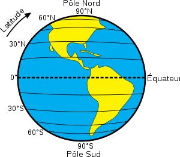

# Coordonnées et GPS

## Introduction : mais où est-ce ?

Téléchargez et ouvrez le fichier [suivant](Arbres.jpg){: target="_blank"}. 

J'ai pris cette photo lors de mes dernières vacances. Pouvez-vous dire précisemment le nom du camping où je me trouvais ?

## Coordonnées sur le globe terrestre

!!! abstract "Système géodésique WGS84"
	Tout point situé à la surface du globe terrestre est déterminé par ses coordonnées géographiques :

	* la **latitude** : angle d'écart par rappor à l'équateur ;
	* la **longitude** : angle d'écart par rapport au méridien de référence (méridien de Greenwich) ; 
	* son **altitude**  : élévation par rapport au niveau de la mer

	

	

				
	{: style="width:50%; margin:auto;display:block;background-color: #546d78;"}
				
	

	

				
	{: style="width:50%; margin:auto;display:block;background-color: #546d78;"}				
				
	

	

	L'ensemble de ces trois notions, auquel on ajoute le centre de la Terre, est le système **géodésique WGS84**. Il est utilisé comme système de référence mondial pour déterminer les positions sur la terre par les systèmes GPS dont nous parlerons plus loin (et par les systèmes concurrents).

Il existe plusieurs façons de noter les coordonnées latitudinales et longitudinales. On peut utiliser la notation *sexagésimale* DMS (Dégrés, Minutes, Secondes) ou bien les *degrés décimaux*, et on peut donner la direction (Nord ou Sud pour la latitude, Est ou Ouest pour la longitude) ou bien utiliser des latitudes et des longitudes positives ou négatives ( par défaut la latitude positive correspond à l'hémisphère nord, et la longitude positive correspond  à la direction Est).

Ainsi on a l'équivalence entre les notations :

* $48^{\circ}51'24''$ nord, $2^{\circ}21'07''$ ouest
* $48,856448^{\circ}$ nord, $2,352197^{\circ}$ ouest
* $(48,856448~;~-2,352197)$

 

!!! question "Exercice"
	=== "Enoncé"
		1. Trouver les coordonnées géodésiques du Lycée Auguste Pavie
		2. Convertir ces coordonnées dans le système DMS.
		3. Quel bâtiment trouve-t-on aux coordonnées $(51,99837~;~-0,74397)$ ?
	=== "Réponses"
		A venir !
  

## Principes de géolocalisation

Pour comprendre le principe de localisation utilisé par les systèmes tels que le GPS, il faut comprendre le principe de **triangulation**. Regardons l'exemple simplifié suivant:

!!! question "Exercice"
	=== "Enoncé"
		Le messager du roi de la **tour 1** doit se rendre à la **tour 3** au travers d'une forêt dense.
		Pour l’aider à s’orienter, les tours 1, 2 et 4 vont tirer un coup de canon toutes les heures à 2 minutes d’intervalle précises.
		Le messager part et traverse la forêt, sans s'arrêter jusqu'à entendre le premier coup de canon. Il s'arrête alors et attends les coups de canons suivants. Il consulte sa montre d'une très grande précision (oui, c'est peu crédible, mais c'est pour l'exemple...)
		
		1. La première tour tire à $10$ h et le messager entend la détonation à $10$ h et $30$ s.
		2. Il entend la détonation de la tour 2 à $10$ h $2$ min et $35$ s.
		3. Celle de la tour 4 à $10$ h $4$ min et $40$ s.
		
		Sachant que la vitesse du son est d'environ $340~m.s^{-1}$, localiser le messager sur le plan ci-dessous (échelle $0,5~cm$ pour $1~km$).
		
		*Vous pouvez travailler directement sur la feuille, ou bien importer l'image [suivante](Plan_Scale.png){:target="_blank"} dans le logiciel `GeoGebra`.*

		{: style="width:50%; margin:auto;display:block;background-color: #546d78;"}
		
	=== "Réponse"
		A venir !

## Les systèmes de Géolocalisation

!!! question "Le système GPS"
	=== "Enoncé"
		1. Regarder la vidéo [suivante](https://www.futura-sciences.com/sciences/videos/kezako-fonctionne-gps-659/){: target="_blank"}
		2. Quelle est l'incertitude de la mesure avec un mètre ?
		3. De quand date les premiers satellites du réseau GPS ?
		4. Votre téléphone portable possède une puce GPS. Est-ce elle qui envoie des informations au satellite ou bien est-ce le satellite qui envoie des informations ?
		5. Quelles sont les données importantes pour déterminer la distance entre la puce GPS et le satellite ?
		6. Question hors vidéo : combien de satellites sont considérés comme à minima nécessaires pour obtenir à la fois latitude, longitude et altitude d'une puce GPS ?
	=== "Réponses"
		A venir !
  

!!! info "Le système GPS (Etats-Unis)" 
	Le **GPS** (Global Positioning System) est un système de positionnement par rapport à un réseau de satellites. Le satellite envoie un signal qui comprend sa position et son heure d'émission. Pour cela, le satellite possède à son bord **une horloge atomique** d’une très grande précision.

	Le récepteur GPS compare l’heure d'émission du signal à l’heure à laquelle il l’a reçu. La différence correspond au temps mis par le signal qu’on obtient entre le satellite et le récepteur. En le multipliant par la vitesse du signal, qui est la vitesse de la lumière ($300~000~km.s^{-1}$), on obtient la distance entre le satellite émetteur et le récepteur.

	Avec **au moins trois satellites**, le récepteur peut trianguler sa position. Une constellation de 31 satellites est en orbite autour de la Terre et couvre toute la surface terrestre. La qualité de la géolocalisation dépend de la synchronisation des horloges entre les satellites et le récepteur. Une **erreur d’un milliardième de seconde** correspond à une **erreur de positionnement de 30 cm**. 

	L'heure délivrée par les horloges atomiques des satellites GPS est aussi utilisée pour synchroniser des systèmes de télécommunication, les réseaux électriques ou financiers.

!!! info "Autres méthodes de Géolocalisation" 
	Le système GPS n'est pas le seul a être utilsé pour la géoocalisation. Le réseau de satellites  Galileo devrait permettre à terme d'obtenir un concurrent européen au système GPS. Mais il existe aussi d'autres formes de géolocalisation qu'on soupçonne moins :

	1. **La géolocalisation par bornage Wi-Fi : le WPS (Wi-Fi Positioning System)**
	
		Un terminal Wi-Fi peut se géolocaliser en fonction des identifiants des bornes Wi-Fi qu’il détecte. Il va pour cela se référer à des bases de données contenant les identifiants des bornes Wi-Fi ainsi que leurs coordonnées géographiques. Plus il détecte de bornes Wi-Fi, plus la localisation est précise.
	2. **Géolocalisation par antenne relais :**
	
		Il existe d’autres modes de géolocalisation reposant sur le même principe, par exemple la géolocalisation par GSM : un téléphone peut se géolocaliser en fonction des antennes relais qu’il détecte, l'identifiant et la position des antennes relais (au sol) étant connus. La précision de la localisation par GSM est de l’ordre de $200$ m en milieu urbain : elle augmente avec la densité des antennes relais.

