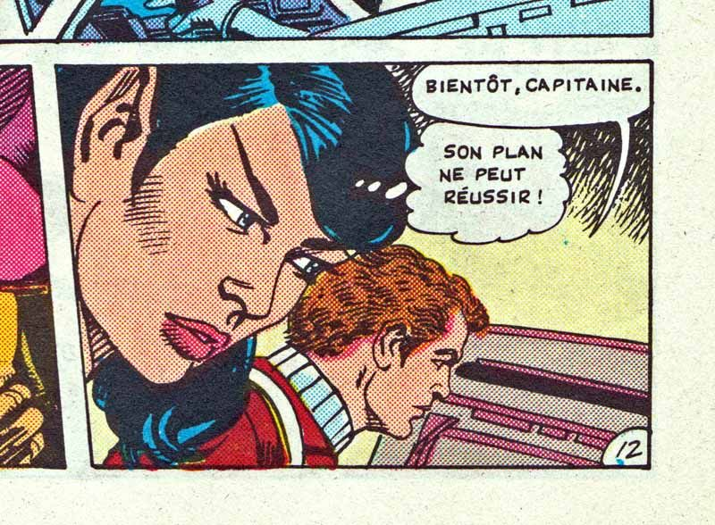
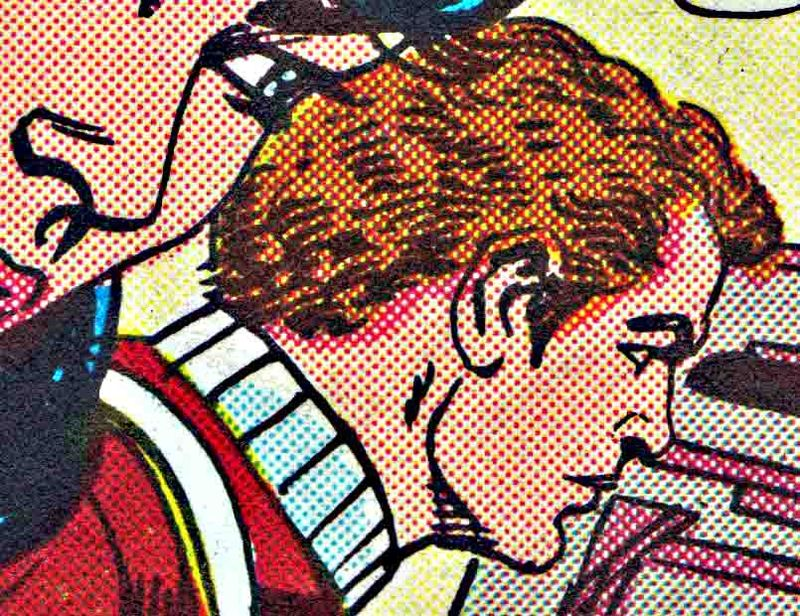
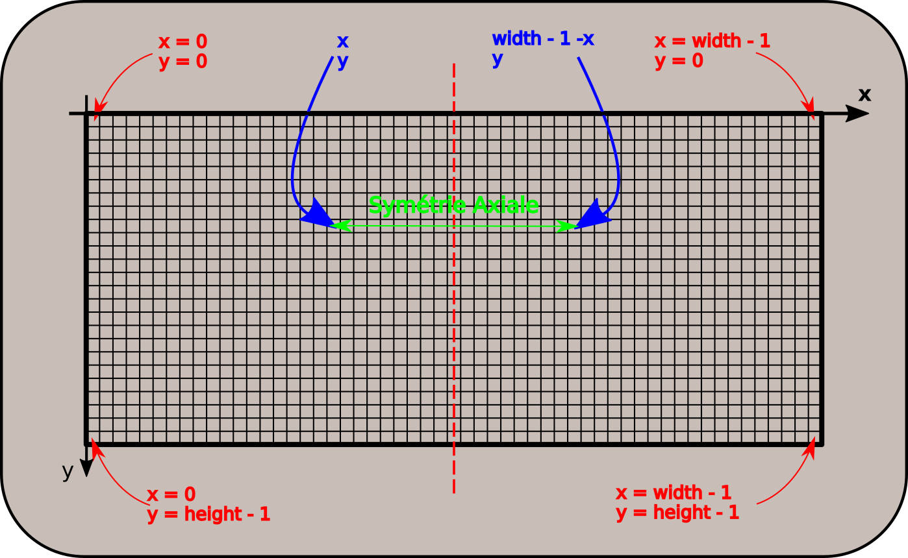

# Les images numériques : du Noir & Blanc aux niveaux de gris

## La révolution des images numériques

!!! tip "La photographie argentique"
	La photographie a été inventée par le français [Nicéphore Niépce](https://fr.wikipedia.org/wiki/Nic%C3%A9phore_Ni%C3%A9pce){: target="_blank"} vers 1824. D'abord sur des plaques d'argent recouvertes de bitumes, et qui nécessitaient plusieurs jours d'exposition aux rayons du soleil. le procédé fut amélioré par [Louis Daguerre](https://fr.wikipedia.org/wiki/Louis_Daguerre){: taget="_blank"}, qui recouvrit la plaque d'argent par une fine couche de iodure d'argent, cette plaque étant ensuite exposée dans une chambre obscure puis soumise à des vapeurs de mercure qui provoquaient l'apparition de l'image. Le procédé s'améliora au fur et à mesure, par l'utilisation de papier argentiques réalisant un négatif de l'image souhaitée, la photographie se révélant après un bain dans différentes substances chimiques au sein d'une chambre noire.
	
	Les procédés de photographie couleur ne sont apparus qu'au milieu des année 1930.

	Au temps de la photographie argentique, obtenir une photographie nécessitait l'exposition puis le développement d'une pellicule sur du papier traité spécialement. Il fallait donc du temps, et chaque photo prise devait être développée - et donc coutait une certaine somme - quel que soit le résultat de la photo.
	
	Pour mieux comprendre, rien de tel qu'une série de vidéo de *C'est pas sorcier* :
	
	* [Comment fonctionne la photographie argentique ?](https://www.youtube.com/watch?v=f53wbt7rfwA){:  target="_blank"}
	* [A quoi sert l'obturateur d'un appareil photo ?](https://www.youtube.com/watch?v=aaHrtSMDXdk){:  target="_blank"}
	* [Comment développe-t'on une photo ?](https://www.youtube.com/watch?v=UgmUemnIlGI&t=12s){:  target="_blank"}

!!! question 
	
	=== "Enoncé"
	
		Quels sont les avantages et les défauts de la photographie argentique par rapport à la photographie numérique ?
		
	=== "Réponses"
	
		La {==**photographie numérique**==} - et par extension la {==**vidéo numérique**==} - a considérablement changé notre rapport à l'image. Tout possesseur de smartphone peut prendre des centaines de photographies, consulter immédiatement le résultat de la prise de vue, supprimer, éditer ou améliorer la photographie, et l'envoyer à l'autre bout du monde via internet, tout cela pour un coût extrêmement bas par photographie.

		Bien entendu, comme tout progrès technologique, celui-ci n'est pas sans poser de nombreux problèmes. Par exemple, il est très facile de copier une photographie numérique ( c'est ce qu'on appelle la non-rivalité de l'information numérique ). D'où un certain nombre de problèmes :

		* droits d'auteurs ;
		* respect de la vie privée ;
		* droit à l'effacement compromis ;
		* deep-fake et manipulation de l'information
		* etc...

Dans cet thème, nous étudierons à la fois le côté numérique et technologique - comment est constituée une image numérique, sous quelle forme elle est stockée dans l'ordinateur - mais aussi sur les aspects sociétaux liés à l'utilisation des images numériques.

## Quelques considérations optiques

### Les trames Benday

Lors des années 1950 -1970, les comics américains ainsi qu'un certain nombre d'éditeurs de bandes dessinées européens utilisaient pour leurs couleurs une impression quadrichromique basée sur  la méthode des [**Benday dots**](https://fr.wikipedia.org/wiki/Points_Benday){: target="_blank"}. Cette méthode consiste à appliquer de la couleur par une juxtaposition de points de couleurs primaires (par couches cyan, magenta, jaune et noire ), comme par exemple dans les images suivantes :

!!! info "BD et Benday Dots"
	<div style="display:flex;">
	<div style="display : inline; width : 50%;">

	{: style="width:60%; margin:auto;display:block;background-color: #d2dce0;"}

	</div>
	<div style="display : inline; width : 50%;">

	{: style="width:60%; margin:auto;display:block;background-color: #d2dce0;"}

	</div>
	</div>

	Cette méthode permettait à moindre coût d'obtenir des nuances de couleurs suffisantes pour une impression de bandes dessinées. L'artiste américain de pop art [Roy Lichtenstein](https://fr.wikipedia.org/wiki/Roy_Lichtenstein){: target="_blank"}. s'est par ailleurs emparé de cette méthode pour réaliser de nombreuses oeuvres.


### Le pouvoir de résolution de l'oeil

Si la méthode des {==**Benday Dots**==} fonctionne et nous donne l'impression de nuances de couleurs, c'est parce qu'à une distance suffisant, nous sommes dans l'impossibilité de distinguer ces points. Ceci est du au [pouvoir de résolution de l'oeil](https://fr.wikipedia.org/wiki/Pouvoir_de_résolution){: target="_blank"}


Pour la vision humaine, selon wikipédia, le pouvoir de résolution de l'œil est d'environ une minute d'arc ($1' = 1/60° = 0,017°$), soit environ 100 km sur la surface de la Lune vue de la Terre, ou plus proche de nous, un détail d'environ 1 mm pour un objet ou une image situé à 3 m de distance.

!!! example "Exemple"
	A titre d'exemple, on peut considérer cette image sous trois résolutions différentes :
	
	{: style="width:90%; margin:auto;display:block;background-color: #d2dce0;"}

	Si de près l'image de gauche est beaucoup plus nette que l'image de droite, en vous reculant par rapport à l'image, vous trouverez une distance pour laquelle vous ne verrez plus de différence entre les images. Vous aurez ainsi atteint la limite de résolution de votre oeil.


## Du noir et blanc aux niveaux de gris

### Du caractère à l'image


!!! question "Du caractère à l'image"

	=== "Enoncé"
		1. Créez un dossier `ImagesNumeriques` dans votre dossier `SNT`.
		2. Téléchargez et enregistrez dans le dossier précédent le fichier [reallyNumbers.txt](https://fvergniaud-drive.mytoutatice.cloud/public?sharecode=wAS20w1woEon){: target="_blank"}
		3. Ouvrez avec `Notepad++` le fichier `reallyNumbers.txt`. Que contient-t-il ?
		4. A l'aide de la combinaison `CTRL+Molette`, dézoomer le fichier. Quel constat pouvez-vous faire ?
		5. A l'aide de l'outil de remplacement (`Recherche > Remplacer`), remplacer toutes les valeurs &laquo;`255`&raquo;  par **rien** (c'est-à-dire PAS PAR UN ESPACE), puis remplacez toutes les valeurs &laquo;`0 `&raquo; ( c'est-à-dire un zéro suivi d'un espace) par &laquo;`0`&raquo; (c'est-à-dire zéro non suivi d'un espace). Dézoomez de nouveau. Que constate-t-on ?
		6. Combien de lignes possède ce fichier ?
		7. Combien de caractères, espaces compris, y-a-t-il par ligne ?
		
	=== "Solution"
	

### Une image en noir et blanc

!!! question "Images en noir et blanc"

	=== "Enoncé"
	
		1. Téléchargez et en,registrez dans le répertoire `ImagesNumeriques` le fichier [champiNB.bmp](https://fvergniaud-drive.mytoutatice.cloud/public?sharecode=tUGUEeL5t6pX){: target="_blank"}
		2. Ouvrez le fichier `champiNB.bmp` dans un visionneur d'images.
		3. Quelle est la largeur en pixel de l'image ?
		4. Quelle est la hauteur en pixel de l'image ?
		5. Combien y-a-t-il de pixels dans l'image ?
		6. Quelle est la dimension en octet de cette image ?
		
	=== "Solutions"

!!! info "Représenter une image en noir et blanc"
	En simplifiant beaucoup, l'image obtenue dans la partie précédente est une image numérique en noir et blanc. Le fichier `reallyNumbers.txt` est une version lisible du fichier `champiNB.bmp`. Chaque {==**pixel**==} de l'image est représenté par deux valeurs : $255$ pour du blanc et $0$ pour du noir - soit un octet plein (`1111 1111`) pour du blanc et un octet vide (`0000 0000`) pour du noir.
	
	Le nombre d'octets dans l'image BMP correpond donc à peu près au nombre de pixels de l'image. La différence provient d'un petit nombre d'informations situées dans l'entête du fichier pour préciser le réel format de l'image - ici le format `BMP` ( *BitmaP*, ou *windows BitMap*).

!!! tips "Ecrans monochromes"
	Au début de l'informatique - des années 1960 aux années 1980, il était très fréquent d'utiliser des écrans **monochromes**. Ces écrans étaient constitués de luminophores - une substance qui emet de la lumière si elle subit une exitation. Ces luminophores donnaient à l'écran, en fonction de leurs caractéristiques, soit une couleur blanche, soit une couleur orange, mais le plus souvent une couleur verte ! D'où les images bien connues du film `Matrix`, ou les couleurs des affichages des ordinateurs de bord dans la première trilogie de `Star Wars`.
	
	<div style="display:flex;">
	<div style="display : inline; width : 50%;">

	{: style="width:60%; margin:auto;display:block;background-color: #d2dce0;" title="Depuis https://fr.m.wikipedia.org/wiki/Matrix_(film)"}

	</div>
	<div style="display : inline; width : 50%;">

	{: style="width:60%; margin:auto;display:block;background-color: #d2dce0;" title="Depuis https://scifi.stackexchange.com/questions/141963/video-displays-in-star-wars?rq=1"}

	</div>
	</div>
	
	Certains écrans monochromes sont toujours utilisés en raison de leur très grande lisibilité.


### Générer ses propres images


!!! question "Fabriquer en PixelArt"

	=== "Enoncé"
	
		1. Ouvrir le logiciel `Thonny`.
		2. Ouvrir le menu `Tools > Manage packages` et dans la barre de recherche, chercher le module `pillow`, et l'installer si il n'est pas déjà installé.
			
			{: style="width:40%; margin:auto;display:block;background-color: #d2dce0;"}
			
		3. Téléchargez et sauvegardez le fichier [GenereBMP.py](https://fvergniaud-drive.mytoutatice.cloud/public?sharecode=aN9e0gyfm0cW){: target="_blank"}, puis ouvrez le dans `Thonny`.
		4. Exécutez le programme, en sauvegardant le fichier sous le nom `Stripes.bmp`. Ouvrez l'image obtenue. Qu'obtient-on ?
		5. Dans le code, quelle structure représente l'image ?
		
			!!! info "Matrice des pixels"
				En Python, une telle structure est **un tableau** (plus précisément, un tableau est une liste de listes). Un tableau de nombre est appelé une {==**matrice**==}. Dans notre cas chaque nombre de la matrice `pix` représente un pixel soit de couleur noire ($0$), soit de couleur blanche($255$).
			
		6. Combien y-a-t-il de pixels dans cette image ?
		7. Modifiez la matrice afin d'obtenir l'image suivante :
			
			{: style="width:30%; margin:auto;display:block;background-color: #d2dce0;"}

		8. A l'aide des grilles suivantes, créez deux nouvelles images :
		
			<div style="display:flex;">
			<div style="display : inline; width : 50%;">
			
			{: style="width:60%; margin:auto;display:block;background-color: #d2dce0;"}
			
			</div>
			<div style="display : inline; width : 50%;">
			
			{: style="width:60%; margin:auto;display:block;background-color: #d2dce0;"}
			
			</div>
			</div>
			
		9. Combien de valeurs sont nécessaires pour une image de $16 \times 16$ pixels ? de $32 \times 32$ pixels ? de $64 \times 64$ pixels ?
		

### Les niveaux de gris

Téléchargez et sauvegardez les fichiers [champisGris.txt](https://fvergniaud-drive.mytoutatice.cloud/public?sharecode=mJRnpOWGEy2i){: target="_blank"} et [champisGris.bmp](https://fvergniaud-drive.mytoutatice.cloud/public?sharecode=cpvc17jWT1Rg){: target = "_blank"}.

Le fichier `champiGris.txt` contient l'extraction des pixels du fichier `champiGris.bmp`. Quelle est la principale différence par rapport au fichier  `champiNB.txt` ?

!!! info "Nuances de gris"
	Contrairement aux écrans monochromes, qui ne pouvaient pour chaque luminophore prendre que deux valeurs (allumés et éteints), les écrans de télévision à tubes cathodiques dits &laquo; en noir et blanc &raquo; étaient en fait capable de prendre toute une nuance de couleur entre le noir et le blanc, ce qu'on appelle des {==**niveaux de gris**==}.
		
	De la même manière qu'en noir et blanc, ont peut donc créer et manipuler des images en niveau de gris, chaque pixel pouvant alors prendre une valeur entière comprise entre $0$ et $255$, soit $256$ nuances différentes.


## Transformer des images


!!! question "Manipuler et transformer des images"

	=== "Enoncé"

		1. Téléchargez et enregistrez le fichier [vador.jpeg](https://fvergniaud-drive.mytoutatice.cloud/public?sharecode=M3OuM7GNgzIm){: target="_blank"} dans votre dossier `SNT/ImagesNumériques`.
		2. Téléchargez et enregistrez [traitementGris.py](https://fvergniaud-drive.mytoutatice.cloud/public?sharecode=IFOmGxePA8fb){: target="_blank"}  puis ouvrez-le dans `Thonny`.
		3. Exécuter le fichier `traitementGris.py`.
		4. Commebnt s'appelle la transformation effectuée entre les deux images ?
		
			!!! tips "La carte des pixels (*Pixel Map*)"
			
				Chaque pixel d'une image est repéré par ses *coordonnées*, sous la forme d'un couple $(x~;~y)$ d'entiers, compris entre :
				
				* `0` et `width-1`, où `width` est la {==**largeur**==} de l'image;
				* `0` et `height-1`, où `height` est la {==**hauteur**==} de l'image.
				
				L'axe des abscisses est *horizontal*, et dirigé vers la droite (comme en maths).
				L'axe des ordonnées est *vertical*, et dirigé **vers le bas** (au contraire des maths !)
				
				{: style="width:80%; margin:auto;display:block;"}
				
				Le pixel obtenu par symétrie axiale d'axe vertical médian en partant du pixel de coordonnées $(x~;~y)$ est donc celui de coordonnées $(width - 1 - x~;~y)$.
				
				On voit cette transformation dans le code Python :
				
				```` python
				gs, alpha = file.getpixel((x,y))
				# On place dans la nouvelle image le symétrique du pixel travaillé
				pixels[width-1-x,y] = (gs, alpha)
				````
 		
		5. Comment transformer le code pour obhtenir une symétrie d'axe horizontal ?
		6. Comment transformer le code pour obtenir une rotation à 180° de l'image originale ?
		7. Pour obtenir un négatif de l'image originelle, il faut changer la valeur de chaque pixel de la manière suivante :
		
			* un pixel de valeur 255 devient de valeur 0 et inversement ;
			* un pixel de valeur 250 devient de valeur 5 et inversement :
			* un pixel de valeur 100 devient de valeur 1555 et inversement :
			* ...
			
			Que changer dans la ligne suivante pour obtenir un tel négatif ?
			
			```` python
			pixels[width-1-x,y] = (gs, alpha)
			````
		
!!! info "Autres images"
	Vous pouvez aussi vous amuser avec d'autres images, il suffit de les mettre dans votre dossier `SNT/Images` et de changer le nom dans la ligne 6 du programme `traitementGris.py`.
		