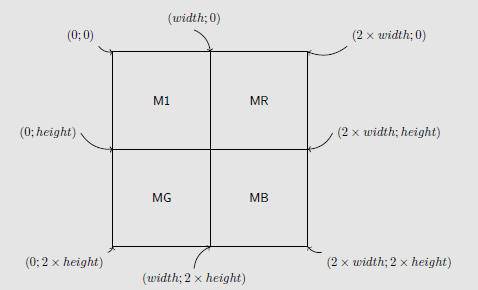

# Les images en couleur

## Les écrans couleurs

*Toutes les questions suivantes sont à réaliser à l'aide de l'appareil photo de votre téléphone portable. Si la manipulation ne fonctionne pas, vous pourrez trouver des images d'exemples dazns le répertoire de votre classe.*


1. A l'aide de l'appareil photo de votre téléphone portable, prenez une photo de l'écran ed l'ordinateur avec un zoom maximal. Essayez d'obtenir une photo la plus nette possible.
2. Ouvrez la photo prise, et zoomez la au maximum. Que voit-on ? Faites un schéma ci-dessous.

## Le format RGB

!!! info "la synthèse additive RGB"
Une norme fréquemment utilisée pour les images numériques est la norme `RGB` (Red Green Blue). Ce qu'on appelle un pixel d'écran est composé de trois leds des trois couleurs RGB. Un pixel informatique est alors représenté sous la forme de trois valeurs numériques comprises entre $0$ et $255$, $0$ représentant la led éteinte, et $255$ la led totalement allumée. 
Ainsi  :

* la couleur rouge est représentée par $(255,0,0)$ ;
* la couleur verte est représentée par $(0,255,0)$ ;
* la couleur bleue est représentée par $(0,0,255)$ ;
* la couleur fuchsia (violet) est représentée par $(255,0,255)$ ...

Vous pouvez utiliser le site [suivant](https://www.w3schools.com/colors/colors_picker.asp){: target="_blank"} pour essayer les différentes valeurs.


1. Quelle est le triplet de valeur RGB pour la couleur jaune ?
2. Quelle est la couleur représentée par le triplet RGB $(255, 153, 0)$ ?
3. Ouvrir le fichier `FunWithFlags.py`, puis déclenchez-le.
	1. Quel est le nom du fichier image créé ?
	2. Quelle est la dimension en pixel de l'image créée ?
	3. A quoi sert la ligne d'instructions
	
		```` python 
		for x in range(200) :
		````

	4. Que représentent les variables $x$ et $y$ dans la ligne de commande :
		```` python 
		img.putpixel((x,y),(0,0,255))
		````
	5. Compléter le fichier afin de réaliser le drapeau français.
	6. Faire de même avec le drapeau belge.
	7. Comment réaliser un drapeau Néerlandais ?


## Un peu d'art

!!! info "Transparence et Canal Alpha"
	Pour certains types d'images, un quatrième octet est utilisé pour chaque pixel. Il s'agit du {==**canal alpha**==}, qui caractérise la {==**transparence**==} de ce pixel. Cette couche supplémentaire permet de superposer des images - par exemple dans un jeu vidéo un sprite pourra  apparaître sur le fond, sans masquer la totalité sous la forme d'un carré.
	
	Cet octet supplémentaire est utilisé de la manière suivante :

	* si il est à $255$, le pixel est correctemnt affiché ;
	* si il est à $0$, le pixel est transparent.


	**Dans toutes les images suivantes, le canal alpha a été désactivé. Il n'y aura donc pas de transparence !**


!!! abstract "Andy Warhol"
	Andy Warhol est un artiste américain, né le 6 août 1928 à Pittsburgh, en Pennsylvanie, et mort le 22 février 1987 à New York. Il est l'un des principaux représentants du pop art. Il est particulièrement célèbre pour certaines de ses oeuvres mettant en scène l'actrice Marilyn Monroe, le visage de cette dernière étant reproduit plusieurs fois avec différentes couleurs, et les portraits étant juxtaposés.


	{: style="width:30%; margin:auto;display:block;;background-color: #546d78;"}
	

	De nombreux artistes du pop-art,du street-art et même de la culture geek ont repris cette oeuvre et l'ont détournée avec leurs propres personnages.

N'étant pas (encore) des artistes émérites, nous nous contenterons donc de copier Andy Warhol, en commençant pas extraire et créer des images monochromes à partir d'une seule image. Pour cela, nous allons appliquer des filtres à une image originelle, filtres qui vont nous renvoyer une matrice de pixels modifiée par ces filtres.

1. Récupérez et copiez dans votre espace personnel les fichiers `MonoChromes.py` et `Stormtroppers.png`.
2. Ouvrez le fichier `MonoChromes.py` avec *Thonny*, puis exécutez-le. Normalement vous devriez voir apparaître une image de Stormtrooper en niveaux de gris. Observez ensuite les dernière lignes du code *Python*.

	!!! info "Fonctions du code"
	
	* `makeMatrix` (L.98) : fabrique une matrice de  pixel RGB à partir d'une image sélectionnée et ouverte dans la ligne 97.
	* `showFromMatrix` (L.99) : affiche dans le visionneur d'image l'image générée par la matrice qui lui est donnée en argument.


### Monochromes

1. Décommentez (= supprimez le symbole #) les lignes 100 et 101, et commentez(= ajoutez devant une ligne le symbole #)
2. Exécutez le code. Qu'obtenez-vous ?
3. La fonction utilisée en ligne 100 utilise un **filtre** sous la forme $(0,1,0)$. A quoi correspondent ces nombres selon vous ?
4. Appliquer un filtre donnant une image rouge. Quel filtre avez-vous appliqué ?
5. Appliquer un filtre donnant une image bleue. Quel filtre avez-vous appliqué ?
6. Quel filtre faut-il appliquer pour obtenir une image jaune ? magenta ? cyan ?

!!! info "Filtres de couleurs"
	La fonction `extractColor` (L.26-46) utilise un filtre pour extraire la coloration d'une image. Le filtre RGB est écrit sous la forme d'un *tuple* $(x,y,z)$ (un *tuple* est une structure Python contenant plusieurs données, séparées par des virgules, et encadrées par une paire de parenthèses).
	
	$x$, $y$ et $z$ sont des réels qui sont compris entre 0 et 2 avec la norme suivante :
	
	* à 0, renvoie la valeur 0 de la composante ;
	* à 1, renvoie la valeur actuelle de la composante du pixel ;
	* à 2, renvoie la valeur maximale de cette composante ( 255) ;
	* toute autre valeur donnera une teinte modifiée de la teinte originale, plus sombne si le nombre est compris entre 0 et 1, plus claire si ce nombre est compris entre 1 et 2.


### Postérisation

1. Commentez les lignes 100 et 101, et décommentez les lignes 102 et 103.
2. Exécutez alors le code. Qu'obtient-on ?
3. Observez la ligne 69 :
	```` python 
	poster =  [[0]*2*width for _ in range(1*height)]
	````
	A votre avis, quelle est la dimension de la matrice `poster` par rapport à l'image originale ?
4. Que se passe-t-il dans les lignes 70 à 73 ?
	
	```` python
	M1 = makeMatrix(img)
	MR = extractColor(img,(1,0,0))
	MG = extractColor(img,(0,1,0))
	MB = extractColor(img,(0,0,1))
	````

5. Dans la ligne 76,

	```` python
	poster[y][x] = M1[y][x]
	````
	Chaque pixel de l'image originale `M1` est placé aux même coordonnées dans la matrice `poster`. Que signifie alors la ligne 77 ?
	
	```` python
	poster[y][x+width] = MR[y][x]
	````

	!!! info "Postériser"
		Pour postériser à la manière d'Andy Warhol notre image, nous devrons copier dans la matrice `poster` les images manquantes vertes et bleues. Pour cela il faut comprendre la façon dont les matrices devront s'organiser, et pour cela iol faut comprendre le système de coordonnées des images :
		
		{: style="width:30%; margin:auto;display:block;;background-color: #546d78;"}
	
6. Modifier la ligne 69 puis les lignes situées après la ligne 77 pour obtenir une postérisation telle que celle-ci :

	{: style="width:30%; margin:auto;display:block;;background-color: #546d78;"}


7.Vous pouvez désormais choisir votre propre image, et la postériser à la manière d'Andy Warhol. Vous pouvez même  créer des images telles que celles-ci, sans modifier beaucoup le code :

	{: style="width:60%; margin:auto;display:block;;background-color: #546d78;"}


## Autres transformations

1. Dans le code on trouve la fonction `negativ`, qui prend une image en argument et renvoie la matrice du négatif de cette image. Le principe est simple : pour chaque composante RGB, on affecte la teinte opposée, par le calcul $255-x$, où $x$ est la valeur de la composante. On obtient ainsi un négatif de l'image originelle. Vous pouvez essayer en décommentant les lignes suivantes :

	```` python
	neg = negativ(originalImg)
	showFromMatrix(neg)
	````
2. En s'inspirant de la fonction `negativ`, créer une fonction `permuteBRG` qui permute les composantes RGB d'une image, en transformant le rouge en bleu, le vert en rouge, et le bleu en vert.
3. Faire de même avec une fonction `permuteGBR` qui permute les composantes RGB d'une image, en transformant le rouge en vert, le vert en bleu, et le bleu en rouge.
4. Créer à partir de la fonction `negativ` une nouvelle fonction `rotateRGB`, et remplacer la ligne
	```` python
	negat[y][x] = 255-R,255-G,255-B
	````
	par 
	```` python
	negat[y][x] = matrix[height-1-y][width-1-x]
	````
	Comment est l'image obtenue ?

5. Modifier de même la fonction pour obtenir une symétrie horizontale, puis une symétrie verticale.
