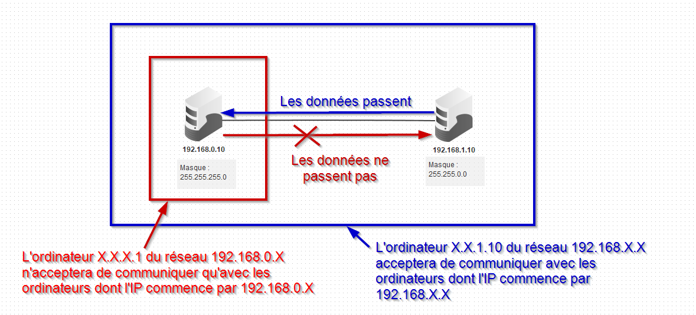

# Connecter des réseaux entre eux : Internet

Nous avons vu dans la partie précédente l'importance du **protocole TCP/IP** dans la communication entre plusieurs ordinateurs **d'un même réseau**.

!!! info "Adresses MAC"
	En fait, au sein d'un même réseau, les adresses IP ne sont pas essentielles. Ce sont en fait les adresses MAC - théoriquement uniques - qui sont échangées entre les machines. Mais pour des raisons de simplifications nous resterons sur les adresses IP.

Créer un  réseau est donc une chose relativement aisée. Mais comment relier deux réseaux existants entre eux ? Comment interconnecter plusieurs de ces réseaux, pour obtenir le réseau des réseaux, communément appelé **Internet** ?

## Adresses IP et masques de sous-réseau

!!! info "Masque de sous-réseau"

	Dans le protocole TCP/IP, l'adresse IP n'est pas seulement l'adresse de la machine. **Il s'agit aussi de l 'adresse du réseau**. Plus spécifiquement, une adresse IP est toujours accompagnée de ce qu'on appelle un **masque réseau**.
	Il s'agit d'un nombre binaire sur 4 octets ( comme les adresses IP ), qui peut être représenté sous la même forme qu'une adresse IP.
	
	Généralement, les masques sont de la forme :

	* `255.0.0.0` ;
	* `255.255.0.0` ;
	* `255.255.255.0` .

	??? info "Pour les curieux"
		Un masque réseau IPV4 est une série de 32 bits ( 8x4 donc 32 bits), telle que les bits de gauche soient tous des 1 et ceux de droite tous des zéros. Par exemple `11111111.11111111.00000000.00000000` est un masque, `11111111.11111111.11110000.00000000` est aussi un masque, mais `11111111.11111111.00001111.00000000` n'en est pas un.
				
		La question n'est pas ici de rentrer dans une technique de calculs binaires assez complexe, mais de vous faire comprendre comment fonctionne globalement un masque. Il faut juste retenir que le nombre $255$ en base 10 s'écrit en binaire `11111111`, et que le nombre $0$ s'écrit `00000000`
		Donc nous allons supposer que seul les 3 premiers octets peuvent être pleins de 1,c'est à dire :

		* `255.0.0.0` (soit `11111111.00000000.00000000.00000000`);
		* `255.255.0.0` (soit `11111111.11111111.00000000.00000000`);
		* `255.255.255.0` (soit `11111111.11111111.11111111.00000000`).

		Ce n'est pas exact, car en réalité le masque n'est pas obligé de compléter intégralement un octet. On peut ainsi avoir des masques de type `11111111.11100000.00000000.00000000`, où le deuxième octet n'est que partiellement complété - ce qui donne alors un masque `255.204.0.0`. Mais ce type de masque a pour conséquence de rendre certains calculs très fastidieux pour les humains, qui comptent en base décimale, alors que les machines, qui comptent en binaire réussissent facilement ces calculs.

!!! question "Exercice"

	1. Placer deux ordinateurs dans l'espace de travail `Filius`.
	2. Configurez :
		1. le premier avec comme adresse IP `192.168.0.10` et comme masque `255.255.255.0` ;
		2. le second avec avec comme adresse IP `192.168.1.10` et comme masque `255.255.0.0`.
	3. Installez sur chacun des pc le programme *Ligne de commande*.
	4. Sur la machine `192.168.0.10`, essayez de joindre avec la commande `ping` la machine `192.168.1.10`. Que se passe-t-il ?
	5. Sur la machine `192.168.1.10`, essayez de joindre avec la commande `ping` la machine `192.168.0.10`. Que se passe-t-il ?
	
!!! abstract "Masque de réseau et IP"
	Le masque de réseau permet de définir quelle partie de l'adresse IP est celle du réseau, et quelle partie est celle de la machine. Ainsi la machine dont l'IP est `172.16.180.1` avec la masque `255.255.0.0` a pour adresse de réseau `172.16.X.X` et pour adresse de machine `X.X.180.1`
	Une machine ne pourra communiquer par principe qu'avec les machines possédant le même numéro de réseau.

!!! example "Exemple"

	Avec les données de l'exercice précédent :
	
	{: style="width:100%; margin:auto;display:block;background-color: #546d78;"}
	

## Le routeur : un appareil pour relier les réseaux

!!! abstract "Routeur"
	Un **routeur** est une machine possédant plusieurs cartes réseaux, et étant capable de faire des liens ({==**des routes**==}) entre différents réseaux.
	Un routeur possède une adresse IP pour **chacun des réseaux duquel il fait partie**, et est considéré comme faisant partie de chacun des réseaux auquel il est relié.

!!! question "Exercice"
	Nous allons tenter de relier deux réseaux différents entre eux :

	* dans le premier il y a trois machines (sous forme de tours) d'IP `192.168.0.10` à `192.168.0.12`, toutes avec le masque `255.255.255.0`, reliées par un switch ;
	* dans le deuxième il y a trois machines (sous forme de portables) d'IP `172.180.100.110` à `172.180.100.112`, toutes avec le masque `255.255.0.0`, reliées par un switch.
	
	Répondez à chacune des questions suivantes :

	1. Quel est le numéro de réseau du premier réseau ? Du second réseau ?
	2. Créez dans `Filius` ces deux réseaux, le réseau `192.168.0.X`. étant situé à gauche de l'acran, et le réseau `172.180.X.X` étant à doite.
	3. Installez la ligne de commande sur une des machines de chacun des réseaux, et vérifiez si vous pouvez utiliser correctement la commande `ping`.
	4. Placez un routeur au milieu, avec deux interfaces, et joignez le par un câble à chaque switch.
	5. Le routeur étant une machine du réseau, il faut lui adresser une IP compatible pour chacun de ces réseaux. Vous lui donnerez comme IP `192.168.0.254` pour le premier, et `172.180.100.254` pour le second.
		Testez la commande `ping` entre deux postes des deux réseaux. Que se passe-t-il ?
		
		!!! abstract "Passerelle"
			Une machine basique n'est normalement pas capable de résoudre (c'est-à-dire identifier) des adresses IP n'appartenant pas à son réseau. Elle délègue ce travail à une machine particulière, appelée **passerelle** (ou \emph{Gateway}). Cette machine particulière peut être une machine du réseau, comme un serveur spécifique, ou bien directement un routeur.

	6. Configurez les machines du réseau `192.168.0.X`  pour qu'elles aient comme passerelle l'IP du routeur, c'est-à-dire `192.168.0.254`. Faites de même avec le réseau `172.180.X.X`.
		Testez de nouveau la commande `ping`. Que se passe-t-il ?
	7. Installez sur une machine du réseau `192.168.0.X` un serveur web, et testez sur les machines du réseau `172.180.X.X` l'affichage de la page web d'accueil du serveur.

## Multiples réseaux, multiples routeurs

*Cette partie est très largement inspirée du travail de [David Roche](https://pixees.fr/informatiquelycee/n_site/snt_internet_routage.html).

!!! abstract "Internet"
	D'après [wikipédia](https://fr.wikipedia.org/wiki/Internet) ;
	&laquo; Internet est le réseau informatique mondial accessible au public. C'est un réseau de réseaux, à commutation de paquets, sans centre névralgique, composé de millions de réseaux aussi bien publics que privés, universitaires, commerciaux et gouvernementaux, eux-mêmes regroupés en réseaux autonomes (il y en avait plus de 91 000 en 2019). &raquo; 
	
Nous avons vu comment relier deux réseaux différents. Internet fonctionne donc de la même manière, mais avec plusieurs milliers de réseaux reliés entre eux par l'intermédiaire de nombreux routeurs, privés ou publics.

!!! question "Exercice"
	Dans `Filius` ouvrez le fichier `snt_sim_res.fls` situé dans les documents en consultations de votre répertoire de classe.
	Ce fichier représente une petite portion d'Internet simplifiée à l'extrême :
	
	{: style="width:100%; margin:auto;display:block;background-color: #546d78;"}
	
	Il contient :

	* $15$ ordinateurs : $M1$ à $M15$ ;
	* $6$ switchs : $R1$ à $R6$ ;
	* $8 $routeurs : $A, B, C, D, E, F, G$ et $H$.

	Voici quelques exemples de communications entre 2 ordinateurs. Pour chacun des suivants, donnez les trajets (c'est-à-dire les machines) suivis par les paquets de données :

	1. **cas n°1 : M1 veut communiquer avec M3**
	2. **cas n°2 : M1 veut communiquer avec M6**
	3. **cas n°3 : M1 veut communiquer avec M9**
	4. **cas n°4 : M13 veut communiquer avec M9**

!!! abstract "Routage des paquets"
	Il est très important de bien comprendre qu'il existe souvent plusieurs chemins possibles pour relier 2 ordinateurs.
	Nous pouvons avoir : 
	
	$$
	M13 \rightarrow R6 \rightarrow Routeur~G \rightarrow Routeur~F \rightarrow Routeur~E \rightarrow R4 \rightarrow M9
	$$
	
	ou encore :
	
	$$
	M13 \rightarrow R6 \rightarrow Routeur~G \rightarrow Routeur~F \rightarrow Routeur~H \rightarrow Routeur~C \rightarrow Routeur~D\\
	\rightarrow Routeur~E \rightarrow R4 \rightarrow M9
	$$
	
	On pourrait penser que le chemin &laquo; $Routeur~F \rightarrow Routeur~E$&raquo; est plus rapide et donc préférable au chemin &laquo; $Routeur~F \rightarrow Routeur~H$&raquo;, cela est sans doute vrai, mais imaginez qu'il y ait un problème technique entre le Routeur F et le Routeur E, l'existence du chemin &laquo; $Routeur~F \rightarrow Routeur~H$&raquo; permettra tout de même d'établir une communication entre $M13$ et $M9$. Parfois, on entend certains politiques ou journalistes évoquer &laquo; la coupure d'internet &raquo;, peut être comprendrez-vous mieux maintenant que cela n'a aucun sens, car même si une autorité quelconque décidait de couper une partie des infrastructures, les paquets pourraient passer par un autre chemin. C'est ce à quoi font référence les termes &laquo; sans centre névralgique &raquo; dans la définition de wikipédia.

	 

