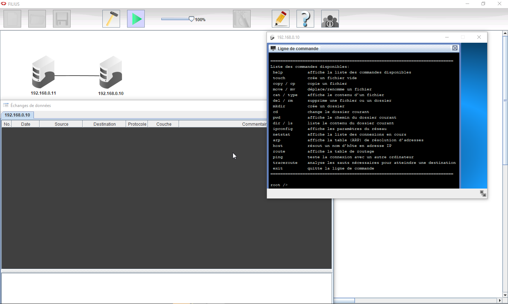
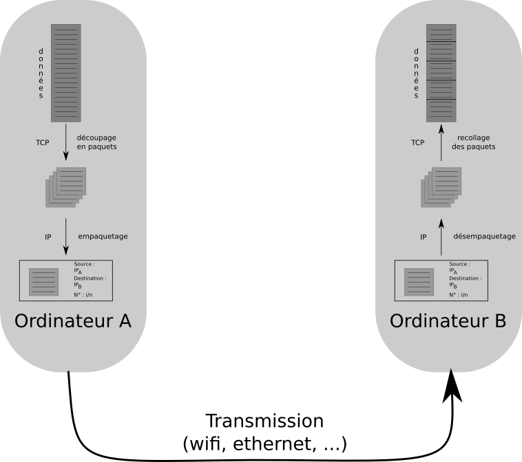

# Adresses IP et protocole TCP/IP

Lorsque vous tapez dans votre navigateur une URL, par exemple &laquo; [www.toutatice.fr](https:\\www.toutatice.fr){: target="_blank"} &raquo;, et que vous appuyez sur entrée, votre ordinateur ou téléphone se met en communication avec une autre machine, probablement à Rennes, et cette machine vous renvoie la page HTML correspondante.

Cet acte que nous pratiquons quotidiennement soulève de nombreuses questions quand on réfléchit à son fonctionnement :

* Comment les ordinateurs se reconnaissent-ils entre eux ?
* Comment font-ils pour trouver par où faire passer les données ?
* Comment les données circulent-elles et sont elles reconstituées correctement par l'ordinateur qui les reçoit ?


Nous ne pourrons bien entendu pas répondre à toutes ces questions dans le cadre du cours de SNT, mais nous pouvons quand même lever un peu le voile sur le fonctionnement réel de l'internet.

## Connecter entre eux deux ordinateurs

Dans toute la suite de ce thème, nous utiliserons le logiciel libre [Filius](https://www.lernsoftware-filius.de/Herunterladen), qui permet de simuler de manière simplifiée les réseaux informatiques.

Commençons donc par connecter deux ordinateurs entre eux, et regardons comment ils communiquent :

1. Ouvrez le logiciel `Filius`.

	!!! warning "Attention : choix de la langue"
		Attention, la première chose que vous demandera `Filius` sera de choisir votre langue d'utilisation, et **il n'y a pas moyen de changer cette langue** sauf en supprimant le fichier de configuration qui se trouve dans le dossier `C:\Users\"nom d’utilisateur sur le réseau" \AppData\Local\.filius` (sous win7 et win 10).
		
		Il est possible de supprimer uniquement le fichier `konfig.xml` :
		
		````
		del C:\Users\"nom d’utilisateur sur le réseau"\AppData\Local\.filius\konfig.xml
		````
		
2. Par glisser-déposer avec l'icône {: style="width:3em;"}, placez deux ordinateurs dans l'espace de travail.
3. Ajoutez un câble entre les-deux.
4. Cliquez-droit sur un des ordinateurs, puis choisissez le menu *Configurer*. Vous ouvrez un menu de configuration de l'ordinateur.

	!!! info "Adresses IP - premier aperçu"
		Afin de pouvoir s'identifier, tout ordinateur possède une adresse sur un réseau, appelée {==**adresse IP**==} ( pour **Internet Protocol**).

		Une adresse IP est de la forme `195.221.67.112` (cette adresse IP correspond au serveur `epwebc1.toutatice.fr`, correspondant à l'URL [www.toutatice.fr](https:\\www.toutatice.fr){: target="_blank"} .

		Les adresses IP, en version 4, sont de la forme : `a.b.c.d`, avec $a, b, c$ et $d$ qui sont des entiers compris entre `0` et `255`. Il existe une version 6 des adresses IP, utilisant 6 valeurs, mais nous nous contenterons d'étudier l'IP V4 .
	
	Modifiez l'adresse IP d'un des ordinateurs en la remplaçant par `192.168.0.11`. Vous laisserez le deuxième ordinateur avec l'adresse `192.168.0.10`. Vous devez aussi, pour *chacun des ordinateurs*, cocher l'option à droite &laquo; `Utiliser l'adresse IP comme nom` &raquo;.
	
	{: style="width:70%; margin:auto;display:block;background-color: #d2dce0;"}

5. Démarrez la simulation grâce à l'icône {: style="width:3em;"}.
6. Cliquez-droit sur l'ordinateur portant l'IP `192.168.0.10` (en n'oubliant pas de régler de manière à avoir son IP comme nom), et cliquez sur `Afficher les échanges de données`. Déplacez la fenêtre sur la droite de l'écran afin de pouvoir voir à la fois cette fenêtre et les deux ordinateurs.

	!!! tips "Arrêter la simulation"
	En cas de besoin, vous pouvez toujours arrêter la simulation en cliquant sur l'icône {: style="width:3em;"}, et ainsi pouvoir déplacer les ordinateurs dans le plan de travail.
	
7. Cliquez droit toujours sur le même ordinateur et sélectionnez `Afficher le bureau`.
8. Dans ce bureau, cliquez sur l'installateur de logiciels et installez `Ligne de commande`. Une fois l'installation effectuée (c'est immédiat !), ouvrez le logiciel `Ligne de commande` par un click gauche. Vous devriez avoir une situation telle que celle-ci :

	{: style="width:70%; margin:auto;display:block;background-color: #d2dce0;"}
	
9. Dans l'invite de commande, tapez la ligne suivante :

	````
		ping 192.168.0.11
	````
	!!! question
	
	=== "Question"
		Que s'est-il passé ?
		
	=== "Réponse"
		A venir !
		
10. On s'intéresse dans les échanges de données à la première ligne utilisant le protocole `ICMP` (**Internet Control Message Protocol**), qui doit être en toute logique la ligne n°3. Cette ligne, appelée {==**trame**==}, représente un échange de données entre les deux machines. Cliquez sur la ligne pour obtenir les informations Dans cette trame :
	1. Quelle est l'IP de la source ?
			
	2. Quelle est l'IP de la destination ?
		
	3. Quel est le commentaire ? 
			
11. Dans la trame suivante :
	1. Quelle est l'IP de la source ?
	
	2. Quelle est l'IP de la destination ?
		
	3. Quel est le commentaire ? 
	

!!! info "Commande `ping`"
	La commande `ping` est une commande très souvent utilisée pour effectuer des tests réseau, en cas de dysfonctionnement. Elle s'utilise en donnant soit l'adresse IP de l'ordinateur cible, soit en donnant le {==**nom de domaine**==} de l'ordinateur cible, par exemple :
	
	````
	ping www.google.fr
	````
	
	Cette commande est disponible sur tous les systèmes d'exploitation, vous pouvez vous amuser chez vous à tenter quelques pings, depuis la ligne de commande.

## Échanger des données

Nos deux ordinateurs sont bien connectés, ils se reconnaissent l'un l'autre et forment donc un {==**réseau informatique**==}, que nous agrandirons plus tard. Nous allons maintenant simuler, avec ces deux ordinateurs, une requête web classique.

1. Ne fermez pas les fenêtres de bureau et d'échanges de données de l'ordinateur `192.168.0.10`.
2. Cliquez droit sur l'ordinateur `192.168.0.11`, et ouvrez le bureau.
3. Installez le logiciel *Serveur Web*.
4. Cliquez sur le nouvel icône et démarrez le serveur.
5. Sur l'ordinateur `192.168.0.10`, installez le *Navigateur Web*.
6. Ouvrez ce navigateur et tapez dans la barre d'adresse l'IP du serveur web (c'est-à-dire `192.168.0.11`). Vous obtenez une page web, certes basique, mais réelle.
7. Si vous avez regardé la fenêtre montrant les échanges de données, vous avez constaté que beaucoup d'échanges se sont produits. Nous passerons sur les trois premières lignes (il s'agit de la négociation des paramètres de la transmission entre les deux ordinateurs, appelée [TCP-handshake](https://developer.mozilla.org/fr/docs/Glossary/TCP_handshake), qui est hors-programme de SNT), mais nous nous arrêterons sur les échanges des trames en bleu foncé :
	1. Cliquez sur la première des lignes bleu foncé dont la source est `192.168.0.11` (en théorie la deuxième ligne bleu foncé):
		1. Dans la couche `Transport`, quel est le numéro de séquence `SEQ` ?
		

		2. Dans la couche `Application`, que contient le commentaire ?
		
		3. Quel est le numéro d'{==**acquittement**==} (`ACK`) de la ligne bleue-claire suivante ? Par qui cette trame a-t-elle été émise ?
		
	2. Cliquez sur la ligne bleu foncé suivante.
		1. Qui est l'émetteur ?
		
		2. Quelle est la demande ?
		
	3. Que contiennent les lignes bleu foncé suivantes ?
		
			
## Protocole TCP/IP

Depuis le début de cette activité, j'utilise le mot {==**protocole**==}. Mais que signifie-t-il ?

!!! question "Protocole"
	Cherchez la définition Wikipédia et donnez la définition de &laquo; protocole &raquo; dans le cas général puis en informatique :


En informatique, il existe de nombreux protocoles. Vous en avez quelques exemples avec *Filius* : `ARP`, `ICMP`, `TCP`, etc.

Nous nous intéresserons uniquement à 2 protocoles : `IP` et `TCP` (**Transmission Control Protocol**), qui sont très utilisés pour les transmissions web. Ils sont tellement liés qu'on parle souvent de protocole `TCP/IP`.

Détaillons-en un peu le fonctionnement !

Lorsqu'un ordinateur $A$ veut envoyer des données, par exemple une image, à un ordinateur $B$, le protocole `TCP` va, avec un certain nombre d'opérations, découper les données de l'image en petits {==**paquets**==}, les numéroter, puis les transmettre au protocole `IP`.

Le protocole IP {==**encapsule**==} les données et rajoute, entre autre, l'adresse `IP` de la source (ordinateur $A$) et celle de la destination (ordinateur $B$).

Une analogie simple serait de considérer l'idée de transmettre par la poste un très très long texte. `TCP` écrirait ce texte sur des feuilles simples et numéroterait ces feuilles. Chacune des feuilles serait transmise au protocole `IP`, qui les mettrait dans une enveloppe, sur laquelle est écrit à la fois l'adresse du destinataire, ainsi que celle de l'expéditeur. `IP` envoie ensuite chacune des enveloppes à l'ordinateur $B$.

{: style="width:70%; margin:auto;display:block;background-color: #d2dce0;"}

`TCP` et `IP` ne se contentent pas d'envoyer. Ils travaillent aussi à la réception. `IP` {==**désencapsule**==} les données (il sort les feuilles des enveloppes), puis `TCP` remets les feuilles dans l'ordre tout en envoyant à l'expéditeur un accusé de réception (`ACK`) pour lui signaler que le paquet est bien arrivé.
Une fois l'accusé reçu par l'émetteur, le protocole `TCP` de l'ordinateur $A$ envoie le paquet suivant. Au bout d'un certain temps, si l'ordinateur $A$ ne reçoit pas d'accusé, il renvoie le paquet une nouvelle fois. D'où le `C` de `TCP`, qui signifie &laquo; Contrôle &raquo;, car le protocole `TCP` est un protocole qui contrôle l'intégrité des données.


!!! info "Protocole UDP"
	`TCP/IP` n'est pas le seul protocole utilisé pour envoyer des données. Entre autres parce que `TCP/IP` est lent avec toutes les phases d'accusés de réception.
	Un des autres protocoles utilisé est `UDP` (*User Datagram Protocol*), qui envoie les données en flux continu sans se préoccuper de leur réception. Ce type de protocole est particulièrement utilisé lorsque la perte de données n'est pas un gros problème, par exemple lors de la transmission de flux vidéos de streaming en temps réel, ou pour de la voix sur IP.


## Plus d'ordinateurs

Évidemment, un réseau ne peut pas se contenter d'avoir uniquement deux ordinateurs. Pour connecter plusieurs ordinateurs entre eux, on utilise un {==**Switch**==}.

1. Dans `Filius`, retirez le câble entre les deux ordinateurs, ajoutez un `switch` à l'aide de l'icône correspondant et ajoutez deux autres ordinateurs.
2. Connectez les ordinateurs au `switch` à l'aide de câbles, puis configurez correctement votre réseau, en donnant à chacun des ordinateurs des IP de types `192.168.0.X` où `X` est un nombre entier entre $1$ et $254$
3. Testez ensuite les connexions entre les machines à l'aide soit de la ligne de commandes, soit d'un navigateur web.