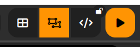

# Construire une page Web : Bases de HTML

## Qu'est-ce qu'une page web

### Première approche

!!! question "Découvrir HTML"

    1. Téléchargez le fichier [Micro_Maqueen](Micro_Maqueen.txt){target="_blank"} (avec un clic droit puis «Enregistrer la cible du lien sous...») et copiez-le dans votre répertoire `SNT` dans lequel vous aurez au préalable créé un dossier `web`.

    2. Double-cliquez sur ce fichier. Quel logiciel l'ouvre ?

    3. Quelle est la nature du contenu du fichier ?

    4. Vous pouvez fermer le logiciel. Nous allons changer l'extension du fichier `Micro_Maqueen`. Pour ce faire :

        1. Placez-vous dans votre dossier `SNT/web` à l'aide de votre explorateur de fichier, puis cliquez sur le menu en haut `Affichage`, puis cochez la case `Extensions de noms de fichiers`. Quelle extension a pour l'instant le fichier `Micro_Maqueen` ?

        2.  Sélectionnez le fichier puis appuyez sur `F2` pour renommer, puis changez l'extension `.txt` en `.html`. Que se passe-t-il pour l'icône de fichier ?

    5. Double-cliquez sur le fichier. Quel logiciel l'ouvre ?

    6. Quelle est la nature du contenu du fichier ?

    7. Quelle est l'URL de la page ?

    8. Téléchargez les fichiers [Microbit.jpg](Microbit.jpg){target="_blank"} et [Maqueen.png](Maqueen.png){target="_blank"} (avec un clic droit puis «Enregistrer la cible du lien sous...»), et copiez-les dans le même répertoire que votre fichier `Micro_Maqueen.html`. Rechargez la page web.

        Quels sont les changements apportés ?

    9.  Réduisez sans fermer votre navigateur, puis cliquez-droit sur le fichier `Micro_Maqueen.html`, et sélectionnez `Edit with Notepad++`. Que retrouvez-vous ?

    10. Quelles différences constatez-vous entre le fichier ouvert dans un navigateur, et le fichier ouvert par `Notepad++`?

### Deuxième approche : via les blocs dans Capytale, lien entre HTML et CSS

!!! question "Utilisation de blocs"

    1. Ouvrir dans un nouvel onglet de `Firefox` le lien suivant : [web capytale](https://capytale2.ac-paris.fr/web/c/c568-4008908){target = "_blank"}, puis accédez à l'activité *Capytale*.
    2. Cliquez sur le bouton ``Visualiser``. Normalement, vous voyez une partie de la page avec des blocs, et le rendu des blocs sous la forme d'une page web.
    3. Répondez dans un premier temps aux questions suivantes.
        1. Il y a une erreur dans les années. Remplacez celles-ci par `2024-2025`, puis actualisez l'aperçu avec le bouton de rafraichissement.
        2. Effectuez un ++ctrl+left-button++ sur le lien proposé dans la page. Est-ce fonctionnel ?
        3. En observant les blocs, répondez aux questions suivantes :
            1. Combien de sous-blocs enfants directs possède le bloc `<html> ... </html>` ? Comment s'appellent-ils ?
            2. Détacher le bloc ``, puis actualiser la page. Que s'est-il passé ? Rattacher le bloc ``.
            3. Dans le bloc `<body> ... </body>`, transformer le bloc `<h2> ... </h2>` en bloc `<h1> ... </h1>`, puis actualisez l'aperçu. Que s'est-il passé ? Replacer ce bloc en `<h2> ... </h2>`.
            4. Changer le style de la bordure du bloc `<h1> ... </h1>` en `groove`, et choisissez une nouvelle couleur pour celui-ci.
            5. Qu'ont en commun tous les éléments écrits en gras et en bleu dans la page web ?
            6. Ajouter un style au bloc `<h2> ... </h2>` en lui appliquant un fond de couleur jaune.
    4. Basculer l'affichage en mode hybride en cliquant sur le bouton central surligné ici {:style="height : 3em;"}, puis désactiver l'aperçu. Qu'observe-t-on ?
    5. Passez en affichage avec uniquement le code (bouton à droite du mode hybride). Réactivez l'aperçu, puis amusez-vous à changer quelques éléments dans le code et observez les effets de vos changements.

## Le fond : du texte et de l'hypertexte - HTML

*Dans un premier temps, on ne s'intéressera qu'au code HTML à proprement parlé, ce qui signifie qu'on ne traitera pas des couleurs, alignements de textes, centrages, etc...*

!!! info "HTML et notion de balises"
    Une page web, c'est **un fichier contenant du texte**, ce texte étant enrichi par un système de {==**balises**==} ouvrantes et fermantes permettant de donner un sens particulier au texte encadré par ces balises. Par exemple le couple de balises `
` et `
` :
    
    * est composé de la balise ouvrante `
` ;
    * et de la balise fermante `
` (observez la différence avec la balise ouvrante) ;
    * et le couple sert à délimiter un paragraphe.

    Ces balises sont interprétées par le navigateur web et donnent une **sémantique** particulière au texte (titre, paragraphe, élément de liste, etc), ou bien introduisent des comportement particuliers à certains éléments (transforment en lien hypertextuels, insèrent des images, etc).

    Le langage utilisé qui contient le texte et les balises s'appelle {==**HTML**==} ( d'où le nom de l'extension `.html` ) , qui est un acronyme pour {==**Hyper Text Markup Language**==}, soit *langage de balisage hypertexte*. Il est à noter que `HTML` **n'est pas un langage de programmation**, mais simplement un langage de description hypertextuel, privilégiant la **mise en avant du sens avant la forme**.

    Il existe de nombreux langages de balisages, permettant de donner une forme particulière à du texte ou à des chaines de caractères. Par exemple, `HTML` pour le Web, `LaTeX` pour les documents scientifiques et les formules mathématiques, `XML` pour organiser des données, ou même `Mardown`, un langage ultra simplifié utilisé par exemple dans des Notebooks Jupyter ( que nous utiliserons plus tard dans l'année ), mais aussi sur des plateforme de réseaux sociaux telles que `Discord`.

L'objectif des questions suivantes est de vous faire comprendre le rôle des balises `HTML`. Vous devez donc comparer les deux visions du fichier `HTML`, celle vue par le navigateur et celle vue par l'éditeur de texte. Pour ce faire, nous allons utiliser l'activité *Capytale* suivante : [f780-4006303](https://capytale2.ac-paris.fr/web/c/f780-4006303){target="_blank"}.

!!! question "Ex1 : Comprendre `HTML` : une balise - vocabulaire"

    Prenons la deuxième ligne du fichier, vue dans `Notepad++`. Celle ci contient une {==**balise ouvrante**==} :
    
    * de **nom** `html`
    * d'**attribut** `lang`.

    1.  L'attribut `lang` possède une valeur. Quelle est-elle ?

    2.  {==**Toute balise ouvrante doit être fermée**==}. Où se trouve la balise fermante correspondant à `<html lang="fr">` ? Avec quoi la distingue-t-on ?

!!! question  "Ex2 : Comprendre HTML : les principales balises "

    Pour chacun des cas ci-dessous, trouver le couple de balise qui correspond :

    1. Texte affiché dans l'onglet :

    2. Titre principal :

    3. Sous-titre :

    4. Sous-sous-titre :

    5. Paragraphe :

    6. Mise en gras dans un paragraphe :

    7. Hyperlien :

    8. Élément d'une liste :

    9. Liste numérotée :

    10. Liste à puces :

    11. En-tête de la page :

    12. Corps principal de la page :

    13. Haut du corps de page :

    14. Pied du corps page :

    15. Ensemble du code html :

!!! question "Ex3 : Comprendre HTML - Des balises spécifiques"

    3.  1.  Concernant les balises de **liens hypertextes** de la page, les deux ne se comportent pas de la même manière. Comment expliquer cela ?

        2.  Toujours concernant les liens hypertextes, que doit-on renseigner pour donner la **cible du lien** ?

    4.  1.  Nous n'avons pas évoqué les **images** présentes sur la page. Quelle balise permet d'afficher ces images ? Qu'a-t-elle de particulier par rapport à toutes celles vues avant ?

            !!! warning "Obtenir le lien réel d'une image sur le web"

                Lorsque vous faites une recherche par Google Image ou tout autre moteur de recherche, et que vous cliquez-droit sur une image puis sur `Copier le lien de l'image`, vous **n'obtenez pas le réel lien hypertexte** de l'image, mais un lien crée par le moteur de recherche vers une copie de cette image qu'il stocke dans sur ses serveurs de **manière temporaire**.

                Pour éviter de perdre ainsi l'image, il est toujours préférable d'aller directement sur le site où se situe l'image et de copier le lien correspondant.

        2. Faites survoler ces deux images par votre pointeur de souris dans votre navigateur. Vous devez constater une différence de traitement entre les deux. Comment l'expliquer ?

        3. Au début de l'activité avec `Notepad++`, avant de copier les fichiers images dans le même répertoire que le fichier `Micro_Maqueen.html`, les images n'étaient pas affichées. Par quoi étaient elles remplacées ?

    5.  Le pied de page est particulier, car il a un caractère spécial. Comment ce caractère est-il représenté en HTML ?

    6.  Il y a trois vidéos, toutes issues de `Youtube` :

        1.  Quelle balise permet de les visionner ? Est-elle fermante ?

        2.  Quels sont les attributs donnés, et à quoi correspondent-ils ?

        3.  L'une de ces vidéos n'a pas le même comportement que les deux
            autres. Comment expliquer cela ?

        !!! tips "Trouver le code pour insérer une vidéo"
            Quand vous visionnez une vidéo sur `Youtube`, sous la vidéo vous avez un icône `Partager`. En cliquant sur cet icône, vous obtenez des liens pour partager sur `Facebook`, `Twitter`, etc. Mais vous avez aussi un icône `Intégrer`. En cliquant sur celui-ci, vous obtenez la balise complète vous permettant d'intégrer la vidéo en question dans votre site web.

    7.  Au milieu du code est inséré ce qu'on appelle un commentaire, c'est-à-dire une ligne qui ne peut être lue que par ceux qui regardent le code source (le contenu réel du HTML). Cette ligne sert à faire des commentaires à la personne qui voudra comprendre le code donné. Quelle balise introduit ces commentaires ?

## À vous de jouer

Vous devez créer une page web sur le {==**thème de votre choix**==}, contenant :

* un titre principal ;
* deux sous-parties ;
* deux hyperliens vers des sites externes ;
* une liste (à puce ou numérotée) ;
* au moins deux images ;
* une vidéo (ou un lien vers une vidéo).

Pour cela vous utiliserez *Capytale* avec l'activité suivante [55a8-4017712](https://capytale2.ac-paris.fr/web/c/55a8-4017712){target="_blank"}.

!!! danger "Pour avoir une bonne note !"
    On respectera aussi les recommandations suivantes :

    * Un soin particulier sera apporté à l'orthographe. Si vous n'êtes pas certains de votre orthographe ou de votre syntaxe, vous devez passer votre texte dans un correcteur orthographique en ligne tel que [Scribens](https://www.scribens.fr/){target = "_blank"}.
    * Le copié-collé depuis un autre site doit impérativement mentionner l'origine du texte. Sans ces sources citées, vous pourriez être accusé de plagiat.
    * De même l'origine des images ou des vidéos doit être explicitement donné dans le site, soit sous la forme d'infobulles, soit sous la forme d'un commentaire d'image (balises `<figure>` et `<figcaption>`, voir [ici](https://developer.mozilla.org/fr/docs/Web/HTML/Element/figcaption){: target="_blank"}).
    * Attention aux informations que vous trouvez sur le web. Certaines sont fortement datées et utilisent des balises qui sont **obsolètes** (comme les balises `
`, `<S>`, `<U>`, `<B>`). De manière générale, {==**n'essayez pas de faire de la mise en page !**==} `HTML` n'est pas fait pour ça, nous utiliserons `CSS` pour améliorer votre site dans un autre TP.
    * La méthode la plus sûre si vous cherchez de nouvelles balises, ou bien des attributs spécifiques, est d'aller sur le site consacré au `HTML` de la [fondation Mozilla](https://developer.mozilla.org/fr/docs/Web/HTML){: target = "_blank"}.

